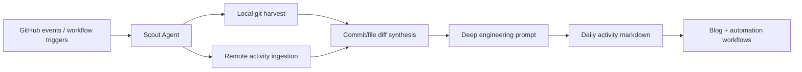
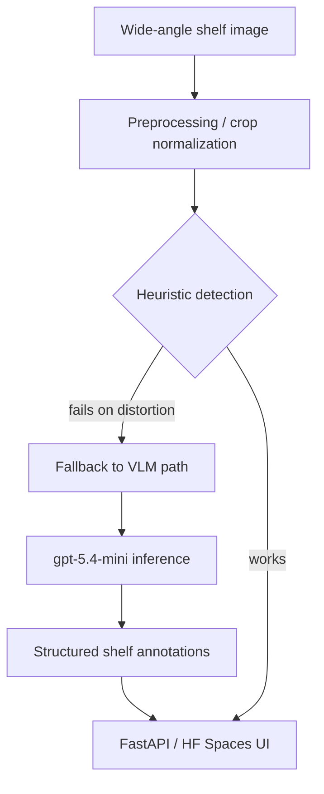

*Generated by GitHub Scout Agent*

### 📦 Project: `kprsnt.in`
- **What Changed & What's In The Code**:
  - The core engineering change landed in `scripts/ecosystem_agents.py` with a substantial expansion of the Scout ingestion path: `+176/-66` in the local script, plus a workflow fan-out across `.github/workflows/blog.yml`, `brand_tracker.yml`, `daily_jobs_pipeline.yml`, `ecosystem_agents.yml`, `jobs.yml`, and `pharma.yml`.
  - The new commit `e6a63fe` introduces a local git harvest step, which means the agent no longer depends purely on remote/API-shaped activity. It can now inspect repository-local commit state and synthesize richer daily logs from actual git metadata rather than only event feed summaries.
  - The generated activity artifact `AI_Eco_Blogs/github-activity-2026-09-01.md` was updated as part of that pipeline, and a new daily snapshot `AI_Eco_Blogs/github-activity-2026-09-06.md` was also added to the repo-level blog output stream.
  - The implementation appears to have been paired with a “deep engineering prompt” upgrade: the agent is now being instructed to preserve implementation detail, architectural rationale, and commit-level specificity instead of flattening everything into generic productivity prose.
- **Why We Did It (Architectural Rationale)**:
  - The prior ingestion model was too lossy for serious technical logs. Remote activity feeds tell you *that* something changed, but not enough about *how* the system changed: what workflows were touched, what state machines were expanded, whether the change was an orchestration fix or a content update.
  - Local git harvest closes that gap by letting the Scout agent infer from the repo’s own commit graph and file diffs. That matters for multi-repo engineering narratives where branch creation, workflow edits, and blog content updates need to be correlated into a single coherent story.
  - The workflow expansion suggests the pipeline is now more modular: separate jobs for blog generation, brand tracking, daily jobs, ecosystem agent runs, and domain-specific tasks like pharma can be orchestrated independently while still feeding a shared activity ledger.
- **Engineering Highlights & Trade-offs**:
  - The main trade-off here is fidelity vs. complexity. Pulling local git state gives better signal, but it also increases the chance of noisy or duplicated events if the pipeline doesn’t dedupe by commit SHA, branch, or file path.
  - Another important trade-off is prompt depth vs. determinism. A richer prompt can produce better technical writing, but if the prompt is too unconstrained, the output can drift into narrative filler. The “deep engineering prompt” change looks like an attempt to preserve structure while still allowing context-rich synthesis.
  - From a systems perspective, this is the right direction for an autonomous dev-log pipeline: the output becomes closer to an engineering incident summary than a social media recap.
  

### 📦 Project: `kprsnt.in` — Retail shelf engineering story
- **What Changed & What's In The Code**:
  - The blog source was updated in two places: `blog_drafts/retail-shelf-intelligence-engineering-story.md` and `blog_inputs/retail-shelf-intelligence-engineering-story.md`, with a large net rewrite (`+98/-349`) in the input file.
  - The content now explicitly attributes the build to **Gemini 3.8 Flash + OMP (Oh My Pi)** and tightens the “struggles” section, which is a strong signal that the story was revised to reflect the actual debugging path rather than a polished hindsight version.
  - The underlying narrative describes a real system architecture: an on-prem edge CV prototype that failed under wide-angle supermarket imagery, then a pivot to a dual-mode vision engine backed by OpenAI `gpt-5.4-mini`, Hugging Face ZeroGPU, and MCP surfaces.
- **Why We Did It (Architectural Rationale)**:
  - The original heuristic pipeline appears to have broken on the exact kind of visual ambiguity that retail aisles create: perspective distortion, ceiling lights, occlusions, reflective packaging, and inconsistent shelf geometry.
  - Updating the blog inputs with the struggle path is not just editorial cleanup; it preserves the engineering truth that the first architecture was insufficient and that the production design emerged from failure analysis.
  - The attribution change matters because the build loop itself was part of the engineering story. The OMP + Gemini 3.8 Flash harness wasn’t just a writing assistant; it functioned as a rapid diagnosis and iteration layer while the system evolved.
- **Engineering Highlights & Trade-offs**:
  - The key architectural trade-off was heuristic simplicity vs. model robustness. Heuristics are cheap and fast, but they fail catastrophically when the input distribution shifts from clean shelf shots to real store aisles.
  - Moving to a dual-mode engine suggests a split between deterministic preprocessing and model-assisted interpretation. That’s usually the right answer when you need both operational reliability and semantic flexibility.
  - The rewrite in the blog input file likely reflects a conscious decision to keep the published case study aligned with the actual debugging chronology: initial failure, root-cause analysis, model pivot, ZeroGPU integration issues, and frontend rework.
  

### 📦 Project: `kprsnt.in` — mSeat engineering story
- **What Changed & What's In The Code**:
  - The repo includes two closely related case-study files: `mseat-engineering-story-mbbs.md` and `mseat-engineering-story-mbbs-counselling-predictior.md`.
  - These drafts describe the same core system: a 1-click MBBS mock counselling engine for Telangana NEET aspirants, built around a discrete allocation simulator rather than a naive marks-to-rank estimator.
  - The technical framing emphasizes the transition from a simple estimator to a seat-allocation engine that can reason about reservation categories, local/non-local quotas, and the real-world counselling process.
- **Why We Did It (Architectural Rationale)**:
  - The important engineering shift here is from prediction to simulation. In this domain, a rank-to-college mapping is not a regression problem; it’s a constrained allocation problem with policy rules, category buckets, and seat availability changes.
  - That’s why the story stresses discrete allocation: the output needs to model how the official counselling process actually assigns seats under multiple constraints, not just approximate a cutoff curve.
  - The content also highlights why historical cutoff spreadsheets are unreliable: they don’t account for seat expansion, sub-category splits, or evolving reservation policy. That makes a simulator materially more useful than a static model.
- **Engineering Highlights & Trade-offs**:
  - The system has to balance explanatory simplicity with allocation correctness. A good UX can make the result feel like a “1-click” experience, but under the hood the engine must preserve the complexity of counselling rules.
  - The scale is non-trivial: 18,000+ aspirants competing for roughly 6,000 seats means the allocator must be stable and deterministic, or users will lose trust immediately.
  - The write-up also suggests a model/tooling stack that is intentionally pragmatic: JavaScript and Vercel for fast product iteration, with future extension paths toward Gemini/ChatGPT and MCP for richer orchestration and explainability.
  

### 📦 Project: `kprsnt-vercel-rust`
- **What Changed & What's In The Code**:
  - A new `main` branch was created. No file-level diff was provided, so the visible change is repository bootstrap rather than a feature commit.
  - Given the repo name, this likely marks the start or reactivation of a Rust-based Vercel integration or service layer.
- **Why We Did It (Architectural Rationale)**:
  - Branch creation at this stage usually means the project is being prepared for a clean initial implementation path or a new line of work that should not be mixed into an existing history.
  - Rust is a strong choice if the target is latency-sensitive, correctness-sensitive, or edge-deployable logic where memory safety and predictable runtime behavior matter more than rapid prototype convenience.
- **Engineering Highlights & Trade-offs**:
  - The main trade-off here is startup cost vs. long-term reliability. Rust increases implementation rigor, but it also slows early iteration compared with a scripting-first stack.
  - Since no code diff is visible yet, the meaningful signal is organizational: the repo is now ready for a disciplined implementation branch rather than ad hoc experimentation.

### 📦 Project: `retail_shelf_intelligence`
- **What Changed & What's In The Code**:
  - This repository also had a new `main` branch created, with no file-level changes visible in the activity log.
  - The branch creation aligns with the retail shelf intelligence work described in the `kprsnt.in` blog drafts, suggesting this repo is the likely product/code counterpart to the narrative case study.
- **Why We Did It (Architectural Rationale)**:
  - Creating a clean main branch here is a useful signal that the project is being staged for production-grade work or a formalized codebase structure.
  - For a computer vision and multimodal pipeline, isolating the repo early helps keep model experiments, API surfaces, and deployment config from getting tangled with documentation or blog-generation artifacts.
- **Engineering Highlights & Trade-offs**:
  - The likely architectural pressure point in a system like this is deployment topology: edge inference, hosted VLM fallback, and UI orchestration each want different runtime assumptions.
  - A fresh branch boundary gives room to separate those concerns cleanly before the implementation hardens.

Overall, the last day’s work was less about one isolated feature and more about tightening the whole engineering narrative around the actual system behavior: ingesting real git evidence, preserving implementation detail in the daily log, and keeping the public-facing case studies honest about failures, pivots, and trade-offs. The next obvious milestone is to make the Scout pipeline even more commit-aware and deduplicated, then continue turning the mSeat and retail shelf stories into code-backed, architecture-accurate project logs rather than polished summaries.