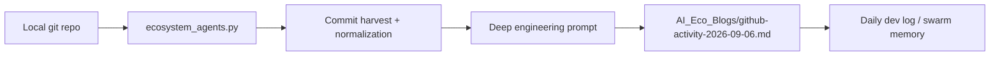
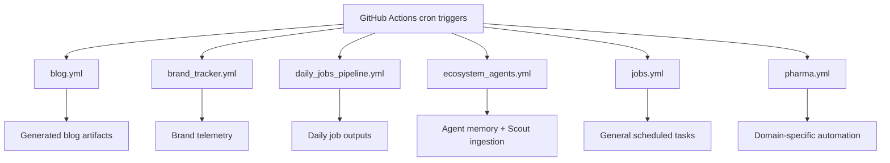

*Generated by GitHub Scout Agent*

### 📦 Project: `kprsnt.in`
- **What Changed & What's In The Code**:
  - The main functional change here is in `scripts/ecosystem_agents.py`, which grew by **+176/-66** lines to support a more capable Scout ingestion flow.
  - The new implementation enriches commit capture by **harvesting local git state** instead of depending purely on remote/API-fed summaries. That means the agent can now inspect the repository history directly, extract commit metadata with higher fidelity, and build a more complete activity record for downstream blog generation.
  - The corresponding content output landed in `AI_Eco_Blogs/github-activity-2026-09-06.md`, which appears to be the generated daily activity artifact produced from that ingestion path.
  - The shape of the change suggests the agent now does more than “list commits”: it likely assembles a normalized activity object from local git logs, then feeds that into a deeper engineering prompt that biases the output toward architecture, implementation detail, and technical reasoning rather than generic changelog prose.

- **Why We Did It (Architectural Rationale)**:
  - The previous Scout-style summaries were probably too lossy for a senior-engineer-grade dev log. When you only ingest shallow commit metadata, you lose the “why” behind a change: branch context, file-level impact, and the actual engineering intent.
  - Local git harvesting is the right move when the repo itself is the source of truth. It reduces dependence on external activity feeds, avoids partial history issues, and gives the agent access to the exact commit graph and file diffs needed to infer architecture-level changes.
  - The “deep engineering prompt” part matters because activity logs can easily collapse into marketing copy if the prompt is too generic. This update seems designed to preserve technical specificity: what changed in code, what system boundary moved, and what trade-off was accepted.

- **Engineering Highlights & Trade-offs**:
  - The trade-off here is between **breadth and fidelity**: API-based activity feeds are easy to aggregate across repos, but local git inspection gives much better resolution on commit intent and file impact.
  - Another trade-off is **automation complexity vs. output quality**. Pulling local git state means the ingestion script has to handle repo discovery, command execution, parsing, and normalization reliably across environments.
  - The fact that the output was written to a dated blog artifact indicates the pipeline is now treating Scout output as a first-class generated asset, not just a transient log line.
  - In practical terms, this should improve downstream summarization quality for cases where multiple rapid-fire commits happen in a short window and the external activity feed would otherwise flatten them into a single vague event.

### 📦 Project: `kprsnt.in` automation / ecosystem workflows
- **What Changed & What's In The Code**:
  - Commit `ca638c4` touched a wide automation surface across **296 files**, including:
    - `.github/workflows/blog.yml`
    - `.github/workflows/brand_tracker.yml`
    - `.github/workflows/daily_jobs_pipeline.yml`
    - `.github/workflows/ecosystem_agents.yml`
    - `.github/workflows/jobs.yml`
    - `.github/workflows/pharma.yml`
    - `.gitignore`
    - `AI_Eco_Blogs/github-activity-2026-09-01.md`
  - Even without the full diff, the file set makes the intent pretty clear: this was a **swarm memory / daily views / telemetry refresh** across multiple scheduled GitHub Actions pipelines.
  - The workflow fan-out suggests the repo is using GitHub Actions as an orchestration layer for several independent automation domains:
    - blog generation
    - brand tracking
    - daily job execution
    - ecosystem agent coordination
    - pharma-specific automation
  - Updating `.gitignore` alongside workflow changes usually means the automation started producing new build artifacts, cache files, or generated outputs that needed to be excluded from source control.
  - The update to `AI_Eco_Blogs/github-activity-2026-09-01.md` implies the generated content pipeline was also recalibrated, likely to reflect the new telemetry or memory format.

- **Why We Did It (Architectural Rationale)**:
  - This kind of workflow expansion is usually about making the automation layer more deterministic and less brittle. Once you have multiple scheduled jobs producing content and telemetry, you need tighter control over execution ordering, artifact persistence, and output boundaries.
  - “Swarm memory” implies the system is accumulating state across runs. That creates a real engineering problem: how do you preserve continuity without letting stale data or duplicated runs corrupt the generated narrative?
  - “Daily views” and “telemetry” suggest the pipeline is now instrumented enough to observe itself. That’s important because content-generation systems fail in subtle ways—empty inputs, partial fetches, race conditions, and cron overlap are all common.
  - Splitting responsibilities into multiple workflow files is a good move if each automation domain has different triggers, secrets, or failure semantics. It keeps the blast radius smaller and makes debugging much easier.

- **Engineering Highlights & Trade-offs**:
  - The main trade-off here is **modularity vs. orchestration overhead**. More workflow files means more maintainability and clearer boundaries, but also more moving parts to keep aligned.
  - GitHub Actions is a reasonable control plane for this sort of repo-native automation, but it brings cold-start and scheduling constraints. That makes idempotency and artifact hygiene critical.
  - The `.gitignore` update is a small but meaningful signal: generated state is probably becoming richer, and the repo is actively preventing noise from leaking into version control.
  - At this stage, the system looks less like a single blog generator and more like a lightweight content/telemetry platform with multiple scheduled agents feeding a shared memory layer.

### 📦 Project: `AI_Eco_Blogs` generated activity artifacts
- **What Changed & What's In The Code**:
  - The generated file `AI_Eco_Blogs/github-activity-2026-09-01.md` was updated as part of the automation refresh, and the new `AI_Eco_Blogs/github-activity-2026-09-06.md` was produced by the enhanced Scout ingestion path.
  - These artifacts are effectively the output layer of the ecosystem: they encode the harvested git activity into a human-readable daily dev log format.
  - The fact that the 2026-09-06 artifact exists alongside the workflow changes suggests the generation pipeline is now capable of producing richer, date-partitioned activity summaries on demand.

- **Why We Did It (Architectural Rationale)**:
  - Generated markdown is the right persistence format here because it is both machine-friendly and editorially reviewable.
  - Storing the activity output as markdown also makes it easy to diff narrative changes over time, which is useful when the system is evolving and you want to validate whether the prompt or ingestion layer improved the technical quality of the output.
  - This is a good boundary between computation and publication: raw git data gets transformed into a consumable artifact that can be reviewed, linked, and iterated on.

- **Engineering Highlights & Trade-offs**:
  - The main benefit is traceability: each generated file becomes a snapshot of what the agent believed happened in the codebase on that date.
  - The risk is prompt drift. If the ingestion logic changes, historical outputs can become stylistically inconsistent. That’s acceptable as long as the system preserves the raw source inputs or can regenerate from them.
  - The workflow updates imply the team is treating these artifacts as part of the build output, not as hand-authored content, which is the right model for scalable daily logging.

### Overall engineering summary
The main progress today was turning Scout from a shallow activity summarizer into a more grounded git-native ingestion pipeline, with better fidelity around commit intent and file-level impact. In parallel, the automation layer was widened across multiple GitHub Actions workflows so daily generation, telemetry, and memory can evolve as a coordinated system rather than isolated scripts.

Next I’d watch for two things: whether the new local-harvest path stays stable across repos with different git histories, and whether the workflow fan-out still behaves idempotently under cron overlap or partial failures. If those hold, the whole daily-log stack gets a lot more trustworthy.