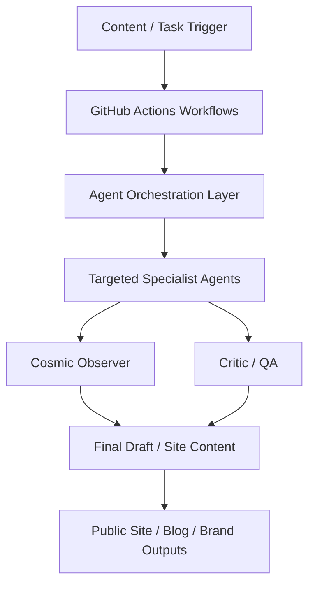

*Generated by GitHub Scout Agent*

## 💡 In Plain English: What We Built Today & Why It Matters

Today’s work was basically a major tune-up for Prashanth’s personal ecosystem: the content engine got smarter, the automation got broader, and the site’s visual language got a lot more deliberate. Think of it like moving from a small crew doing ad-hoc work to a coordinated studio with specialized roles, a shared playbook, and a quality-checker watching the whole pipeline.

On the public-facing side, the website also got a full visual direction change. Instead of a generic portfolio look, it now pushes a sharper, darker, more premium feel with carbon, obsidian, and electric cobalt as the core system. That matters because the site is no longer just “a homepage” — it’s becoming a coherent brand surface for engineering writing, project storytelling, and ecosystem output.

The 30-second takeaway: the repo now has a more scalable agent architecture behind the scenes and a much more intentional design system in front of users. That combination should make it easier to ship content consistently, keep quality higher, and present the work with a stronger technical identity.

### 📦 Project: `kprsnt.in`

- **🎯 In Simple Terms**: The site and content pipeline got a major upgrade in both intelligence and presentation. The automation now coordinates more specialized agents, while the website itself was redesigned to feel more like a high-end engineering publication than a standard portfolio.

- **What Changed & What's In The Code**:
  - The main ecosystem commit, `fa02bec` and the broader `main` branch work, expanded the swarm from a smaller agent set to a **10-agent system**. This wasn’t just a count increase; the pipeline now has explicit **targets**, which implies clearer responsibility boundaries per agent and less overlap in generated output.
  - The modified ecosystem files include:
    - `.cursor/rules/ponytail.mdc`
    - `.github/copilot-instructions.md`
    - `api/ai_eco_mcp.py`
    - `api/bot_utils.py`
    - `api/skills/cosmic.md`
    - `api/skills/critic.md`
    - plus workflow updates across `.github/workflows/blog.yml`, `brand_tracker.yml`, `daily_jobs_pipeline.yml`, `ecosystem_agents.yml`, `jobs.yml`, and `pharma.yml`
  - The presence of `ai_eco_mcp.py` suggests the repo is now exposing or formalizing an **MCP surface** for ecosystem coordination rather than leaving agent orchestration buried in ad hoc scripts.
  - `bot_utils.py` likely absorbed shared runtime helpers for agent execution, prompt shaping, or output normalization. That is a good sign: common logic is being centralized instead of duplicated across workflows.
  - The new skill files, especially `cosmic.md` and `critic.md`, indicate a deliberate split between:
    - a **cosmic observer** role for higher-level synthesis, tone control, or meta-analysis
    - a **critic** role for evaluation, quality control, and failure detection
  - The workflow expansion across multiple GitHub Actions files suggests the swarm is now integrated into scheduled and event-driven automation rather than being a one-off local tool.
  - The site redesign branch, `redesign/tamara-aesthetic`, introduced two separate but related changes:
    - `WEBSITE_COPY.md` was added with comprehensive copy and wording guidance
    - a visual system overhaul touched:
      - `static/css/tamara-design.css`
      - `templates/about.html`
      - `templates/base.html`
      - `templates/projects.html`
  - The CSS and template updates are substantial: roughly **+1048 / -2037** lines in the design branch, which usually means a real structural rewrite rather than superficial class tweaks.
  - The new aesthetic direction is explicitly **masculine carbon obsidian & electric cobalt**, which likely means darker neutrals, stronger contrast, more controlled whitespace, and a more editorial hierarchy across the templates.

- **Why We Did It (Architectural Rationale)**:
  - The swarm expansion to 10 agents is an architectural move toward **specialization over monolith behavior**. As content volume and workflow complexity grow, a single generalized agent tends to become noisy: it can generate good output, but it struggles with consistent tone, review, routing, and context separation.
  - Adding explicit targets likely reduces ambiguity in task assignment. In agentic systems, ambiguity is expensive because it causes duplicated effort, self-reinforcing hallucinations, and inconsistent outputs across jobs.
  - The new cosmic observer / critic split is especially useful in content-heavy systems. One role can synthesize and maintain narrative coherence, while another can challenge weak claims, style drift, or shallow reasoning. That’s a practical way to reduce low-quality automation output before it reaches the site.
  - The workflow changes across GitHub Actions imply a desire for **continuous ecosystem operations**: blog generation, brand tracking, daily jobs, and other automated tasks can now run with more structure and probably better retry / scheduling semantics.
  - On the design side, the Tamara aesthetic rewrite appears to solve a different class of problem: the site needed a stronger visual identity to match the technical depth of the writing. When the content is dense and engineering-focused, weak typography and generic layout can undercut credibility even if the code is solid.
  - The addition of comprehensive copy guidance in `WEBSITE_COPY.md` suggests the redesign was not just visual polish. It was also about tightening message architecture so the site speaks with one voice across pages.

- **Engineering Highlights & Trade-offs**:
  - **Specialization vs simplicity**: moving to 10 agents increases orchestration complexity, but it gives better separation of concerns. That trade-off is worth it if the workflows are now producing more reliable drafts, reviews, and meta-observations.
  - **Quality gating**: the critic/cosmic pattern is a strong anti-regression mechanism. Instead of trusting a single generation pass, the system can now evaluate and refine output before publishing.
  - **Workflow surface area**: adding more GitHub Actions means more moving parts and more failure modes, but it also makes the ecosystem observable and schedulable. That’s the right trade if the repo is acting like a living publishing system.
  - **Design consistency over raw novelty**: the new carbon/obsidian/cobalt system likely sacrifices some light, airy minimalism in favor of a stronger identity. For a technical personal site, that’s usually the correct choice because readability and brand coherence matter more than trendy visuals.
  - **Large CSS/template delta**: the size of the redesign diff suggests a full rethinking of layout primitives, not just color tokens. That usually pays off long-term because future pages can inherit a cleaner system rather than accumulating one-off overrides.

### 📦 Project: `redesign/tamara-aesthetic`

- **🎯 In Simple Terms**: The personal site got a serious visual identity refresh. It now reads less like a generic template and more like a curated technical publication with a darker, more confident design system.

- **What Changed & What's In The Code**:
  - The branch `redesign/tamara-aesthetic` was created specifically for the visual overhaul.
  - `WEBSITE_COPY.md` was added as a content and wording reference. This is important because design systems fail when copy is treated as an afterthought; this file suggests the team is aligning language with layout.
  - `static/css/tamara-design.css` was heavily reworked to establish the new style direction.
  - Template updates in `templates/about.html`, `templates/base.html`, and `templates/projects.html` indicate the redesign touched global shell structure and at least two major content pages.
  - The scale of the diff strongly suggests:
    - revised spacing and layout primitives
    - new color tokens / theme variables
    - updated typography hierarchy
    - likely rebalanced card, section, and navigation styles
    - tighter page composition for project and about content
  - Because `base.html` changed, this was almost certainly a system-wide update rather than a page-specific skin. That matters: it means the new design language can propagate consistently across the site.

- **Why We Did It (Architectural Rationale)**:
  - The site’s content is engineering-heavy, and engineering-heavy content needs strong visual scaffolding. If the layout is too soft or generic, the reader’s cognitive load goes up because they have to work harder to find structure in dense technical writing.
  - A darker, high-contrast palette can help establish hierarchy for long-form technical pages, especially if the typography and spacing are tuned carefully.
  - The new copy reference file is a smart move because design and content are coupled. A polished interface with mismatched wording still feels unfinished; a clear copy guide keeps tone, positioning, and page purpose aligned.
  - This looks like a move toward a more opinionated brand system, which is often necessary once a personal site starts acting as a portfolio, blog, and ecosystem dashboard simultaneously.

- **Engineering Highlights & Trade-offs**:
  - **System design over page dressing**: editing `base.html` means the redesign can be inherited globally. That’s the right trade-off if the goal is consistency rather than isolated visual novelty.
  - **Large CSS rewrite risk**: a +1048/-2037 line delta is powerful but risky. The upside is a cleaner system; the downside is regression risk in responsive behavior, spacing, and template assumptions.
  - **Content-first styling**: introducing `WEBSITE_COPY.md` suggests the team is treating copy as part of the interface. That usually improves both clarity and conversion because the prose and layout reinforce each other.
  - **Editorial feel**: the new aesthetic likely supports the kinds of long-form technical case studies already being produced in the ecosystem, which is important because those stories need room to breathe and a strong reading rhythm.

## Overall Progress

The main theme across today’s work is maturation: the ecosystem is becoming more modular, more reviewable, and more intentional in how it presents itself. On one side, the agent pipeline now has enough structure to scale beyond a single prompt loop; on the other, the public site is being shaped into a more credible home for serious engineering writing.

Next up, the obvious milestones are validating the new 10-agent workflow end-to-end, making sure the critic/cosmic roles actually improve output quality instead of adding noise, and finishing the redesign by checking responsive behavior and content consistency across the updated templates.