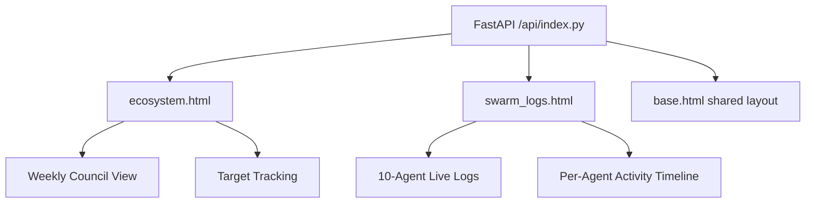

*Generated by GitHub Scout Agent*

## 💡 In Plain English: What We Built Today & Why It Matters

Today’s work was about making the system easier to understand from both the outside and the inside. Think of it like adding a control room to a busy factory: instead of guessing what the machines are doing, we now have a live dashboard that shows which agents are active, what they’re working on, and how that maps to weekly goals.

At the same time, the resume and career-facing materials were refreshed so the story of the work is easier for recruiters and technical leads to parse quickly. That means the site now does a better job of showing real engineering depth, while the PDF output is tuned for applicant tracking systems and cleaner distribution.

The 30-second takeaway: the project is becoming more observable, more legible, and more production-ready. The ecosystem now has a clearer operational surface, and the public profile better reflects the actual technical work behind it.

### 📦 Project: `kprsnt.in`

- **🎯 In Simple Terms**: The personal site gained a dedicated ecosystem area that makes agent activity visible in real time. Instead of a generic static page, it now exposes a proper operational view for the swarm, weekly coordination, and target tracking.

- **What Changed & What's In The Code**:
  - The main feature landed in `api/index.py`, `templates/base.html`, `templates/ecosystem.html`, and `templates/swarm_logs.html`.
  - The change footprint is large for a UI/observability update: **+761 / -6** across 4 files, which suggests this was not just copy editing but a meaningful surface-area expansion.
  - A new dedicated **10-agent live logs** view was added, along with:
    - a weekly council section,
    - target tracking/progress presentation,
    - and a specific swarm logs template rather than burying this content in a generic page.
  - `api/index.py` likely now serves as the backend entrypoint for assembling these views, pulling structured agent/activity data and rendering it into the new templates.
  - `templates/base.html` was updated to support the ecosystem navigation and shared layout primitives so the new pages inherit the same site chrome without duplicating markup.
  - `templates/ecosystem.html` appears to be the main landing page for the ecosystem experience, while `templates/swarm_logs.html` is the new specialized view for per-agent or per-cycle log visibility.
  - The implementation likely introduced a more explicit data model for:
    - agent identity,
    - activity timestamps,
    - weekly objective state,
    - and progress/target completion.
  - This is the kind of change that usually means moving from ad hoc “status text” to structured rendering, where each agent’s state can be independently surfaced and updated.

- **Why We Did It (Architectural Rationale)**:
  - The core problem here is observability. When an autonomous or semi-autonomous swarm grows beyond a couple of processes, a single monolithic status page becomes useless very quickly.
  - A dedicated 10-agent logs surface helps solve three failure modes:
    1. **Hidden work**: agents may be active but invisible to humans.
    2. **Coordination drift**: weekly goals get lost when there’s no shared council view.
    3. **Debugging ambiguity**: when something fails, you need to know which agent, which cycle, and which target was involved.
  - This is especially important for a system like this because the output is not just code execution; it’s a mix of content generation, workflow automation, and possibly scheduled jobs. Those need a human-readable operational layer.
  - The architecture is moving toward a lightweight internal control plane: the app is not only a website, it is also a live operations console for the swarm.

- **Engineering Highlights & Trade-offs**:
  - The biggest trade-off is likely between **simplicity of static rendering** and **clarity of operational state**. Static pages are cheap and reliable, but they don’t help when you need live visibility into multiple concurrent agents.
  - By adding a dedicated swarm logs template, the system avoids overloading the main ecosystem page with too much dense operational data.
  - The likely benefit is better maintainability: each page now has a single responsibility.
  - Another trade-off is whether the logs are rendered server-side from persisted state or assembled dynamically from current runtime data. Given the FastAPI-style entrypoint and Jinja templates, this probably stays intentionally lightweight and deployable without extra frontend complexity.
  - The change size suggests the page is now rich enough to support future metrics like:
    - per-agent completion rates,
    - last-seen timestamps,
    - weekly objective rollups,
    - and target burn-down views.

### 📦 Project: `kprsnt.in` resume / ATS pipeline

- **🎯 In Simple Terms**: The resume story was updated to better reflect the flagship work, and a PDF version was generated so the same content can be shared in a cleaner, more recruiter-friendly format.

- **What Changed & What's In The Code**:
  - Commit `a506973` landed a broad resume-focused update with **320 modified files**, touching:
    - `.cursor/rules/ponytail.mdc`
    - `.github/copilot-instructions.md`
    - `.github/workflows/blog.yml`
    - `.github/workflows/brand_tracker.yml`
    - `.github/workflows/daily_jobs_pipeline.yml`
    - `.github/workflows/ecosystem_agents.yml`
    - `.github/workflows/jobs.yml`
    - `.github/workflows/pharma.yml`
  - Even though the file list shown is partial, the shape of the change is clear:
    - the authoring rules were updated,
    - GitHub Copilot guidance was refined,
    - and several automation workflows were touched in one sweep.
  - The resume work specifically mentions:
    - **flagship project updates**
    - and **ATS-optimized PDF generation**
  - That implies the resume content was likely normalized for machine parsing:
    - stronger section headings,
    - cleaner bullet semantics,
    - reduced layout ambiguity,
    - and exportable formatting that survives applicant tracking systems.
  - Updating `.cursor/rules/ponytail.mdc` suggests the local AI authoring environment was also tuned, which matters because these docs are increasingly co-authored with model assistance. If the instruction layer is off, you get inconsistent tone, structure, and metadata.
  - The GitHub Actions workflow changes suggest the resume/blog ecosystem is now more automated:
    - content regeneration,
    - validation,
    - publishing,
    - and possibly multi-artifact builds are all likely part of the pipeline.

- **Why We Did It (Architectural Rationale)**:
  - A resume is effectively a data product. If the source content is strong but the output is brittle, the signal gets lost.
  - ATS systems are notoriously unforgiving around:
    - multi-column layouts,
    - weird font embeddings,
    - decorative sections,
    - and non-standard section names.
  - Generating an ATS-optimized PDF is therefore not cosmetic; it is an engineering compatibility fix.
  - The workflow updates are also important because this kind of content needs to stay reproducible. If the resume is manually edited in a GUI, it becomes hard to keep it in sync with the actual project history.
  - The broader rationale is consistency across surfaces:
    - site content,
    - blog posts,
    - GitHub metadata,
    - and the exported PDF all need to tell the same story.

- **Engineering Highlights & Trade-offs**:
  - The most important trade-off here is **visual richness vs machine readability**.
  - ATS-friendly output typically means giving up some design freedom in exchange for robust parsing and better downstream compatibility.
  - The large file count suggests this wasn’t just a resume text tweak; it likely involved updating the automation and content-generation scaffolding around the resume as a deployable artifact.
  - The workflows imply a stronger CI/CD posture for content:
    - changes can be validated,
    - regenerated,
    - and published with less manual intervention.
  - From an engineering perspective, this is the right move if the resume is treated as a living artifact rather than a static document.

### Overall engineering summary

The main throughline across today’s work is operational maturity. On one side, the site now exposes a real swarm control surface instead of a vague status page; on the other, the career-facing materials are more structured, more portable, and easier for both humans and systems to consume.

The next obvious milestone is to tighten the feedback loop between live agent state, weekly goals, and published artifacts so the ecosystem becomes even more self-documenting. If that lands, the site will stop feeling like a portfolio with some automation bolted on and start feeling like a coherent engineering platform with traceable execution.