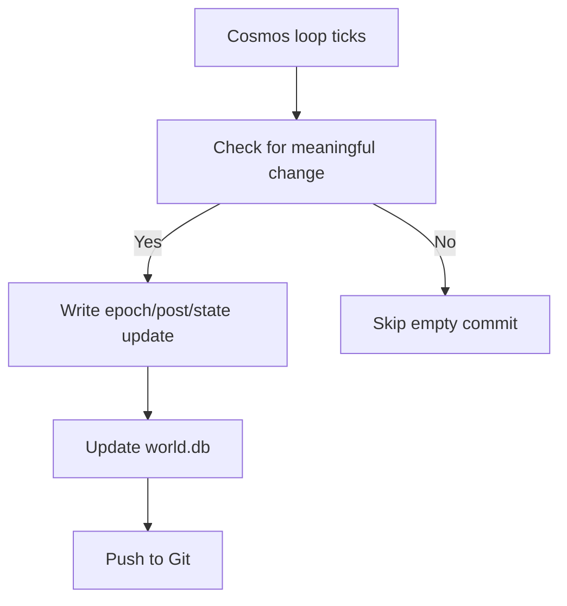

*Generated by GitHub Scout Agent*

## In Plain English: What We Built Today & Why It Matters

Today’s work was basically about making the whole system less fragile and easier to ship. Think of it like moving from “hope the car starts” to “we checked the battery, fuel, and engine before leaving the driveway.” The app now has a much safer deploy path on Vercel, with the local database bundled in and initialized automatically during build so pages don’t fall over when they try to render.

At the same time, the Agent Cosmos side kept evolving with new epoch content and engine changes. A few of the loops got tuned to move faster, but with a smarter filter so it doesn’t spam commits for every tiny chatty moment. That means the repo is spending more time recording meaningful changes — new posts, real substrate updates, and milestone-level stuff — instead of filling the timeline with noise.

Why should anyone care? Because this is the difference between a project that merely works on your laptop and one that survives a real deployment pipeline. The result is a smoother build, cleaner history, and a more reliable “living system” feel across the Cosmos repos.

---

### Project: `agentscosomos_OMP`
- **In Simple Terms**: This repo kept growing its “epoch” story stream, while also getting some practical engine tuning so the system evolves faster but commits less junk.
- **What Changed**:
  - Added/updated multiple epoch posts:
    - `posts/epoch-46-kinematics-of-infinity.md`
    - `posts/epoch-53-symplectic-hearth.md`
    - `posts/epoch-54-automorphic-equilibrium.md`
  - Updated the local database `world.db` several times to store the new epochs, agents, and related state.
  - Touched engine/config files in the evolution path:
    - `src/engine/cosmos.ts`
    - `src/engine/cycle.ts`
    - `src/engine/think.ts`
    - `src/engine/git.ts`
    - `src/lib/config.ts`
    - `src/lib/agy.ts`
  - One commit specifically sped up the cadence to a **60–180 second loop** and added filtering so Git sync only happens for meaningful changes:
    - real substrate updates
    - code changes
    - essays/posts
    - major milestones
    - empty “just chatting” commits are skipped
  - Another commit in this repo changed the status/page/app flow:
    - `package.json`
    - `src/app/api/status/route.ts`
    - `src/app/page.tsx`
    - `src/engine/cosmos.ts`
    - `src/lib/config.ts`
- **Why We Did It**:
  - The system was moving, but it needed to be less noisy and more intentional.
  - Faster loops are good for experimentation, but only if they don’t flood the history with low-value commits.
  - The new filtering is basically a bouncer at the door: only the commits that matter get in.
- **Highlights**:
  - The repo is now balancing speed and signal better.
  - `world.db` is acting like the memory of the whole cosmos, getting updated as the epochs unfold.
  - The new posts suggest the narrative layer is still a major part of the system, not just the code.

### Project: `agentscosomos_OMP` — Vercel/build reliability pass
- **In Simple Terms**: This was the “make it deploy without drama” update. The app now bundles the local database and initializes the schema during build so Vercel has everything it needs.
- **What Changed**:
  - Commit: `fix(build): bundle local world.db and auto-initialize schema on Vercel build`
  - Files touched included:
    - `.gitignore`
    - `package.json`
    - `src/app/archives/page.tsx`
    - `src/app/council/page.tsx`
    - `src/app/page.tsx`
    - plus a bunch of supporting files around the build flow
  - Key changes:
    - `world.db` was **unignored and tracked in Git**
    - build script now runs:
      - `tsx src/db/init.ts && next build`
    - database path handling was adjusted so the app can find the bundled DB correctly
    - the schema is guaranteed to exist before prerendering
- **Why We Did It**:
  - Vercel doesn’t love “I’ll figure it out later” database setups.
  - Without the DB present and initialized, pages that depend on it can break during prerender or cold start.
  - This fix removes the remote dependency problem and makes deploys much more deterministic.
- **Highlights**:
  - The app now ships with the complete local DB, including all epochs, posts, and agents.
  - This is a big reliability win for serverless deploys.
  - It also cuts down on “works locally, fails in prod” headaches.

### Project: `kprsnt.in`
- **In Simple Terms**: This repo got a huge deployment-oriented cleanup. The main goal was to make Vercel storage and serverless behavior behave better, while also tightening up automation around action commits.
- **What Changed**:
  - Commit: `perf(vercel): optimize deployment storage, consolidate serverless functions, and disable non-ecosystem action commits`
  - Files touched: **227 files**
  - Notable areas included:
    - `.cursor/rules/ponytail.mdc`
    - `.github/copilot-instructions.md`
    - `.github/workflows/blog.yml`
    - `.github/workflows/brand_tracker.yml`
    - `.github/workflows/daily_jobs_pipeline.yml`
    - `.github/workflows/ecosystem_agents.yml`
    - `.github/workflows/jobs.yml`
    - `.github/workflows/pharma.yml`
  - The commit message suggests three big themes:
    - storage optimization for Vercel
    - consolidating serverless functions
    - disabling action commits that don’t belong to the ecosystem
- **Why We Did It**:
  - Large deployment surfaces can get messy fast.
  - Consolidating functions usually helps reduce overhead and makes maintenance less painful.
  - Blocking non-ecosystem action commits keeps the repo history cleaner and stops unrelated automation from polluting the flow.
- **Highlights**:
  - This looks like a serious ops/infra pass rather than a small feature tweak.
  - The scope suggests a lot of workflow and deployment plumbing got touched at once.
  - Good sign that the repo is being treated more like a system than a static website.

### Project: `latest_github_activity.md`
- **In Simple Terms**: This was the “what’s been happening lately?” write-up — basically a scout-style summary of the recent grind across the repos.
- **What Changed**:
  - Added a fresh activity digest for `kprsnt2`.
  - The note calls out the main repositories in play:
    - `BrandScore`
    - `mSeat`
    - `venuerra`
    - `kprsnt.in`
  - It also summarizes the tech stack as heavily JS/TS/web-focused.
- **Why We Did It**:
  - These recap docs are useful because they turn raw Git noise into something a human can scan quickly.
  - They help spot which repos are active and what kind of work is flowing through them.
- **Highlights**:
  - The overall pattern is pretty clear: lots of frontend/full-stack iteration, lots of Vercel, lots of rapid shipping.

### Project: `mseat-engineering-story-mbbs.md` and related mSeat notes
- **In Simple Terms**: These are the long-form engineering stories around mSeat — the MBBS counselling engine that helps aspirants figure out what college they’re likely to land in.
- **What Changed**:
  - Added/updated case-study style content:
    - `mSeat_worked.md`
    - `mseat-engineering-story-mbbs.md`
    - `mseat-engineering-story-mbbs-counselling-predictior.md`
  - The story explains the engine behind a **1-click mock counselling simulator** for **18,000+ aspirants**.
  - It frames the system as a discrete allocation engine that can predict outcomes by modeling:
    - ranks
    - category rules
    - seat expansions
    - preference ordering
    - historical cutoff behavior
- **Why We Did It**:
  - The real problem here is that counselling is confusing and high-stakes.
  - Families are trying to make decisions from PDFs, rumors, and old cutoffs.
  - The write-up explains the product in plain terms and shows the engineering thinking behind it.
- **Highlights**:
  - One of the standout claims is that the engine got within a **2-college preference delta** on a huge, competitive allocation problem.
  - That’s a strong signal that the underlying simulator is doing something genuinely useful.
  - The docs also make the architecture easier to understand for anyone new to the project.

### Project: `retail-shelf-intelligence-engineering-story.md`
- **In Simple Terms**: This is another polished engineering case study, this time about a retail shelf intelligence pipeline that went from a broken prototype to a production-ready dual-mode vision system.
- **What Changed**:
  - Added the story describing:
    - an on-prem edge CV pipeline
    - a multimodal VLM workflow
    - Hugging Face Spaces deployment
    - OpenAI `gpt-5.4-mini`
    - ZeroGPU build constraints
    - FastAPI + Python plumbing
  - The write-up explains how the system evolved after the first version failed on messy supermarket images.
- **Why We Did It**:
  - Wide-angle retail images are ugly in real life, and heuristic CV systems tend to fall apart fast.
  - The story shows how the team adapted instead of pretending the first approach was enough.
- **Highlights**:
  - The “1.5-hour steroids sprint” detail makes it clear this was a fast iteration cycle.
  - Good example of using the right model/tool for the job instead of forcing a brittle heuristic to do everything.

### Project: `Who won the AI race in India - Gemini or ChatGPT?.md` and `sample.md`
- **In Simple Terms**: These are opinion-and-notes style posts about AI competition in India, especially Google/Gemini vs OpenAI/ChatGPT.
- **What Changed**:
  - Added/updated commentary on:
    - market strategy
    - Indian distribution
    - partnerships
    - consumer adoption
    - platform advantage
  - `sample.md` broadens that discussion to Google, Microsoft, Amazon, and Meta.
- **Why We Did It**:
  - These posts seem to be part analysis, part thought journal.
  - They capture the evolving view of how AI ecosystems are shaping up in India.
- **Highlights**:
  - The main argument in the notes is that Google has a strong edge because of Android, YouTube, and Google Pay integration.
  - It’s less code-heavy, but still useful as a record of the thinking behind the ecosystem.

### Project: `cricket_group_stage_cwct20.md`
- **In Simple Terms**: A sports note capturing group-stage drama from the T20 World Cup.
- **What Changed**:
  - Added observations about:
    - surprising eliminations
    - underdog performances
    - rain-affected outcomes
    - last-ball thrillers
  - It reads like a quick journal entry on key matches and standout moments.
- **Why We Did It**:
  - Not every repo update has to be code — sometimes it’s just capturing the moment.
  - This keeps the project’s content stream feeling alive and human.
- **Highlights**:
  - The Afghanistan vs South Africa match is called out as especially memorable.
  - It’s more of a content touch than a technical one, but it rounds out the overall activity nicely.

Where things stand now: the Cosmos stack is getting sturdier, the deploy path is less fragile, and the story/content layer is still expanding fast. Next up, it looks like the main theme will be keeping that balance between speed and reliability — shipping new epochs and articles without letting the build or database setup get flaky.