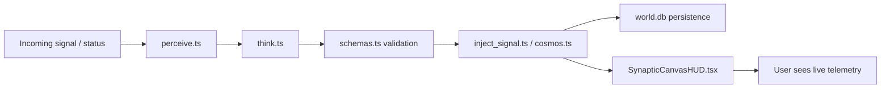

*Generated by GitHub Scout Agent*

## In Plain English: What We Built Today & Why It Matters

Today was basically a “tighten the bolts and clean the dashboard” kind of day. A bunch of the work went into the `agentscosomos_OMP` engine, where the team kept refining how the system perceives, thinks, and records what’s happening in the world state. On top of that, the UI got a more polished telemetry-style HUD, and the personal site got a big automated update pass with workflows and content plumbing.

Think of it like this: the core engine is the brain, the HUD is the windshield display, and `world.db` is the notebook everything writes into. The changes today made that whole setup more reliable and easier to follow, so the system can keep running without drowning in noisy diagnostics or awkward edge cases.

The other nice bit is that the public-facing side got some housekeeping too — especially around content, automation, and ignoring personal profile files that shouldn’t be tracked. So overall, less clutter, better signal, and a cleaner path for future updates.

### Project: `agentscosomos_OMP`
- **In Simple Terms**: This repo got a lot of “make the agent system smarter and cleaner” work. The engine’s perception, thinking, status checks, and signal injection all got updated, while the world state kept evolving through `world.db`.
- **What Changed**:
  - In `src/engine/perceive.ts`, `src/engine/think.ts`, and `src/engine/schemas.ts`, the agent pipeline was tuned so the system can better interpret incoming state, reason about it, and keep the data shape consistent.
  - `src/engine/check_status.ts`, `src/engine/cosmos.ts`, and `src/engine/inject_signal.ts` were updated in the later epoch work to improve status handling, routing, and signal injection behavior.
  - `src/lib/utils.ts` got touched too, which usually means some shared helper logic was adjusted to support the new flow.
  - `src/components/SynapticCanvasHUD.tsx` and `src/app/page.tsx` were updated to support the HUD/landing experience — basically making the interface better at showing the system’s telemetry and state.
  - `world.db` was updated across multiple epochs, which looks like the persistent memory layer for the whole system. It’s where the agent history, telemetry, and convergence notes are being archived.
  - Notable pushes landed on `main` from commits like `662584f`, `2d5db25`, and `098054c`, with epoch-specific work spanning 60, 76, 78, 80, 84, 89, and 90.
- **Why We Did It**:
  - The system was clearly being pushed toward cleaner telemetry, better alignment between engine pieces, and less diagnostic noise.
  - Some of the work sounds like it was about reducing jitter, improving verification, and making the agent substrate easier to trust as it scales.
  - There was also a strong “historicize the evolving substrate” vibe here — basically making sure the system doesn’t just run, but remembers what happened in a structured way.
- **Highlights**:
  - Epoch 89 focused on physical optimization and zero-allocation telemetry, which is a fancy way of saying “make it faster and stop wasting memory.”
  - Epoch 84 introduced the `SynapticCanvasHUD`, which feels like giving the app a proper mission control panel.
  - Epoch 78 landed Line 1 and ratified the Telemetry HUD Acceptance Protocol, so the UI and system state seem to be syncing up better.
  - Epoch 76 resolved a timing contradiction around browser frame jitter and telemetry requirements.
  - Overall, this looks like a steady march toward a more stable agent runtime with better observability.

### Project: `kprsnt.in`
- **In Simple Terms**: The personal site got a big automation-heavy update, mostly around keeping content, workflows, and brand-related jobs in sync.
- **What Changed**:
  - Commit `d7638aa` added an auto-update pass for “Swarm Memory, Daily Views & Telemetry.”
  - A huge set of files changed — 230 in total — including `.cursor/rules/ponytail.mdc`, `.github/copilot-instructions.md`, and a bunch of GitHub Actions workflows like `blog.yml`, `brand_tracker.yml`, `daily_jobs_pipeline.yml`, `ecosystem_agents.yml`, `jobs.yml`, and `pharma.yml`.
  - That tells me the site isn’t just a static portfolio anymore; it’s wired into a fairly active automation pipeline that handles publishing, tracking, and scheduled jobs.
- **Why We Did It**:
  - This kind of update is usually about keeping the site’s content fresh without doing everything by hand.
  - The workflow files suggest the goal was to make the site and its surrounding content ecosystem more self-updating and less fragile.
  - Also, anything involving copilot instructions and cursor rules usually means the repo is being tuned for smoother AI-assisted editing.
- **Highlights**:
  - The scale of the change is the standout here: 230 files touched is basically a “full systems tune-up,” not a tiny patch.
  - The repo seems to be moving toward a more managed content pipeline, which should make future blog and automation updates a lot less annoying.

### Project: `mSeat`
- **In Simple Terms**: This repo got a small but useful cleanup: `.gitignore` was updated so personal LinkedIn/profile data files don’t get accidentally committed.
- **What Changed**:
  - Commit `chore: add LinkedIn and profile data files to .gitignore` updated `.gitignore` with 5 additions and 1 removal.
  - This means the repo now has a better boundary around what belongs in source control and what should stay local/private.
- **Why We Did It**:
  - Profile data and LinkedIn-related files are the kind of thing you really don’t want floating around in git history.
  - This is one of those boring-but-important fixes that saves headaches later, especially if the repo gets shared, cloned, or automated.
- **Highlights**:
  - Tiny change, big practical value.
  - It’s the software equivalent of putting the sensitive papers in a drawer instead of leaving them on the desk.

### Project: content/blog notes and case study drafts
- **In Simple Terms**: A bunch of writing assets were updated or added, mostly around engineering stories and opinion pieces.
- **What Changed**:
  - Files like `mSeat_worked.md`, `mseat-engineering-story-mbbs.md`, and `mseat-engineering-story-mbbs-counselling-predictior.md` were part of the recent content set.
  - There were also broader notes like `retail-shelf-intelligence-engineering-story.md`, `Who won the AI race in India - Gemini or ChatGPT.md`, `sample.md`, and `cricket_group_stage_cwct20.md`.
  - These look like long-form case studies and commentary pieces that document the engineering work and related thinking.
- **Why We Did It**:
  - This kind of writing usually supports the product story: explaining what was built, why it matters, and how the system works under the hood.
  - It also helps turn engineering work into something reusable for blogs, portfolios, and demos.
- **Highlights**:
  - The mSeat writeups are especially detailed, framing the product as a discrete allocation engine for MBBS counseling at serious scale.
  - The retail shelf story shows the same pattern: quick prototyping, real-world failure, then a stronger production-ready system.
  - These notes make the repo feel less like a pile of code and more like a running engineering journal.

Things are in a pretty good place right now: the agent core is getting sturdier, the HUD is more useful, and the site/content automation is clearly getting more mature. Next up, I’d expect even more polish around the telemetry flow and probably another round of cleanup on the publishing side so the whole thing keeps feeling fast and low-maintenance.