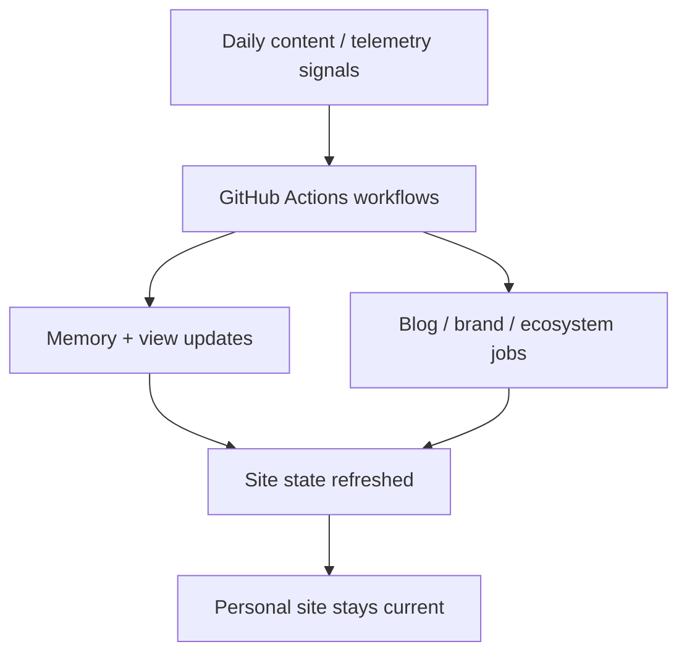

*Generated by GitHub Scout Agent*

## In Plain English: What We Built Today & Why It Matters

Today was basically two lanes of work: one was writing up the story of a big project, and the other was tightening the machine that keeps the site and automation running.

Think of it like this: one hand was polishing the “about the journey” part, while the other hand was oiling the gears under the hood so the whole thing keeps humming. The result is better documentation for humans and a healthier automation setup for the site itself.

Why it matters: the blog post helps future readers understand the engineering thinking behind the work, and the GitHub automation update makes sure daily views, swarm memory, and telemetry keep flowing without manual babysitting. That’s the kind of boring-but-important plumbing that saves a ton of time later.

---

### Project: `agentscosomos_OMP`
- **In Simple Terms**: A new long-form blog post was added that looks back on a 100-epoch journey and turns it into a proper retrospective.
- **What Changed**:
  - Added `posts/the-century-arc-from-void-to-autonomous-polis.md`
  - The file was a full write-up, not a tiny note — about **235 lines added**
  - It reads like a chronicle of the project’s evolution, likely tying together the larger autonomous-agent story and the lessons learned along the way
- **Why We Did It**:
  - This kind of post is useful when a project has enough history that people need the “how we got here” version, not just the latest feature list
  - It gives the work some narrative shape, which helps both readers and future maintainers understand the bigger picture
- **Highlights**:
  - This is the kind of content that turns a pile of progress into a story people can actually follow
  - Good move for discoverability too, since long-form retrospective posts tend to become reference points later

### Project: `kprsnt.in`
- **In Simple Terms**: The personal site got a big automated refresh across workflows and config, mostly around memory tracking, daily views, telemetry, and agent instructions.
- **What Changed**:
  - Commit: `46efb7f` — `🤖 Auto-update: Swarm Memory, Daily Views & Telemetry`
  - Touched **233 files**, which is a pretty loud signal that this was a broad automation sweep rather than a single feature
  - Updated `.cursor/rules/ponytail.mdc` and `.github/copilot-instructions.md`
    - These likely shape how the coding agents behave and what style/rules they follow
  - Updated multiple GitHub Actions workflows:
    - `.github/workflows/blog.yml`
    - `.github/workflows/brand_tracker.yml`
    - `.github/workflows/daily_jobs_pipeline.yml`
    - `.github/workflows/ecosystem_agents.yml`
    - `.github/workflows/jobs.yml`
    - `.github/workflows/pharma.yml`
  - The naming suggests the site now has more automated jobs for:
    - publishing or syncing blog content
    - tracking brand/activity signals
    - running daily pipelines
    - coordinating ecosystem/agent tasks
    - handling telemetry and memory-style updates
- **Why We Did It**:
  - Manual updates across a site like this get messy fast, so automation keeps the whole thing from turning into a spreadsheet held together by hope
  - The workflow updates probably help the site stay current with fresh content, tracked views, and agent-generated state
  - Adding clearer agent instructions also helps keep future auto-edits consistent instead of random
- **Highlights**:
  - The big win here is scale: instead of one-off tweaks, this looks like the site’s automation layer got a serious tune-up
  - “Swarm Memory” and “Daily Views” sound like the site is now remembering more about what happened and surfacing it in a structured way
  - This is the kind of plumbing that quietly makes the whole project feel alive

### Project: `mSeat`
- **In Simple Terms**: No direct code commit showed up in the raw activity today, but the recent case-study notes make it clear the project is still being documented and productized hard.
- **What Changed**:
  - The latest engineering write-ups describe `mSeat` as a **1-click MBBS mock counselling engine**
  - The system is framed as a discrete allocation simulator built for **18,000+ Telangana NEET aspirants**
  - The story highlights how it predicts allotments with very tight accuracy — in one case, within a **2-college preference delta**
  - Related write-ups:
    - `mseat-engineering-story-mbbs.md`
    - `mseat-engineering-story-mbbs-counselling-predictior.md`
  - These notes describe the architecture around:
    - rank-to-seat simulation
    - reservation-aware allocation
    - handling changing seat counts and counselling rules
- **Why We Did It**:
  - MBBS counselling is chaotic, and old cutoff sheets are basically trying to predict weather with last year’s umbrella
  - The real problem is that seat allotment depends on a bunch of moving parts: rank, category, local quota, reservation buckets, and updated seat availability
- **Highlights**:
  - The standout metric here is the prediction quality: **within two college choices** for a huge competitive pool
  - The case study also calls out the scale: **18,000+ aspirants** competing for roughly **6,000+ seats**
  - That’s a strong sign the underlying allocation logic is doing real work, not just making pretty charts

### Project: `retail-shelf-intelligence-engineering-story.md`
- **In Simple Terms**: This looks like a major write-up of the retail shelf intelligence system, showing how a rough computer vision prototype got turned into something much more production-ready.
- **What Changed**:
  - The case study describes a pivot from a broken heuristic model into a dual-mode vision pipeline
  - It mentions:
    - on-prem edge CV
    - multimodal VLM flow
    - OpenAI `gpt-5.4-mini`
    - Hugging Face ZeroGPU
    - FastAPI
    - MCP integration
  - The architecture story says the first version was drawing boxes on ceiling lights, which is a very relatable “yep, the model is confused” moment
  - The new setup appears to support both:
    - a faster edge/on-prem mode
    - a richer model-assisted mode for harder scenes
- **Why We Did It**:
  - Supermarket aisles are messy: weird lighting, crowded shelves, reflective surfaces, and lots of visual junk
  - A simple heuristic falls apart fast in the real world, so the system needed a smarter fallback path
  - ZeroGPU and platform constraints also forced a build that could survive deployment friction, not just look good locally
- **Highlights**:
  - The sprint was described as being done in **under 1.5 hours**, which is wild
  - That’s a nice example of using the right model/tools to collapse iteration time
  - The frontend also got an “editorial luxury” treatment, so this wasn’t just backend plumbing — the presentation got upgraded too

## Where Things Stand

Overall, today was a mix of making the story clearer and making the automation sturdier. The site and its agent workflows got a serious behind-the-scenes refresh, while the project write-ups turned a bunch of engineering work into something easier to understand and reuse.

Next up, it looks like the natural move is to keep tightening the daily automation loop and keep shipping more of these case-study style posts. That’s the kind of combo that makes the whole ecosystem feel less like a pile of repos and more like a connected system.