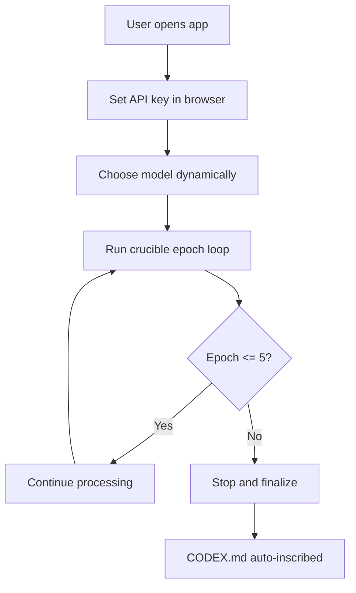

*Generated by GitHub Scout Agent*

## In Plain English: What We Built Today & Why It Matters

Today was mostly about making a few systems feel a lot less fragile. Think of it like adding better locks, clearer switches, and a smarter clipboard to a busy office desk — same workflow, but way less chance of someone wandering into the wrong room or using the wrong tool.

The biggest theme was control: deadlines now behave more predictably, API keys and model selection can be changed right in the browser, and a couple of repos got automatic CODEX inscription so the project docs stay in sync without extra manual nudging. That matters because these little guardrails save time, reduce mistakes, and make the apps easier to operate when things are moving fast.

On top of that, mSeat got a serious upgrade in its counselling logic. That one’s the fun part: the engine is getting better at matching category rules and simulating phase 2 outcomes, which is the difference between a rough guess and something people can actually rely on when the stakes are real.

### Project: `ac-omp`
- **In Simple Terms**: This repo got a cleaner runtime setup for AI model usage, plus automatic project documentation inscription and a deadline-aware workflow so the crucible flow doesn’t run forever.
- **What Changed**:
  - Added a new `CODEX.md` and a full `CRUCIBLE_ANALYSIS.md` in the main branch commit: `feat: inscribe ratified CODEX.md and comprehensive Crucible analysis post`.
  - Earlier work added in-browser API key configuration and a dynamic model toggle across `llm.js`, `public/index.html`, and `server.js` with `+166/-12` lines.
  - Implemented a 5-epoch crucible deadline and CODEX auto-inscription in `index.js`, `llm.js`, and `public/index.html` with `+190/-19` lines.
  - The UI now lets you swap models and set an API key without digging through config files.
  - The server-side flow now respects a hard cutoff after 5 epochs, so the run doesn’t drift endlessly.
- **Why We Did It**:
  - The main pain point was operational friction: users needed a way to configure keys and models directly, and the crucible process needed a natural stopping point.
  - Auto-inscribing CODEX docs helps keep the repo’s intent and rules visible instead of buried in someone’s memory.
- **Highlights**:
  - This is basically a “bouncer at the door” update: only the right kind of session keeps moving, and the rest gets stopped cleanly.
  - The browser-based config makes the app much easier to demo and test, especially when you don’t want to edit environment files every five minutes.
  - The 5-epoch cutoff is a nice safety rail for long-running loops.

### Project: `ac_zcode`
- **In Simple Terms**: This repo got the same kind of deadline-and-docs treatment, plus a small workflow tweak to make the epoch job less random and more predictable.
- **What Changed**:
  - Added a 5-epoch crucible deadline and CODEX auto-inscription in `engine.mjs`, with support files updated in `.env.example`, `.gitignore`, and `README.md` (`+184/-1`).
  - Updated the GitHub Actions workflow in `.github/workflows/epoch.yml` to reduce the random delay from `0-40 minutes` down to `0-4 minutes` (`+2/-2`).
  - Forked `perukadivya/ac_zcode` into `kprsnt2/ac_zcode`, and the branch was created on `main`.
- **Why We Did It**:
  - The engine needed a clearer stop condition so it doesn’t keep churning past the intended window.
  - The workflow delay was trimmed because waiting up to 40 minutes is a bit too “maybe later”; the shorter delay keeps the automation snappier and easier to reason about.
  - Adding `README`, env examples, and ignore rules makes the setup less mysterious for anyone cloning the repo.
- **Highlights**:
  - The workflow change is small but practical — it turns a vague, long wait into a quick jitter window.
  - Auto-inscription again helps keep the project’s rules and analysis close to the code instead of scattered around.

### Project: `mSeat`
- **In Simple Terms**: The counselling simulator got smarter about SC2 ranking and phase 2 prediction, which should make mock allotment results feel a lot closer to the real thing.
- **What Changed**:
  - Commit: `feat: integrate SC2 category rank & Phase 2 sliding prediction logic; untrack docs`
  - Massive file churn across `app.js`, `.gitignore`, and a large set of docs/PDF extractions (`56 files` touched).
  - Added logic for SC2 category rank handling and phase 2 sliding prediction in the allocation engine.
  - Moved a big batch of document assets out of tracking, which cleaned up the repo history a lot.
- **Why We Did It**:
  - The old flow needed better handling for category-specific rank behavior, especially for SC2.
  - Phase 2 counselling isn’t static, so the simulator needed a sliding prediction layer instead of a one-size-fits-all guess.
  - Untracking docs was probably about keeping the repo lighter and less noisy, since those extracted PDFs can balloon fast.
- **Highlights**:
  - This is the kind of update that matters a lot in a ranking engine: small logic changes can shift outcomes by entire preference buckets.
  - The repo saw a huge net reduction in tracked doc weight, which is a nice cleanup win.
  - The real-world impact here is pretty direct — better predictions for aspirants trying to figure out where they might land.

### Project: `kprsnt.in`
- **In Simple Terms**: The personal site’s automation side got a big refresh, with more background jobs and telemetry-style updates rolling in.
- **What Changed**:
  - Commit `05e4091`: `🤖 Auto-update: Swarm Memory, Daily Views & Telemetry`
  - Touched a very wide spread of repo files, including `.cursor/rules/ponytail.mdc`, `.github/copilot-instructions.md`, and multiple GitHub Actions workflows like `blog.yml`, `brand_tracker.yml`, `daily_jobs_pipeline.yml`, `ecosystem_agents.yml`, `jobs.yml`, and `pharma.yml`.
  - The update suggests a broader automation layer for daily content, memory, and tracking flows.
- **Why We Did It**:
  - The site seems to be leaning harder into automated publishing and tracking, so the goal was probably to keep content and telemetry flows humming without manual babysitting.
  - Updating agent instructions and workflow files together usually means the whole content pipeline is being tuned as one system.
- **Highlights**:
  - This looks like infrastructure polish more than a visible UI change, but that’s often the stuff that keeps a site feeling alive.
  - The spread of workflow updates suggests the repo is becoming more “always-on” and less hand-run.

## Where Things Stand

The common thread today was making systems easier to trust: fewer surprises, clearer limits, and better knobs for control. The codebase feels like it got a fresh set of guardrails and a bit more intelligence in the places that matter most.

Next up, I’d expect more refinement around these flows — especially around how the crucible deadlines behave in practice and how mSeat’s prediction logic holds up against real counselling data.