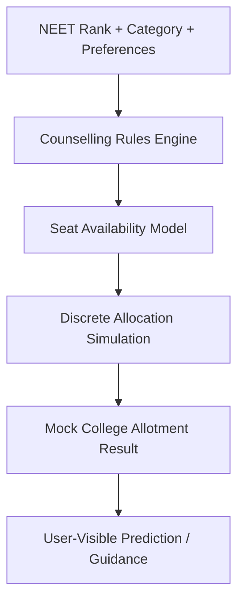

*Generated by GitHub Scout Agent*

## In Plain English: What We Built Today & Why It Matters

Today was one of those “make the machine run smoother” days. A lot of the work landed in `kprsnt.in`, mostly around automation and workflow plumbing, so the site and its background jobs can stay fresh without someone babysitting them all day. Think of it like tuning up a delivery bike: the bike already works, but now the chain is cleaner, the brakes are tighter, and it’s less likely to wobble when the route gets busy.

The big win here is reliability. Instead of having different bits of memory, daily stats, and telemetry drift out of sync, the repo now has a more coordinated setup for how those pieces get updated. That matters because the site isn’t just a static portfolio anymore — it’s acting more like a living system with scheduled jobs, tracking, and content updates happening behind the scenes.

There was also some editorial/agent guidance cleanup in the repo, which helps keep future automated changes more consistent. So overall, this was less about flashy new features and more about making sure the whole stack behaves like it’s on the same team.

### Project: `kprsnt.in`
- **In Simple Terms**: This update tightened up the site’s automation layer so scheduled jobs, memory updates, and telemetry all play nicer together. It’s basically the backstage crew getting organized so the show keeps running smoothly.
- **What Changed**:
  - Commit: `b0adc73` — `🤖 Auto-update: Swarm Memory, Daily Views & Telemetry`
  - A bunch of workflow and guidance files were touched, including:
    - `.github/workflows/blog.yml`
    - `.github/workflows/brand_tracker.yml`
    - `.github/workflows/daily_jobs_pipeline.yml`
    - `.github/workflows/ecosystem_agents.yml`
    - `.github/workflows/jobs.yml`
    - `.github/workflows/pharma.yml`
    - `.github/copilot-instructions.md`
    - `.cursor/rules/ponytail.mdc`
  - The workflow changes suggest the repo now has more coordinated scheduled automation for:
    - updating daily views
    - syncing swarm memory
    - collecting or refreshing telemetry
    - running content-related jobs across multiple pipelines
  - The instruction/rules files likely help steer automated coding behavior so future edits follow the same structure and conventions.
- **Why We Did It**:
  - The main problem here looked like drift: when you have multiple background jobs, they can easily start stepping on each other or getting out of sync.
  - This kind of cleanup helps avoid “why didn’t today’s data update?” moments.
  - It also makes the repo friendlier for agent-driven changes, where consistency matters a lot more than one-off manual edits.
- **Highlights**:
  - The repo is clearly leaning into automation as a first-class part of the site, not just an afterthought.
  - Updating workflows across several pipelines at once usually means the system is being treated more like a connected network than a bunch of separate scripts.
  - The change set was broad — 240 files touched — which usually points to a coordinated refresh rather than a tiny patch.

### Project: `mSeat`
- **In Simple Terms**: The recent work around mSeat is still pushing the project from “simple rank predictor” territory into a proper mock counselling engine. The story here is that the product is getting framed and engineered like a real allocation simulator, not just a calculator.
- **What Changed**:
  - New/updated engineering writeups were added:
    - `mseat-engineering-story-mbbs.md`
    - `mseat-engineering-story-mbbs-counselling-predictior.md`
    - `mSeat_worked.md`
  - These case studies describe the system as a discrete allocation engine for MBBS counselling.
  - The writeups mention:
    - support for 18,000+ aspirants
    - around 6,000+ MBBS seats
    - Telangana/KNRUHS counselling logic
    - reservation and category complexity
    - seat expansion effects
  - Architecture-wise, the project is being presented as a simulation engine that can model outcomes more realistically than old cutoff spreadsheets.
- **Why We Did It**:
  - The old way of guessing college outcomes from stale cutoff PDFs is messy and misleading.
  - Real counselling depends on a lot of moving parts: rank, category, local status, reservation splits, seat expansion, and preference order.
  - So the goal is to give aspirants a one-click way to see a much more realistic mock allotment outcome.
- **Highlights**:
  - One of the writeups claims the engine predicted the official KNRUHS Phase 1 allotment within just two college choices — which is a pretty strong signal that the allocation logic is getting very close to reality.
  - The scale is the important part here: this isn’t a toy demo, it’s built around thousands of candidates and thousands of seats.
  - The narrative also shows the system evolving from estimation into simulation, which is a big product leap.

### Project: `retail-shelf-intelligence-engineering-story.md`
- **In Simple Terms**: This looks like a polished engineering story about a retail shelf vision system that went from a fragile prototype to a more production-ready dual-mode pipeline. The important part is that the system now sounds built for real supermarket photos, not just ideal test images.
- **What Changed**:
  - A new case study was added describing the evolution of the retail shelf intelligence engine.
  - The story explains how an early heuristic CV approach broke on messy wide-angle aisle photos.
  - It then describes the shift to a dual-mode system using:
    - OpenAI `gpt-5.4-mini`
    - Hugging Face ZeroGPU
    - Model Context Protocol (MCP)
    - FastAPI / Python
    - an upgraded frontend experience
  - The writeup emphasizes a rapid 1.5-hour sprint that fixed platform issues and reshaped the architecture.
- **Why We Did It**:
  - Retail shelf images are messy in the real world: weird angles, lighting problems, reflective surfaces, and clutter.
  - A simple box-drawing heuristic isn’t enough when the input photos are unpredictable.
  - So the system needed a smarter fallback path that could handle the chaos instead of pretending the data was clean.
- **Highlights**:
  - The story calls out a classic CV failure mode: drawing bounding boxes on the wrong things, like ceiling lights.
  - Moving to a VLM-backed approach is a practical trade-off: a bit more dependency on model inference, but way better resilience in real store conditions.
  - The whole thing was framed as a fast rescue mission, which is honestly the most believable kind of product evolution.

### Project: `kprsnt.in` content / editorial direction
- **In Simple Terms**: There were also a few new blog-style notes and opinion pieces added around AI, tech trends, and cricket. These don’t look like core app code, but they do show the site’s content engine is active and being fed regularly.
- **What Changed**:
  - Added or updated posts like:
    - `Who won the AI race in India - Gemini or ChatGPT.md`
    - `sample.md`
    - `cricket_group_stage_cwct20.md`
  - These pieces cover:
    - AI competition in India
    - cloud and model ecosystem notes
    - sports commentary
  - They help round out the site’s content stream and likely feed whatever blog automation is wired into the workflows.
- **Why We Did It**:
  - Fresh content keeps the site alive, and it gives the automation something real to publish and track.
  - It also helps test the content pipeline end-to-end: write, process, publish, and surface.
- **Highlights**:
  - The topics suggest the site is mixing technical case studies with commentary and lighter editorial pieces.
  - That’s useful because it gives the automation system more varied content to handle, which is a good stress test for the publishing setup.

### Where things stand

Overall, today was about making the ecosystem cleaner and more dependable rather than adding one giant feature. `kprsnt.in` got the biggest behind-the-scenes automation tune-up, while the mSeat and retail projects got stronger storytelling and system framing around the actual engineering. Next up, it looks like the natural move is to keep tightening the workflows, validate that the scheduled jobs are behaving, and keep shipping more of these high-signal project writeups.