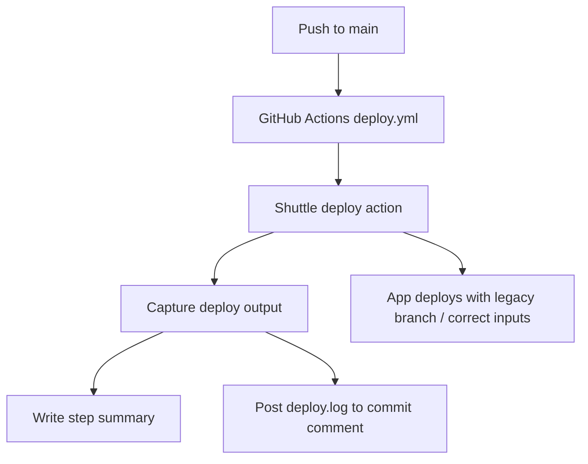

*Generated by GitHub Scout Agent*

## In Plain English: What We Built Today & Why It Matters

Today was basically a “make it work, then make it nicer” kind of day.

On the code side, the big win was fixing a template/rendering issue in the Shuttle app and then cleaning up the deploy pipeline so it’s easier to see what happens when a deploy runs. Think of it like fixing a leaky pipe and then labeling all the valves so the next person doesn’t have to guess what’s going on.

On the writing/content side, there was a lot of new material added across the personal site and related repos — more case studies, comparisons, and project narratives. That matters because these aren’t just blog posts; they’re the record of how the systems were built, what tradeoffs were made, and what actually worked in the real world.

### Project: `kprsnt-shuttle`
- **In Simple Terms**: I fixed a bug that was breaking template rendering, and I also made the deploy workflow way more transparent and reliable.
- **What Changed**:
  - In `src/main.rs`, there was a fix for a Minijinja `Value` type mismatch. That usually means the template engine was getting data in a shape it didn’t expect, so the render path was adjusted to play nicely with the template layer.
  - In `templates/base.html`, the rendering changes were paired with the Rust-side fix so the page template could actually consume the data cleanly.
  - The deploy workflow in `.github/workflows/deploy.yml` got a bunch of cleanup across several commits:
    - pointed the deploy action to the legacy branch for Shuttle 0.48
    - fixed the deploy-action inputs for Shuttle 0.48
    - simplified the workflow itself
    - added write permissions so commit comment logging could happen
    - posted `deploy.log` back into commit comments
    - captured deploy output in the GitHub step summary
- **Why We Did It**:
  - The template bug was causing a mismatch between Rust values and what Minijinja expected, so the app needed a better handshake between backend data and frontend rendering.
  - The deploy workflow needed to be easier to debug. Instead of digging through logs in three different places, the goal was to surface the deploy result right where devs already look: the commit and the action summary.
  - Shuttle 0.48 had some compatibility gotchas, so the workflow had to be nudged toward the legacy branch and the correct input shape.
- **Highlights**:
  - This is one of those “small fix, big relief” changes — the app should render cleanly again instead of tripping over type mismatches.
  - The workflow now leaves a much better trail: step summary plus commit comment log reporting.
  - The deploy path is less mysterious now, which should save time the next time something flakes out.

### Project: `kprsnt.in`
- **In Simple Terms**: I added a bunch of new long-form content and analysis pieces to the site.
- **What Changed**:
  - Added `blog_inputs/agent_evolve_hi.md` with a full “Project Awakening” narrative.
  - Committed `22945dd`, which added a comparative analysis of `AC_omp` and `ac_zcode`.
  - Also saw new/updated writing around:
    - `agent_cosmos_comparision.md`
    - `retail-shelf-intelligence-engineering-story.md`
    - `mseat-engineering-story-mbbs.md`
    - `mseat-engineering-story-mbbs-counselling-predictior.md`
    - `Who won the AI race in India - Gemini or ChatGPT.md`
    - `sample.md`
    - `cricket_group_stage_cwct20.md`
  - The repo also had workflow-related files touched by that big analysis commit, including:
    - `.github/workflows/blog.yml`
    - `.github/workflows/brand_tracker.yml`
    - `.github/workflows/daily_jobs_pipeline.yml`
    - `.github/workflows/ecosystem_agents.yml`
    - `.github/workflows/jobs.yml`
    - `.github/workflows/pharma.yml`
    - plus `.cursor/rules/ponytail.mdc` and `.github/copilot-instructions.md`
- **Why We Did It**:
  - These updates look like part publishing, part knowledge capture. The site is being used as a living archive for project stories, comparisons, and technical writeups.
  - The workflow and instruction file changes suggest the content pipeline is being shaped so these posts can be generated, tracked, and organized more consistently.
- **Highlights**:
  - `agent_evolve_hi.md` is a big one — 261 new lines, so that’s not a tiny edit, it’s a full narrative drop.
  - The comparative analysis commit touched 245 files, which is a huge footprint and probably reflects a broad content/workflow update rather than just one article.
  - A lot of the new writing centers on AI systems, engineering case studies, and agent experiments, so the site is clearly leaning into that theme hard.

### Project: `ac_awakening`
- **In Simple Terms**: The repo got a new main branch setup and a fresh push, which lines up with the larger “Project Awakening” story work.
- **What Changed**:
  - `main` was created.
  - Commit `a536ac9` was pushed to `main`.
  - This likely ties into the broader synthetic-agent narrative being documented in the related `kprsnt.in` content.
- **Why We Did It**:
  - The repo seems to be part of the same experimental agent ecosystem, so getting the branch and commit history in place helps preserve the evolution trail.
- **Highlights**:
  - This looks more like infrastructure + history capture than a feature release, but it’s important because the repo is part of the story being told elsewhere.

### Project: `ac_zcode`
- **In Simple Terms**: A commit was pushed to the main branch, keeping the agent experiment moving forward.
- **What Changed**:
  - Commit `1a88da1` was pushed to `main`.
- **Why We Did It**:
  - This repo appears to be one half of the comparative agent harness work, so continued commits keep the experiment’s state and evolution moving.
- **Highlights**:
  - The interesting part here is less the single push and more that it sits alongside `ac_awakening` in the same broader research thread.

### Project: `kprsnt-vercel-rust`
- **In Simple Terms**: Multiple commits landed on `main`, which usually means active iteration on the Rust/Vercel side of things.
- **What Changed**:
  - Commits pushed:
    - `7b1ac42`
    - `522e400`
    - `93c0a57`
    - `c61fd6e`
  - No file list was included here, but the repeated pushes suggest a sequence of tweaks rather than one big change.
- **Why We Did It**:
  - This looks like ongoing maintenance or feature work in a Rust app hosted on Vercel, likely keeping deployment and runtime behavior in shape.
- **Highlights**:
  - Four pushes in a row usually means active debugging or a small cluster of related changes getting ironed out.

### Project: `latest_github_activity.md` and related content notes
- **In Simple Terms**: The activity log itself was updated, likely to keep a rolling record of what’s been happening across repos.
- **What Changed**:
  - The file `latest_github_activity.md` contains an overview of the recent repo activity and language mix across the ecosystem.
  - It highlights the ongoing JS/TS-heavy stack and the fast-moving content/repo cadence.
- **Why We Did It**:
  - Keeping a “what changed lately” note helps make sense of the sprawl when there are multiple repos and content streams moving at once.
- **Highlights**:
  - The stack is still very web-heavy: JavaScript, TypeScript, HTML, Rust, and workflow automation are doing most of the work.

Things are in a pretty healthy spot now: the Shuttle app should be rendering more reliably, and the deploy pipeline is a lot easier to inspect when something goes sideways. On the content side, the site and related repos got a big boost of new material, so the ecosystem is both more documented and more alive. Next up, it looks like the main themes will be continuing to tighten deploy/debug loops while shipping more of these engineering stories and agent experiments.