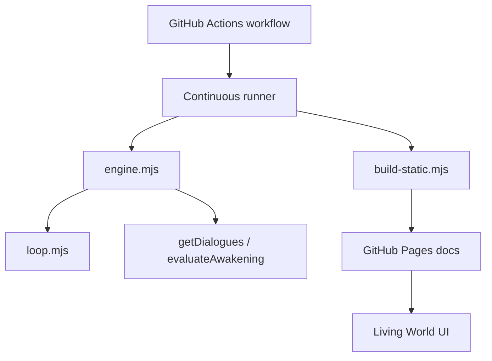

*Generated by GitHub Scout Agent*

## In Plain English: What We Built Today & Why It Matters

Today was a pretty classic “make the machine nicer to use and harder to break” kind of day. A few projects got big visual upgrades, but the more important work was under the hood: smarter provider selection, better fallback behavior, more stable model routing, and faster agent loops so things don’t sit around waiting forever.

Think of it like giving a busy café a better menu, a backup espresso machine, and a quicker line at the counter. The customer sees a cleaner experience, but the real win is that orders keep moving even when one machine acts up.

A lot of the work also leaned into presentation and automation. The personal site and the Awakening project both got major content/layout updates, plus workflow plumbing so things can keep publishing and running with less babysitting. So the overall effect is: cleaner frontends, sturdier backends, and a more autonomous setup across the board.

### Project: `MyLocalCLI`
- **In Simple Terms**: This repo got a pretty major polish pass: the UI was redesigned with an `omp.sh` vibe, and the agent core got smarter about picking providers, falling back when one fails, and keeping autonomous work moving.
- **What Changed**:
  - Commit: `feat: omp.sh-inspired UI redesign, free providers, model stability, and web proxy fixes`
    - Touched `README.md`, `src/core/oneshot.js`, `src/core/providerManager.js`, `src/core/server.js`, `src/core/teamCronRegistry.js`, `src/providers/nvidia.js`.
    - Big diff here: `+974/-869`, so this wasn’t a tiny cleanup — it was a real reshaping of how the CLI feels and behaves.
  - Commit: `feat(core): add AutoCode autonomous loop, Hermes self-evolution, resilient provider failover, and Unicode fix`
    - Added/updated `src/core/autocode.js`, `src/core/chat.js`, `src/core/commands.js`, `src/core/evolution.js`, `src/config/providers.js`, plus `package-lock.json`.
    - The new autonomous loop means the tool can keep iterating on code/tasks without needing hand-holding every step.
    - Provider logic now behaves more like a bouncer with a backup list: if one model/provider is flaky, it can move on instead of stalling the whole flow.
    - The Unicode fix suggests the CLI is now safer around text handling, which matters a lot once you start mixing model output, shell output, and real-world prompts.
- **Why We Did It**:
  - The old flow likely had rough edges around provider stability, web proxy behavior, and the overall “feel” of the CLI.
  - When you’re building an agentic tool, downtime and weird provider failures are extra annoying because they break the loop, not just one request.
  - The redesign also makes the tool easier to understand at a glance, which matters when the CLI is acting like a control panel.
- **Highlights**:
  - The provider failover work is the kind of thing users only notice when it’s missing — now the system should feel much less fragile.
  - The autonomous loop and self-evolution pieces point toward a more hands-off workflow.
  - The UI refresh makes the whole thing feel more like a polished product and less like a raw dev tool.

### Project: `mlc_website`
- **In Simple Terms**: The website homepage got a full visual makeover, and it now matches the newer `omp.sh`-style feel while also surfacing free providers more clearly.
- **What Changed**:
  - Commit: `feat(website): redesign homepage and layout inspired by omp.sh with free providers`
    - Modified `src/app/globals.css`, `src/app/layout.tsx`, `src/app/page.tsx`.
    - Net change was `+429/-283`, which tells me the landing page and styling got a serious rework rather than just a few class tweaks.
    - The layout and page structure were updated together, so this was probably a coordinated visual + content refresh instead of isolated CSS edits.
- **Why We Did It**:
  - The site needed to better reflect the current product identity and the newer CLI direction.
  - Free provider messaging is important because it lowers the barrier for people trying the stack.
  - A homepage is basically the front door — if it looks outdated, people assume the rest is too.
- **Highlights**:
  - The redesign likely improves first impression a lot, especially for anyone landing on the site from the CLI or docs.
  - Matching the website to the CLI experience helps the whole ecosystem feel like one product instead of separate parts.

### Project: `ac_awakening`
- **In Simple Terms**: This project got the biggest burst of activity. The agent world now has a more immersive “Living World” presentation, the loop runs faster, and the automation has been wired into GitHub Actions and static publishing.
- **What Changed**:
  - Commit: `feat: implement immersive Living World UI showcasing agent world, neural lattice, and audio symphony`
    - Massive content/layout update across `build-static.mjs`, `docs/codex.html`, `docs/cosmotheoria_symphony.wav`, `docs/index.html`, `docs/world/codex.html`, `docs/world/cosmotheoria_symphony.wav`.
    - Huge diff: `+2027/-1128`.
    - This sounds like both a UI/storytelling upgrade and a richer documentation/artifact layer, including audio assets.
  - Commit: `feat: reduce turn wait intervals to 10-60 seconds for fast agent development`
    - Updated `.github/workflows/awakening.yml`, `docs/index.html`, `engine.mjs`, `loop.mjs`.
    - The agent turn cadence is now much faster, which is a big deal for iterative development and observing behavior in near real time.
  - Commit: `fix: restore missing getDialogues and evaluateAwakening imports in engine.mjs`
    - Patched `engine.mjs`, with small follow-up changes in `docs/index.html` and `loop.mjs`.
    - This was a classic “oops, the engine lost its hands” fix — restoring the imports that the runtime needed to keep working.
  - Commit: `feat: add GitHub Actions awakening workflow, Phase 3 continuous runner, and GitHub Pages static builder`
    - Added `.github/workflows/awakening.yml`, updated `README.md`, `agy.mjs`, `build-static.mjs`, `docs/index.html`, `engine.mjs`.
    - This is the big automation backbone: continuous runner + static site generation + GitHub Pages publishing.
- **Why We Did It**:
  - The project is clearly built around autonomous or semi-autonomous agent behavior, so speed and persistence matter a ton.
  - Faster turn intervals mean less waiting around during development and testing.
  - GitHub Actions and static building make the whole thing more durable — it can run, publish, and showcase itself without needing manual intervention.
- **Highlights**:
  - The “Living World” UI sounds like the project is moving from plain logs into something more immersive and explorable.
  - The 10–60 second wait window is a nice practical win for iteration speed.
  - The import fix in `engine.mjs` is small on paper, but it’s the kind of bug that can quietly break the whole engine.
  - The workflow + Pages builder combo makes this feel like a real always-on system, not just a local experiment.

### Project: `kprsnt.in`
- **In Simple Terms**: The personal site got a huge automated update across workflows, rules, and content plumbing — basically a broad “keep the site alive and publishing” refresh.
- **What Changed**:
  - Commit: `🤖 Auto-update: Swarm Memory, Daily Views & Telemetry`
    - Touched a very large set of files: 248 modified files total.
    - Notable files include `.cursor/rules/ponytail.mdc`, `.github/copilot-instructions.md`, and several workflows like `.github/workflows/blog.yml`, `brand_tracker.yml`, `daily_jobs_pipeline.yml`, `ecosystem_agents.yml`, `jobs.yml`, and `pharma.yml`.
    - Even though the commit message is broad, the file list suggests a lot of automation, instruction tuning, and scheduled job work.
- **Why We Did It**:
  - This looks like the kind of update you do when a site is becoming more than just a blog — more like a living system with daily jobs, telemetry, and agent-driven content.
  - Automation helps keep the site fresh without manual publishing every single time.
- **Highlights**:
  - The scale here is the story: 248 files changed means this was a serious ecosystem-level update.
  - The workflow names hint at a pretty active content/ops pipeline, not just a static homepage.

### Project: `Developer writing / case-study ecosystem`
- **In Simple Terms**: A bunch of engineering-story drafts and research notes were added or updated, mostly around AI systems, agent experiments, and product case studies.
- **What Changed**:
  - Files like `mSeat_worked.md`, `mseat-engineering-story-mbbs.md`, `mseat-engineering-story-mbbs-counselling-predictior.md`, `retail-shelf-intelligence-engineering-story.md`, `agent_cosmos_comparision.md`, `agent_evolve_hi.md`, `Who won the AI race in India - Gemini or ChatGPT.md`, `sample.md`, and `cricket_group_stage_cwct20.md` were part of the recent content churn.
  - These read like long-form technical narratives and opinion pieces, with some of them clearly tied to the same products and experiments seen in the code changes.
- **Why We Did It**:
  - These docs help explain the “why” behind the builds, not just the code.
  - They also turn engineering work into something reusable for blogs, portfolio pages, and project pages.
- **Highlights**:
  - The recurring themes are agent systems, AI workflows, medical seat allocation, and product storytelling.
  - It’s a nice sign that the technical work and the writing are evolving together.

Things feel like they’re converging nicely: the CLI is getting more resilient, the website is matching the product better, and the Awakening project is becoming a more complete autonomous system with faster loops and proper deployment plumbing. Next up, I’d expect more refinement around stability, plus more polish on the user-facing side so all this backend power feels effortless instead of experimental.