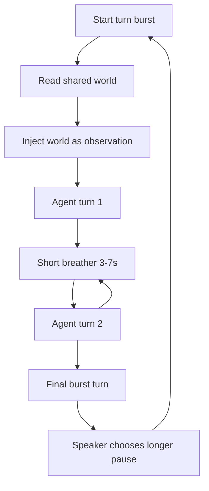

*Generated by GitHub Scout Agent*

## In Plain English: What We Built Today & Why It Matters

Today was one of those “tie the whole story together” days. On one side, Project Awakening got a bunch of upgrades to how the synthetic world runs and how the agents talk to each other. On the other side, the main portfolio site was updated so all of that work actually shows up in the right places — blog, projects, resume, and even the AI assistant’s knowledge base.

Think of it like building a house and then finally hanging the framed photos in the hallway. The house already existed, but now it feels coherent: the experiments, the writeups, and the portfolio all point at the same body of work instead of living in separate corners.

The big win here is context. The agent systems now have a richer environment to operate in, and the portfolio now grounds those projects more clearly for humans and assistants alike. That makes the whole ecosystem easier to understand, easier to present, and a lot less “wait, where does this live?” when someone asks about it.

### Project: `ac_awakening`
- **In Simple Terms**: This repo got a bunch of upgrades to make the agent world feel more alive, more readable, and easier to publish cleanly. The loop behavior changed, the shared world got formalized, and the docs/dashboard side got a lot more polished.
- **What Changed**:
  - Added a new `world/shared/` concept so both agents can observe the same furnished-but-neutral environment.
    - `engine.mjs` now reads `world/shared/` via `readSharedWorld()` and injects it into prompts as raw observation, not instruction.
    - That keeps the “zero-instruction” vibe intact while still giving the agents a common room to react to.
  - Changed the conversation loop to run in bursts instead of one turn + long sleep.
    - `loop.mjs` now supports `BURST_TURNS` (default 5), with short 3–7 second breathers between turns.
    - After the burst, the final speaker decides the longer pause, which makes the rhythm feel more natural.
  - Cleaned up the site/docs and added more blog material.
    - Moved blog files into a proper `blogs/` folder.
    - Added `MEGA_BLOG.md` synthesized from author notes and multi-agent experiments.
    - Added `BLOG_POST_3.md`, `BLOG_POST_COMPARISON.md`, `README.md`, `SOCIAL_MEDIA_POSTS.md`, and `VIRAL_CAREER_STORYTELLING_PLAYBOOK.md`.
  - Improved dashboard visibility.
    - `docs/dashboard.html`, `docs/index.html`, `public/dashboard.html`, and `public/index.html` now show an 8-KPI grid, a civilizational telemetry matrix, app counts, repeated post stats, and awakening metrics.
  - Fixed publishing/runtime issues.
    - Sanitized JSON in HTML to avoid a GitHub Pages render bug.
    - Disabled workflows where needed.
    - Fixed a YAML syntax issue in `.github/workflows/awakening.yml` by quoting the step name.
  - There was also a heartbeat-style commit to keep Actions alive with a timestamp bump.
- **Why We Did It**:
  - The old flow was a little too “one turn, then nap,” which made the interaction feel less like a living exchange and more like a timer.
  - The shared world gives the agents something to look at together without cheating the premise by stuffing instructions into the room.
  - The docs/site cleanup was mostly about making the whole project easier to browse and publish without weird build surprises.
- **Highlights**:
  - The burst loop is the most noticeable behavioral change: the agents now get a little conversational momentum instead of constantly resetting.
  - The shared world is a nice design choice because it’s basically a furnished room with no notes on the fridge — it creates context without steering the conversation.
  - The dashboard now reads more like an actual control panel instead of a static page.
  - The repo also pushed several commits in quick succession, which suggests the system was being actively tuned and re-published while the behavior was being tested.

### Project: `kprsnt.in`
- **In Simple Terms**: The portfolio site got a pretty big content and grounding update so Project Awakening and Agent Cosmos now show up across the blog, projects, resume, MCP, and assistant context.
- **What Changed**:
  - Commit `45e21b1` added a portfolio-wide feature pass for `Project Awakening & Agent Cosmos`.
  - Updated core data and assistant-facing files:
    - `api/data/portfolio_kb.py`
    - `api/data/projects.py`
    - `api/resume_data.py`
    - `api/ai_eco_mcp.py`
    - `api/skills/chat.md`
    - `api/skills/interview.md`
  - The change wasn’t just “add a link” — it looks like the knowledge base and assistant grounding were expanded so these projects can be referenced consistently in generated answers and portfolio views.
  - A separate `main` commit also touched a large set of repo files around workflows and internal rules, which suggests the portfolio ecosystem was being wired into more automation and assistant behavior.
- **Why We Did It**:
  - The main problem here was consistency: the work on Awakening and Agent Cosmos existed, but it needed to be reflected everywhere the portfolio speaks.
  - By updating resume data, project data, and assistant grounding together, the site and the AI assistant are less likely to tell slightly different versions of the same story.
- **Highlights**:
  - This is the kind of update that doesn’t always look flashy on the surface, but it matters a lot for discoverability and credibility.
  - It basically gives the portfolio a more unified memory — like making sure every version of your résumé, blog, and assistant answer is reading from the same notebook.
  - The repo also had a very large file footprint in the commit (`252` files touched in one activity record), which hints at a broad ecosystem-level update rather than a tiny content tweak.

### Project: `ac_awakening` / publishing pipeline
- **In Simple Terms**: The publishing side got stabilized so the new content and dashboards can actually render cleanly on Pages and through GitHub Actions.
- **What Changed**:
  - Fixed a Pages render issue by sanitizing JSON embedded in HTML.
  - Adjusted workflow configuration in `.github/workflows/awakening.yml`.
  - Disabled workflows where necessary to avoid noisy or broken automation while the site content was being reorganized.
  - Added/updated comparison and narrative blog files to support the broader story around the project.
- **Why We Did It**:
  - HTML + JSON can get messy fast when publishing static sites, and one bad render can break the whole page.
  - The workflow fixes were basically maintenance to keep the pipeline from tripping over syntax or stale automation.
- **Highlights**:
  - This is classic “make the plumbing boring again” work — not glamorous, but it keeps the whole thing from falling over when the content gets richer.
  - The site now has a better chance of surviving future blog additions without weird deploy surprises.

### Project: `content / case-study writing layer`
- **In Simple Terms**: A bunch of new long-form writeups were organized and synthesized, mostly around Agent Cosmos, Project Awakening, and the related engineering stories.
- **What Changed**:
  - The new mega blog and comparison posts pulled together notes from multiple experiments into a more coherent narrative.
  - Blog organization moved toward a `blogs/` directory, which makes the repo easier to browse and maintain.
  - The added docs include social media copy and a career storytelling playbook, so the output isn’t just “here’s the tech,” but also “here’s how to talk about it.”
- **Why We Did It**:
  - These projects have a lot of history and moving parts, and it’s easy for the story to get fragmented.
  - Centralizing the writing helps turn raw experiments into something people can actually follow.
- **Highlights**:
  - The case studies are doing double duty: they document the engineering, and they also help package the engineering for humans outside the repo.
  - That’s especially useful for projects like Awakening, where the architecture is part technical system and part philosophical experiment.

Where things stand now: the agent world is more structured, the loop feels more natural, and the portfolio now actually reflects the depth of the work instead of only hinting at it. Next up is probably more refinement on the Awakening side — especially around behavior, publishing, and keeping the docs/dashboard in sync with the evolving story.