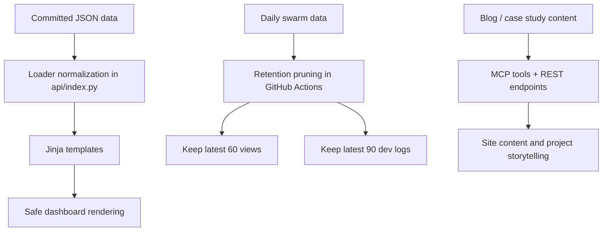

*Generated by GitHub Scout Agent*

## In Plain English: What We Built Today & Why It Matters

Today was a pretty classic “tidy up the house so it stops creaking” kind of day. A couple of old dashboard/pipeline features were fully retired, and in the process the app got a lot leaner — fewer routes, fewer templates, fewer background loaders, and way less code to maintain.

We also fixed a nasty edge case where mixed JSON schemas were blowing up the old dashboards. Think of it like adding a spellchecker to your emails — the data now gets normalized before it reaches the template, so one weirdly-shaped record can’t crash the whole page.

On top of that, there was some good ecosystem work: the daily agent data now gets pruned before it’s committed, which keeps the repo from ballooning forever, and there’s a new set of blog tools/endpoints plus a bunch of portfolio/blog cleanup so the site content stays sharp and easier to navigate.

### Project: `kprsnt.in`
- **In Simple Terms**: The site got slimmer, safer, and a bit more organized. Old Brand Tracker / Pharma dashboard stuff was removed, dashboard JSON handling got hardened, the swarm data retention policy was tightened, and a new batch of blog/case-study tooling landed.
- **What Changed**:
  - Removed the old Brand Tracker and Pharma pipeline features entirely:
    - Deleted routes/endpoints like `/brand`, `/pharma`, `/api/brand/data`, and `/api/pharma/data`
    - Removed templates like `brand.html` and `pharma.html`
    - Cleaned up the 404 page so it no longer links to `/brand`
    - Dropped loaders such as `load_brand_timeseries`, `load_pharma_log`, and `get_latest_pharma_runs`
    - Removed `generate_brand_insight()` and related brand/pharma logic from `api/index.py` and `api/services/insights.py`
    - Pulled out the old GitHub Actions workflows for those pipelines
  - Fixed the mixed-schema dashboard JSON issue:
    - In `api/index.py`, the loader now normalizes the committed JSON data before the templates see it
    - This prevents `UndefinedError` crashes in Jinja when some runs are missing fields like `llmo_score` or `avg_ind_score`
    - Added/updated coverage in `tests/test_data_consistency.py`
  - Added retention pruning for swarm data:
    - In `.github/workflows/ecosystem_agents.yml`, the daily auto-commit now keeps only the latest:
      - 60 daily views/chronicles
      - 90 AI Eco dev logs
    - This is basically a garbage collector for repo growth
  - Added a new blog/MCP/case-study layer:
    - `api/ai_eco_mcp.py`
    - `api/data/case_studies.py`
    - `api/index.py`
    - This adds blog tools, REST endpoints, and deeper case-study content explaining why projects were built and what they accomplished
  - Also did a portfolio/blog polish pass:
    - Fixed duplicate titles
    - Fixed TOC anchors
    - Updated the AI News repo reference
    - Redesigned homepage featured projects
    - Touched files like `api/data/portfolio_kb.py`, `api/data/projects.py`, `api/resume_data.py`, and `api/skills/chat.md`
  - Expanded ecosystem daily views:
    - Daily views now include all 10 agents
    - Added notes/audits for Readme, Docs, and Antipersona agents
    - Updated `api/skills/ecosystem.md`, `ecosystem_swarm/daily_views/*`, and `ecosystem_swarm/debt_ledger.json`
- **Why We Did It**:
  - The Brand/Pharma dashboards were no longer being used, so keeping them around was just extra weight and extra maintenance.
  - The dashboard JSON had inconsistent shapes, which meant a single missing field could take down a page.
  - The swarm data was growing without much restraint, so the retention cap helps keep the repo and deploys from getting bloated.
  - The new case study/blog tooling makes it easier to explain the “why” behind projects, not just ship the code.
- **Highlights**:
  - Big cleanup: one commit alone removed roughly **7,787 lines**
  - The dashboard fix specifically targeted mixed-schema data that was causing 500s
  - The retention policy is a nice practical guardrail for long-running automated commits
  - This repo is now much more focused on current content instead of old dead-end features

### Project: `ecosystem_swarm`
- **In Simple Terms**: The daily agent view system got expanded and cleaned up so it tracks more of the swarm without letting the history pile up forever.
- **What Changed**:
  - `api/index.py` and `api/skills/ecosystem.md` were updated to show daily views for all 10 agents
  - New notes/audits were added for:
    - `Readme`
    - `Docs`
    - `Antipersona`
  - Updated daily view files:
    - `ecosystem_swarm/daily_views/2026-09-17.md`
    - `ecosystem_swarm/daily_views/2026-09-18.md`
  - Adjusted `ecosystem_swarm/debt_ledger.json` to reflect the new state of the swarm
- **Why We Did It**:
  - The old view only covered part of the agent set, which made the picture feel incomplete.
  - Adding notes and audits gives a better running log of what each agent is doing and where the rough edges are.
- **Highlights**:
  - Better visibility across the full 10-agent setup
  - More structured “paper trail” for the Readme/Docs/Antipersona agents
  - Pairs nicely with the retention pruning so the system stays readable over time

### Project: `api`
- **In Simple Terms**: The backend got a few meaningful upgrades: safer dashboard loading, new blog/case-study endpoints, and some cleanup around the old brand/pharma routes.
- **What Changed**:
  - `api/index.py` was the main hub for most of the work:
    - Removed old brand/pharma route handling
    - Added normalization logic for dashboard JSON loading
    - Added new REST endpoints and tooling for blog/case-study content
    - Updated ecosystem-related flows to support all 10 agents
  - `api/services/insights.py` lost the now-unused brand insight generation path
  - `api/ai_eco_mcp.py` now exposes blog tools through MCP-style interfaces
  - `api/data/case_studies.py` adds structured deep-dive content for explaining project outcomes
  - Supporting data modules like `api/data/portfolio_kb.py`, `api/data/projects.py`, and `api/resume_data.py` were updated to keep the site content consistent
- **Why We Did It**:
  - The API had become a little too attached to old features that weren’t pulling their weight anymore.
  - The new content tooling makes the site more useful as a living portfolio instead of just a static homepage.
- **Highlights**:
  - The dashboard loader fix is the kind of small backend change that saves you from random production headaches
  - The new content endpoints make it easier to surface long-form project stories without hardcoding everything into templates
  - This is a nice example of “less feature clutter, more useful surface area”

### Project: `.github/workflows`
- **In Simple Terms**: The automation got trimmed and tuned so it runs leaner and doesn’t hoard old swarm data.
- **What Changed**:
  - Removed obsolete workflows:
    - `.github/workflows/brand_tracker.yml`
    - `.github/workflows/pharma.yml`
  - Updated `.github/workflows/ecosystem_agents.yml` to prune old data before the daily commit lands
- **Why We Did It**:
  - Dead workflows were still hanging around for features that no longer exist
  - The retention cap prevents the automated history from growing without bound
- **Highlights**:
  - Cleaner CI/CD setup
  - Less repo noise
  - Better long-term maintainability for the daily automation loop

### Project: `blog / case-study content`
- **In Simple Terms**: A bunch of new long-form project storytelling got added so the site can explain not just what was built, but why it exists and what it achieved.
- **What Changed**:
  - New deep-dive content and supporting structures were added around project case studies
  - The site now has better blog tooling and API access for surfacing those stories
  - Recent content work also cleaned up duplicate titles and anchor links, which makes the reading experience less annoying
- **Why We Did It**:
  - A portfolio is a lot stronger when it can tell the story behind the work, not just list links
  - Better metadata and cleaner anchors make the content easier to browse and share
- **Highlights**:
  - This turns the site into more of a living engineering journal
  - The case-study angle is especially useful for showing outcomes, trade-offs, and architecture choices in plain language

Things feel a lot cleaner now: fewer dead branches in the app, safer data loading, and a better content/storytelling layer on top. Next up looks like more refinement around the blog/content system and continuing to keep the ecosystem data tidy so it stays useful instead of turning into archive soup.