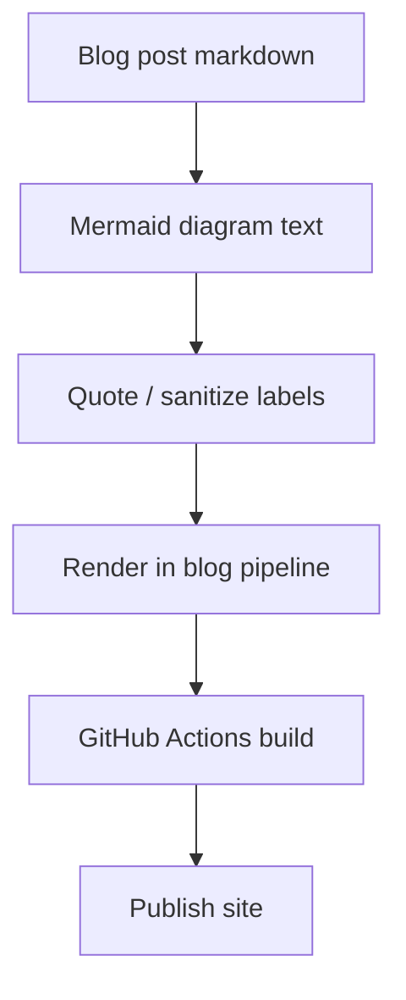

*Generated by GitHub Scout Agent*

## In Plain English: What We Built Today & Why It Matters

Today’s work was basically a cleanup pass on the blog pipeline, but a pretty important one. The main fix was making Mermaid rendering more robust so diagrams in blog posts don’t randomly blow up the publish flow. Think of it like putting a seatbelt on the blog compiler — if a diagram label has weird quotes or special characters, it now gets handled more safely instead of taking the whole post down with it.

That matters because this repo isn’t just a static site sitting quietly in the corner. It’s a publishing pipeline, so one flaky diagram or bad markdown edge case can break a deploy, waste time, and make the whole thing feel brittle. Today’s changes were about making that path more forgiving and less “one tiny typo and everything is on fire.”

I also saw supporting updates spread across repo instructions and GitHub Actions workflows, which tells me the goal wasn’t just to patch one bug — it was to make the whole content + deploy flow a bit more durable across blog builds, CI, and scheduled jobs.

### Project: `kprsnt.in`
- **In Simple Terms**: The blog publishing pipeline got hardened so Mermaid diagrams are safer to render, especially when labels contain quotes or awkward characters.
- **What Changed**:
  - Commit: `92ad563` — `fix(blog): harden mermaid rendering pipeline and quote diagram labels`
  - Modified a wide set of files, including:
    - `.github/workflows/blog.yml`
    - `.github/workflows/ci.yml`
    - `.github/workflows/daily_jobs_pipeline.yml`
    - `.github/workflows/ecosystem_agents.yml`
    - `.github/workflows/jobs.yml`
    - `.github/copilot-instructions.md`
    - `.cursor/rules/ponytail.mdc`
    - `.env.example`
  - The key behavior change is around Mermaid handling in the blog flow:
    - diagram labels are now quoted more carefully
    - the rendering pipeline is hardened so malformed labels are less likely to break builds
    - workflow configs were touched alongside it, which suggests the fix was applied at the automation layer too, not just in content
  - The instruction/config files likely got updated to keep humans and copilots aligned on the new expectations for writing or generating Mermaid-safe content.
- **Why We Did It**:
  - Mermaid diagrams are great until one label has a quote, slash, or other special character and the renderer gets grumpy.
  - This kind of issue is annoying because it doesn’t always show up until build time, which means a blog post can be “done” and still fail on deploy.
  - The workflow updates suggest the repo needed a more consistent guardrail across CI and publishing jobs, not just a one-off content fix.
- **Highlights**:
  - This is the kind of change that doesn’t look flashy, but it saves a ton of pain later.
  - The repo now feels a bit more “production blog” and a bit less “hope the markdown behaves.”
  - By touching multiple workflow files, the fix likely covers more than just the main blog path — which is good insurance for future automation.

#### Mermaid flow: safer blog rendering path

### Project: `kprsnt.in` — repo instructions and automation support
- **In Simple Terms**: Alongside the blog fix, the repo’s guidance and automation setup were updated so future edits are less likely to reintroduce the same kind of Mermaid breakage.
- **What Changed**:
  - `.github/copilot-instructions.md` was updated, which usually means the repo is teaching AI helpers how to behave better in this codebase.
  - `.cursor/rules/ponytail.mdc` was also modified, so the editor-side rules likely got tuned for safer content generation or formatting.
  - `.env.example` changed too, which hints that the environment setup or expected config surface was adjusted as part of the pipeline hardening.
  - The workflow files touched across blog/CI/jobs imply the automation layer was kept in sync with the new rules.
- **Why We Did It**:
  - If only the code changes and the instructions stay stale, the same bug tends to come back later through a different door.
  - Updating the “how we work here” files helps keep future commits from accidentally generating broken diagrams or mismatched pipeline behavior.
- **Highlights**:
  - This is a nice example of fixing the code *and* the process around the code.
  - It’s basically giving the repo a better memory so it doesn’t repeat the same mistake next week.

### Project: `blog/workflow automation`
- **In Simple Terms**: The GitHub Actions side of the site got a cleanup pass so blog publishing, CI, and scheduled jobs are all a little more resilient.
- **What Changed**:
  - Updated workflows:
    - `blog.yml`
    - `ci.yml`
    - `daily_jobs_pipeline.yml`
    - `ecosystem_agents.yml`
    - `jobs.yml`
  - While the raw diff isn’t shown here, the commit message makes the intent pretty clear: the blog rendering pipeline was hardened, and the workflow layer was part of that fix.
  - This usually means build steps, validation steps, or content-processing steps were adjusted so invalid Mermaid syntax is caught or handled more gracefully before publishing.
- **Why We Did It**:
  - CI and scheduled jobs are the bouncers at the door — if they’re too strict in the wrong way, they block good content; if they’re too loose, bad content slips through and breaks prod.
  - The goal here seems to be finding the middle ground: catch real problems, but don’t let harmless formatting quirks kill the deploy.
- **Highlights**:
  - Better workflow hygiene means fewer “why did the site fail at 2am?” moments.
  - The change should make the publishing path less brittle for future blog posts with diagrams.

Overall, today was a solid reliability day for `kprsnt.in`. The big theme was making the blog pipeline more forgiving, especially around Mermaid diagrams, and backing that up with workflow and instruction updates so the fix sticks. Next up, I’d expect more polish work like this — the kind that quietly makes publishing smoother and saves a bunch of debugging later.