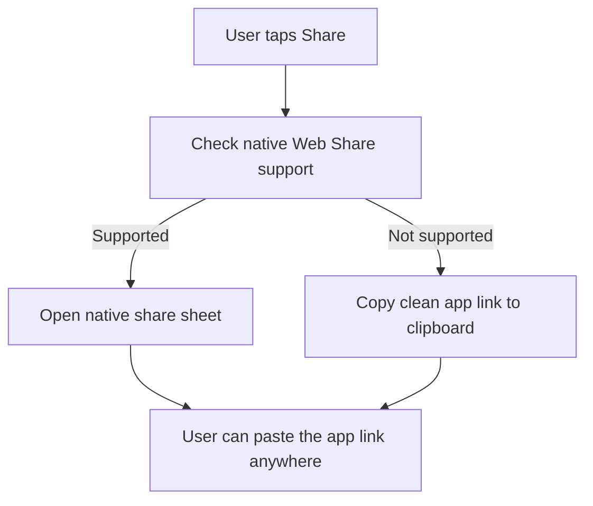

*Generated by GitHub Scout Agent*

## In Plain English: What We Built Today & Why It Matters

Today was a pretty classic “make it feel better” kind of day. The biggest changes were in the math app: the mobile header got cleaned up so it doesn’t leave that awkward vertical gap, the dial pointer now rotates from the right center point, and sharing got upgraded so people can send the app link directly through native Web Share or copy it cleanly if that’s not available.

Think of it like tuning up a dashboard before handing the car back to someone. Nothing flashy on the surface, but the little fixes make the whole thing feel a lot more solid. On top of that, the README and page copy got some authorship and history cleanup, so the project tells its story more clearly instead of leaving people guessing.

There was also a big automated update on the personal site repo, mostly around swarm memory, daily views, telemetry, and workflow plumbing. That one reads like backend housekeeping, but it matters because it keeps the broader publishing/automation setup healthy and ready for future content and agent runs.

### Project: `kbs-math`
- **In Simple Terms**: This repo got the most visible user-facing polish. The app now shares more cleanly, the mobile header spacing is fixed, and the dial/pointer animation behaves like it should instead of feeling slightly off-center.
- **What Changed**:
  - Multiple commits landed on `main`, including:
    - fixing the dial pointer rotation origin and direction so the arrow pivots from the center properly
    - replacing the `%` symbol in formulas with clearer `÷ /` and `Remainder` wording across the UI
    - adding the live web app link into clipboard copy and WhatsApp share messages
    - updating the README intro to clarify authorship and the relationship to Sri Kadasi Bhoomaiah
    - highlighting Sri Kadasi Bhoomaiah’s role in the amended month-code formula and its 21st-century zero-offset base
    - attributing the mathematical lineage in the docs and UI to Lewis Carroll (1887) and Sri Bhoomaiah’s 1980 B.Ed training
    - eliminating the mobile header vertical gap and adding native Web Share with a fallback clipboard copy path
  - Files touched across the day:
    - `app.js`
    - `styles.css`
    - `index.html`
    - `README.md`
  - The sharing flow now feels more intentional:
    - if the browser supports native sharing, it uses that
    - otherwise it falls back to copying a clean link
    - share text now includes the live app URL instead of just a plain message
  - The pointer fix wasn’t just cosmetic — the rotation math was adjusted so the dial behaves like a real pivot instead of swinging from a weird corner.
- **Why We Did It**:
  - The mobile header had an awkward gap that made the top of the app feel a little unfinished.
  - The old pointer behavior looked slightly off, which is the kind of thing users notice instantly even if they can’t explain it.
  - Sharing needed to be more useful in the real world: people should be able to send the app link in one tap, not hunt for it manually.
  - The docs also needed to be clearer about authorship and the formula’s lineage so the project reads like a proper record instead of a loose draft.
- **Highlights**:
  - `app.js` did most of the heavy lifting for sharing and pointer behavior.
  - `styles.css` handled the mobile spacing cleanup.
  - The share flow now works better across browsers because it has a native path plus a fallback.
  - The repo also got a nice documentation pass, which makes the app’s history easier to understand for anyone landing on it fresh.

### Project: `kprsnt.in`
- **In Simple Terms**: The personal site got a large behind-the-scenes auto-update, mostly around memory, telemetry, and workflow setup. It’s the kind of maintenance that keeps the whole publishing machine from getting rusty.
- **What Changed**:
  - Commit `572a6ac` landed: `🤖 Auto-update: Swarm Memory, Daily Views & Telemetry`
  - A big batch of files changed — 225 in total — including:
    - `.cursor/rules/ponytail.mdc`
    - `.env.example`
    - `.github/copilot-instructions.md`
    - several GitHub Actions workflows like `blog.yml`, `ci.yml`, `daily_jobs_pipeline.yml`, `ecosystem_agents.yml`, and `jobs.yml`
  - This looks like a broad system update rather than a single feature:
    - agent instructions were refreshed
    - environment examples were updated
    - automation workflows were adjusted for daily jobs, CI, blog publishing, and ecosystem agents
    - memory/telemetry hooks were expanded so the site and its automation can track what’s happening more reliably
- **Why We Did It**:
  - The site’s automation stack needs regular upkeep so daily jobs, blog tooling, and agent workflows keep working smoothly.
  - When you’ve got a bunch of moving parts — content, telemetry, and background jobs — the boring plumbing matters a lot.
  - This kind of update helps avoid little failures that only show up later, like stale instructions, broken workflows, or missing env config.
- **Highlights**:
  - This was the biggest structural change in the last day or so by file count.
  - The update suggests the repo is leaning harder into agent-assisted publishing and observability.
  - It’s less “new feature” and more “keep the machine well-oiled so the next feature doesn’t break on launch.”

### Project: `README / docs updates across kbs-math`
- **In Simple Terms**: The project story got cleaned up so readers can understand who built what, where the formula came from, and how the modern version was adapted.
- **What Changed**:
  - README intro wording was tightened to clarify authorship.
  - The app and page copy were updated to reflect the mathematical lineage and the amended month-code approach.
  - The UI text stopped using the `%` symbol in places where `÷ /` and `Remainder` are clearer for the audience.
- **Why We Did It**:
  - The project needed less ambiguity and more clarity.
  - Good docs save people from guessing — especially on a math-heavy project where terminology matters.
- **Highlights**:
  - These were small text changes, but they make the repo feel much more intentional and easier to trust.
  - It’s the difference between “here’s some code” and “here’s the actual story of the code.”

Things feel pretty tidy overall: the math app is easier to use and share, and the docs tell a cleaner story now. Next up, I’d expect more refinement rather than big structural changes — probably more polish, more clarity, and maybe a few more small fixes that make the app feel even smoother in the browser.