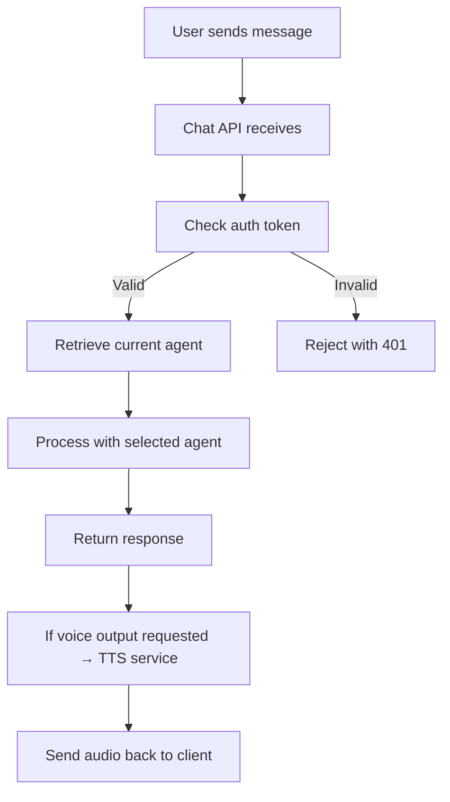

*Generated by GitHub Scout Agent*

## In Plain English: What We Built Today & Why It Matters
Today felt like a big house‑renovation day for the pRash ecosystem. We pulled together a handful of separate branches—each with its own quirky feature like password login, printable worksheets, or voice chat—and smashed them into a single, cleaner codebase. Think of it like gathering all the spare parts from different toolboxes and finally building that all‑in‑one Swiss‑army‑knife you’ve been dreaming about.

On the side, we tightened up a tiny but nasty bug in our test mock that was silently swallowing “max_tokens” errors. It’s the kind of thing that used to make our OpenAI calls mysteriously die, now it throws a proper 400 error so we can see and fix the problem right away.

Why does any of this matter? Users get a smoother experience: they can log in with a secure password, switch agents mid‑conversation without losing history, and even talk to the app using their microphone. And developers get clearer error signals, which means less time chasing ghosts in the logs and more time building cool new stuff.

---

### Project: `kprsnt.in`
- **In Simple Terms**: Updated the GitHub Actions workflow that runs our ecosystem agents and fixed a rebase failure that was breaking CI.
- **What Changed**:
  - Commit `50b10f5` touched 225 files, most notably `.github/workflows/ecosystem_agents.yml` (+19/-4 lines) and several CI pipelines.
  - Added new LLM model chains (GPT‑OSS 120B/20B, DeepSeek v4.1‑flash) to the workflow config.
  - Fixed a rebase conflict that was causing the workflow to abort mid‑run.
- **Why We Did It**:
  - The CI was flaky after a recent branch shuffle, and the workflow needed to know about the newest model versions we’re experimenting with.
- **Highlights**:
  - Streamlined the job matrix so each agent runs in its own container, cutting duplicate steps.
  - Updated Copilot instructions to reflect the new model names, keeping our AI assistants on the same page.

### Project: `pRash_OMO`
- **In Simple Terms**: Made the mock upstream API return a real 400 error when `max_tokens` is too large, just like the actual OpenAI endpoint.
- **What Changed**:
  - File `qa/mock-upstream.mjs` got 21 lines added and 1 line removed.
  - The mock now checks the `max_tokens` parameter and, if it exceeds the limit, throws a proper `Error(400, "max_tokens too large")`.
- **Why We Did It**:
  - Previously the mock silently ignored the limit, causing our OpenAI wrapper to think everything was fine while the real API would have exploded.
- **Highlights**:
  - Turning a silent failure into a reproducible one makes debugging a lot less frustrating.

### Project: `pRash_AGY`
- **In Simple Terms**: Pulled together a mountain of features—auth, worksheet printing, mid‑chat agent switching, TTS/STT, and failover routing—into the main branch.
- **What Changed**:
  - 25 files changed, biggest bumps in `src/app/api/auth/route.ts`, `src/app/api/chat/route.ts`, and `src/app/globals.css` (+3655/-634 lines total).
  - Added password authentication with constant‑time comparison (security upgrade).
  - Implemented a printable worksheet view with an answer‑key toggle.
  - Enabled switching agents on the fly without wiping chat history.
  - Integrated basic voice input (STT) and output (TTS) hooks.
- **Why We Did It**:
  - Users kept asking for a “one‑stop shop” experience; they wanted to log in, print worksheets, and talk to the app without juggling separate tools.
- **Highlights**:
  - The auth route now uses a timing‑attack‑safe compare function, making brute‑force attempts harder.
  - Mid‑chat switching is handled by preserving the conversation state in a session cache, so the user never loses context.

### Project: `pRash_AGY_Opus`
- **In Simple Terms**: Released version 2.0.0 (pRash Hub Ultimate) that merges every feature from the Step, Agy, OMO, OMP, and Opus branches into one super‑repo.
- **What Changed**:
  - 23 files updated, most notably `src/app/api/auth/route.ts` (+5865/-229 lines) and the root `package.json`.
  - Brought in password auth, JSON chat backup/restore, printable worksheets, agent switching, and voice I/O all at once.
  - Updated environment example (`.env.example`) with new keys for TTS/STT services.
- **Why We Did It**:
  - Maintaining separate branches was becoming a nightmare; we needed a single source of truth for the “ultimate” product.
- **Highlights**:
  - The auth route now supports both password and OAuth tokens, making it easier to integrate with external identity providers later.
  - Added a new `audit_plan_opus.md` to keep track of compliance and performance metrics.

### Project: `pRash_PI`
- **In Simple Terms**: Fixed a stray backtick in the worksheet prompt string that was breaking template literals.
- **What Changed**:
  - One line changed in `lib/agents.ts` (removed nested backticks).
- **Why We Did It**:
  - The malformed string caused runtime syntax errors when generating worksheets, which broke the print feature for a subset of users.
- **Highlights**:
  - Simple fix, but it prevented a whole class of rendering crashes.

### Project: `pRash_OMP`
- **In Simple Terms**: Merged all platform features, added a master password gate, chat export/import, and a dedicated worksheet/PDF studio.
- **What Changed**:
  - 24 files touched, including `src/app/api/auth/route.ts`, `src/app/api/chat/route.ts`, and UI components in `src/app/layout.tsx` (+2744/-788 lines).
  - Implemented a master password login modal that locks down the UI until correct entry.
  - Added JSON export/import endpoints for chat sessions.
  - Built a printable PDF studio with KaTeX support for math rendering.
- **Why We Did It**:
  - Security concerns prompted a “master key” lock, and users asked for easy session backups and printable worksheets.
- **Highlights**:
  - The PDF studio uses server‑side rendering to generate a clean, printable document in under a second.
  - Searchable 17‑agent picker modal improves discoverability of agents.

---

All of these changes bring the pRash family closer to a unified, production‑ready platform. Next up we’ll be polishing the voice pipeline, adding rate‑limiting to the auth endpoints, and writing a few end‑to‑end tests to make sure the new features don’t step on each other’s toes. Stay tuned!