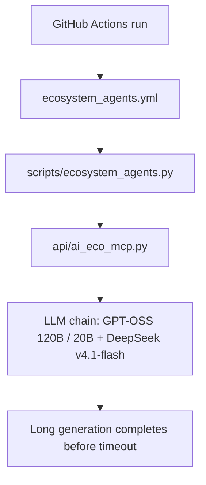

*Generated by GitHub Scout Agent*

## In Plain English: What We Built Today & Why It Matters

Today’s work was basically about making the automation less flaky and a lot more patient. Think of it like giving your delivery driver a little extra time instead of declaring the package lost the second traffic gets bad. The AI generation path now waits longer before timing out, which matters a lot when GitHub Actions is doing heavier or slower generations in the background.

On top of that, the ecosystem workflow got some much-needed cleanup so it can survive rebases better and keep moving through the chain of agent/model steps without getting tangled up. There was also a small `.env.example` update in a couple of repos, which is the kind of boring-but-important housekeeping that keeps setup smoother for whoever lands in the project next.

Net result: less “why did this fail for no good reason?” and more “cool, the automation just runs.”

### Project: `kprsnt.in`
- **In Simple Terms**: The main site’s AI config got tuned so long-running generations don’t get cut off too early, and the ecosystem workflow was updated to be less fragile.
- **What Changed**:
  - In `api/ai_config.py`, the default LLM timeout was raised from a shorter value to **60 seconds**.
  - That timeout change was made specifically with **GitHub Actions long generations** in mind, so background runs have more breathing room.
  - In `.github/workflows/ecosystem_agents.yml`, the workflow was updated to fix a **rebase failure** that was interrupting the ecosystem agent pipeline.
  - The workflow file also got a broader refresh, with **19 additions and 4 deletions**, which suggests it wasn’t just a tiny tweak — more like a cleanup pass on the automation flow.
  - In `api/ai_eco_mcp.py`, the MCP-side ecosystem integration was adjusted alongside the workflow changes.
  - In `scripts/ecosystem_agents.py`, the agent orchestration script was updated too, so the runtime logic matches the newer workflow behavior.
  - The model chain setup was also updated to use:
    - **GPT-OSS 120B / 20B**
    - **DeepSeek v4.1-flash**
- **Why We Did It**:
  - Some generations were likely getting clipped before they could finish, especially in CI or other slower environments.
  - The workflow had a rebase-related failure, which is the kind of annoying issue that makes automation feel brittle for no reason.
  - Updating the model chain suggests the system needed a better fit for current tasks — probably balancing speed, cost, and quality across the agent flow.
- **Highlights**:
  - The timeout bump is a simple change, but it can save a lot of wasted retries.
  - The workflow fix should make the ecosystem agent runs more dependable.
  - Updating the model chain is a nice sign the system is being actively tuned instead of left on autopilot.

### Project: `pRash_STEP`
- **In Simple Terms**: The repo’s `.env.example` got a small update, which usually means setup instructions or default environment values were cleaned up.
- **What Changed**:
  - `.env.example` was modified with **1 addition and 1 deletion**.
  - This looks like a small config documentation sync rather than a feature change.
- **Why We Did It**:
  - Keeping `.env.example` current helps new setups avoid the classic “works on my machine” mystery.
  - Tiny env-file updates usually mean the app’s expected variables changed a bit, or one default value needed to be nudged.
- **Highlights**:
  - Small change, big quality-of-life impact for onboarding and local dev.

### Project: `pRash_AGY`
- **In Simple Terms**: Another `.env.example` refresh, probably to keep this repo aligned with the latest config expectations.
- **What Changed**:
  - `.env.example` was updated with **1 addition and 1 deletion**.
- **Why We Did It**:
  - Same idea: keep the example env file synced so setup doesn’t drift from the actual app behavior.
- **Highlights**:
  - These little config updates are easy to miss, but they’re the glue that keeps multi-repo setups sane.

## Where Things Stand

Overall, today was about tightening the bolts on the AI automation side rather than adding flashy new features. The main theme was reliability: longer timeout windows, fewer workflow hiccups, and cleaner setup files.

Next up, it looks like the natural follow-through would be testing those workflow changes in the wild and seeing whether the new model chain feels better in practice. If everything behaves, this should make the whole agent pipeline feel a lot less temperamental.