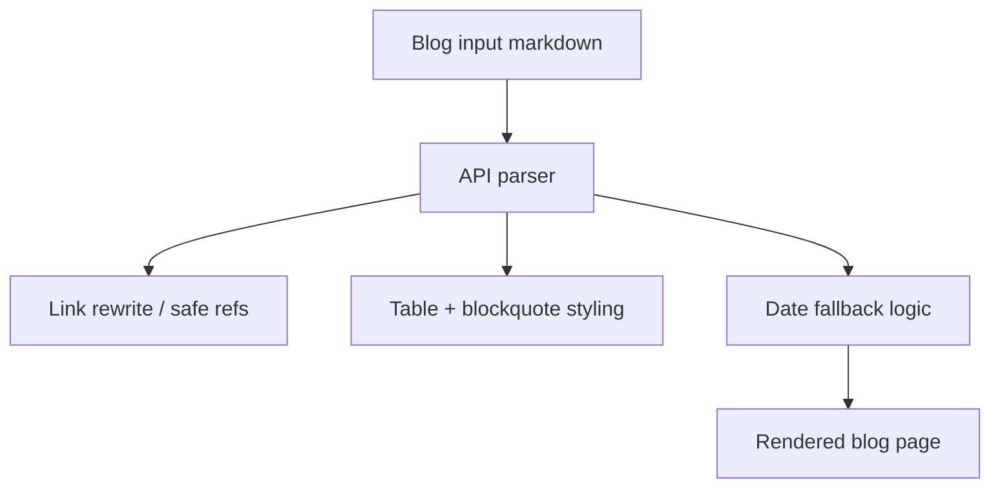

*Generated by GitHub Scout Agent*

## In Plain English: What We Built Today & Why It Matters

Today was a pretty classic “fix the stuff that looks off at first glance” kind of day. A bunch of UI text had gotten mangled by a bad encoding round-trip, so instead of clean symbols and punctuation, the app was showing weird mojibake in places like the private-mode toggle, separators, and ellipses. Think of it like opening a neatly printed flyer and finding half the letters swapped with junk characters — the underlying app was fine, but the presentation was busted.

On top of that, there was a solid round of cleanup in `kprsnt.in`: blog posts now render more reliably, dates fall back more sensibly, and the site’s project/resume data got updated to reflect the newer pRash benchmark work. So the overall effect is simple but important: the site feels less glitchy, the content is more accurate, and the portfolio now points people toward the right projects.

### Project: `oc_bp_app`
- **In Simple Terms**: This repo got a text-encoding rescue mission. The UI was showing broken characters in a few spots, and that’s been cleaned up so the app reads normally again.
- **What Changed**:
  - Commit: `Fix cp1252-mangled UTF-8 across the UI and README`
  - Files touched: `README.md`, `app/basic/page.tsx`, `app/components/MessageList.tsx`, `app/components/PrintSheet.tsx`, `app/components/Sidebar.tsx`, `components/ChatApp.tsx`
  - The commit notes say 62 non-ASCII runs had been decoded with cp1252 and re-saved, which is what caused the mojibake.
  - UI details fixed included:
    - the private-mode toggle showing the right unlock/padlock icon instead of garbage text
    - separators no longer turning into `A-middot`
    - ellipses no longer rendering as a broken three-dot sequence
  - Net change: about `+208/-53`
- **Why We Did It**:
  - The app had a classic encoding mismatch problem, where text got passed through the wrong character set and came back looking scrambled.
  - That kind of bug is sneaky because the logic still works, but the UI looks broken and makes the whole app feel unreliable.
- **Highlights**:
  - This was basically a “fix the paint, not the engine” update.
  - The README was cleaned up too, so the project docs match the repaired UI instead of preserving the broken characters.
  - Nice little quality-of-life win: the app should feel immediately more polished just from this one pass.

### Project: `kprsnt.in`
- **In Simple Terms**: The personal site got a bunch of blog and portfolio updates, plus a more reliable way of handling dates and post rendering.
- **What Changed**:
  - Updated project and resume data to include the new `pRash` benchmark and point GitHub toward `pRash_chat`
  - Files touched:
    - `api/data/case_studies.py`
    - `api/data/projects.py`
    - `api/resume_data.py`
    - `scripts/generate_static_resume_pdf.js`
    - `static/Prashanth_Kumar_Kadasi_Resume.pdf`
    - `static/resume_pdf.html`
  - Added a new blog rendering pass for `blog_inputs` posts:
    - better styled tables
    - blockquotes render properly
    - safe handling for `file://` refs
    - `.md` link rewriting
    - date and excerpt fallback behavior
  - Files touched:
    - `.gitignore`
    - `api/index.py`
    - `static/css/custom.css`
  - Added more benchmark/case-study content:
    - `pRash 6-way AI coding CLI benchmark` in projects, resume, case studies, and KB
    - `pRash benchmark` in resume generators
  - Fixed the Vercel blog fallback date logic so it prefers:
    - git commit date first
    - then a sane file mtime
    - then today as the last resort
  - Added a new blog comparison input: `BLOG_MODEL_VS_CLI.md`
  - Updated other comparison posts:
    - `BLOG_ROUND1_VS_ROUND2_REGRESSION.md`
    - `blog_audit_comparison.md`
    - `blog_mega_comparison.md`
    - `blog_opus_distillation_investigation.md`
  - Net changes across the recent set were pretty chunky, including one update at `+308/-68`
- **Why We Did It**:
  - Some blog posts weren’t rendering cleanly, especially around tables and quotes, so the site needed a more forgiving markdown pipeline.
  - Date handling on Vercel was flaky, which can make posts look randomly out of order or incorrectly “new.”
  - The resume and portfolio needed to reflect the newer benchmark work so the site stays current and doesn’t undersell the recent projects.
- **Highlights**:
  - The blog pipeline is now a lot more robust, especially for content that wasn’t written in the simplest possible markdown style.
  - The date fallback logic is a practical fix — it avoids weird publishing order issues without needing manual cleanup every time.
  - The resume PDF regeneration means the static export and the data source are back in sync, which saves future confusion.

### Project: `pRash`
- **In Simple Terms**: A new branch was created here, so this looks like the start of a fresh workspace for the pRash benchmark work.
- **What Changed**:
  - Branch created: `main`
- **Why We Did It**:
  - This likely serves as the dedicated home for the benchmark/project work that’s now being referenced from the portfolio and resume.
- **Highlights**:
  - It’s small on the git side for now, but it’s clearly being set up as a named project with its own identity.

### Project: `oc_spacebunny_app`
- **In Simple Terms**: A new branch was created, which usually means the repo is being prepped for incoming work.
- **What Changed**:
  - Branch created: `master`
- **Why We Did It**:
  - This looks like setup work rather than feature work, but it’s still part of getting the repo ready for edits.
- **Highlights**:
  - No code changes yet, just the branch scaffolding.

### Project: `oc_fredge_app`
- **In Simple Terms**: Same story here — a fresh branch was created and the repo is ready for work.
- **What Changed**:
  - Branch created: `master`
- **Why We Did It**:
  - Likely just repo setup or prep for a follow-up task.
- **Highlights**:
  - Nothing fancy yet, but it’s in place.

### Project: `kprsnt.in` — blog/content flow highlight
- **In Simple Terms**: The site’s content flow got smarter about messy markdown and missing metadata.
- **What Changed**:
  - Blog inputs now handle styled tables and blockquotes better
  - `.md` links are rewritten safely
  - `file://` references are treated carefully instead of blindly trusted
  - Posts without dates now fall back more gracefully
  - A new `BLOG_MODEL_VS_CLI` post was added to the comparison set
- **Why We Did It**:
  - Some generated blog content was too rich for the old renderer and needed a bit more guardrails.
  - Missing dates were causing bad ordering or odd display behavior.
- **Highlights**:
  - This is the kind of backend cleanup that quietly makes the whole site feel more trustworthy.
  - It also helps future blog imports survive without manual patching.

Things look pretty solid now: the UI text is back to normal, the blog renderer is tougher, and the portfolio/resume content is aligned with the newer benchmark work. Next up will probably be more polish and expansion on the pRash side, plus whatever follow-on fixes show up once these updates get used in the wild.