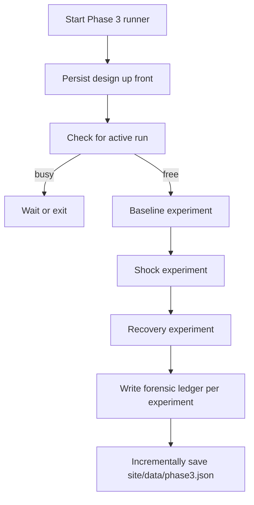

*Generated by GitHub Scout Agent*

## In Plain English: What We Built Today & Why It Matters

Today was a lot of “make the experiment runner stop being flaky” work, which is honestly the kind of plumbing that saves a ton of pain later. Think of it like putting proper labels and locks on a lab bench: the actual experiment might be the same, but now the results don’t get mixed together, and the whole thing is easier to trust.

The biggest theme was the Phase 3 shock runner in `AgentSwarm`. It now saves the design up front, runs one experiment per shock, keeps its own forensic trail for each run, and writes results incrementally instead of waiting until the very end. That matters because if a run crashes halfway through, you still keep the useful bits instead of losing the whole session.

There was also some cleanup work outside that core flow: a stray temp file got removed from version control, the repo finally got a proper top-level README, and another app had to be rescued from mojibake after a bad cp1252 round-trip mangled a bunch of UI text. So overall: less chaos, more readable stuff, and better guardrails.

---

### Project: `AgentSwarm`
- **In Simple Terms**: The Phase 3 runner got a proper “shock experiment” workflow, and it’s now much harder to accidentally run two experiments on top of each other or lose results halfway through.
- **What Changed**:
  - `arena/run-phase3.mjs` was updated twice:
    - It now persists the design before the run starts.
    - It also fixes the final log line so the end-of-run output is correct.
  - The bigger Phase 3 update touched:
    - `arena/run-phase3.mjs`
    - `arena/engine.mjs`
    - `arena/shocks.mjs`
    - `arena/README.md`
    - `arena/test/shocks.test.mjs`
    - `package.json`
  - The runner now does **one experiment per shock**:
    - baseline
    - shock
    - recovery
  - Each experiment gets its **own forensic ledger**.
  - Results are written incrementally to `site/data/phase3.json`, so progress is saved as it goes.
  - The runner refuses to start if another run is already active, unless you use `--wait`, which queues behind the current one.
  - The shock timing logic was tightened up:
    - the turn that triggers a shock now stays in the intended window boundary instead of slipping out of range.
  - Novelty injection was also fixed so the shock phase actually gets the intended “surprise” behavior.
  - Tests were added/updated in `arena/test/shocks.test.mjs` to cover the shock-window behavior.
  - The README in `arena/README.md` was expanded to explain how the runner behaves and how the shock matrix works.
- **Why We Did It**:
  - The old flow was too easy to misread or misuse when multiple experiments were involved.
  - If a run failed partway through, it was annoying to lose everything or have to guess which phase produced which output.
  - The shock boundary bug meant the experiment could drift one turn too early or too late, which is exactly the kind of tiny off-by-one issue that makes experiments feel haunted.
  - The concurrency guard is there because two runs writing to the same data at once is basically a recipe for scrambled results.
- **Highlights**:
  - The runner now behaves more like a proper lab notebook and less like a loose scratchpad.
  - Incremental writes to `site/data/phase3.json` are a nice safety net for long-running experiments.
  - The `--wait` behavior is a good quality-of-life touch for queued runs.
  - Total ledger stats called out in the new docs: **80 turns, 2,592 tool calls, $0.2886, 209 artifacts**.
  - Mermaid flow for the new Phase 3 shape:

---

### Project: `kprsnt.in`
- **In Simple Terms**: The repo got a proper home page for humans, so someone landing there cold can actually understand what the whole thing is about.
- **What Changed**:
  - Added a new root `README.md`.
  - The README explains:
    - what the repository is for
    - what the arena does
    - why the forensic ledger lives outside the agents’ writable directory
    - what question the study is trying to answer
  - It also includes the real ledger totals pulled from the project history.
- **Why We Did It**:
  - The repo needed a front door.
  - Without a root README, a new visitor has to guess what the system is doing and why the architecture is arranged the way it is.
  - The forensic ledger placement is a subtle but important design choice, so it deserved an explanation instead of leaving people to reverse-engineer it.
- **Highlights**:
  - This is one of those small changes that pays off immediately for onboarding.
  - It makes the project feel more like a documented study and less like a pile of scripts.

---

### Project: `oc_bp_app`
- **In Simple Terms**: A bunch of broken-looking text got repaired so the UI and README stop showing weird character soup.
- **What Changed**:
  - Branch: `master`
  - Commit: fixed cp1252-mangled UTF-8 across the UI and README.
  - Files touched:
    - `README.md`
    - `app/basic/page.tsx`
    - `app/components/MessageList.tsx`
    - `app/components/PrintSheet.tsx`
    - `app/components/Sidebar.tsx`
    - `components/ChatApp.tsx`
    - plus a few other UI files in the same sweep
  - The fix restored proper Unicode text that had been decoded with the wrong code page and then re-saved.
  - That meant things like:
    - the private-mode toggle icon showing the correct unlock/padlock symbol
    - separators rendering correctly
    - ellipses and punctuation looking normal again
- **Why We Did It**:
  - The app had literal mojibake in several places, which makes the whole UI feel busted even when the logic is fine.
  - This kind of issue usually comes from a bad encoding round-trip, so the fix was about undoing that damage cleanly.
- **Highlights**:
  - 62 non-ASCII runs were repaired.
  - This is a good reminder that text encoding bugs can be sneakier than logic bugs because they don’t crash — they just make the app look broken.

---

### Project: `kprsnt2/AgentSwarm` repo housekeeping
- **In Simple Terms**: A stray scratch file got cleaned out so it won’t keep sneaking into commits.
- **What Changed**:
  - Removed `commitmsg.tmp` from the repo.
  - Updated `.gitignore` so it stays ignored going forward.
- **Why We Did It**:
  - The file was accidentally picked up by `git add -A`.
  - It was only meant to help pass a multi-line commit message to `git commit`, not live in the repo.
- **Highlights**:
  - Tiny cleanup, but the kind that saves future “wait, why is this file here?” moments.

---

### Project: `kprsnt2` ecosystem / repo activity sweep
- **In Simple Terms**: There was a broad auto-update pass across the personal site and supporting project files.
- **What Changed**:
  - Commit: `🤖 Auto-update: Swarm Memory, Daily Views & Telemetry`
  - A very large set of files changed — **242 files**.
  - The update touched things like:
    - Cursor rules
    - environment examples
    - GitHub workflow files
    - daily job pipelines
    - ecosystem agent tooling
- **Why We Did It**:
  - This looks like a repo-wide maintenance and automation refresh.
  - The kind of update that keeps the surrounding tooling in sync so the projects don’t drift apart.
- **Highlights**:
  - Big automation sweeps like this usually aren’t flashy, but they’re the reason everything else keeps running smoothly.

---

### Project: `mSeat` / related writing work
- **In Simple Terms**: Not a code commit here, but the recent activity shows the project story and engineering writeups are still getting refined around the MBBS counselling engine.
- **What Changed**:
  - Multiple case-study and blog-style markdown files were present in the recent activity set, including:
    - `mseat-engineering-story-mbbs.md`
    - `mSeat_worked.md`
    - `mseat-engineering-story-mbbs-counselling-predictior.md`
  - These documents describe the discrete allocation simulator and the real-world counselling workflow it models.
- **Why We Did It**:
  - The project is clearly being documented as both a product and an engineering case study.
  - That usually means the goal isn’t just “make it work,” but also “explain why it works and why it matters.”
- **Highlights**:
  - The writeups keep emphasizing the scale:
    - **18,000+ aspirants**
    - **6,000+ MBBS seats**
  - That’s a good reminder that the app is solving a genuinely high-stakes planning problem, not just a toy demo.

---

### Project: `sample.md` and related blog notes
- **In Simple Terms**: A few research-style markdown notes were present in the activity stream, mostly about AI competition, model ecosystems, and India-focused tech commentary.
- **What Changed**:
  - Files like `sample.md` and `Who won the AI race in India - Gemini or ChatGPT.md` were part of the broader content churn.
  - These are more editorial than code, but they show the same pattern: documenting experiments and opinions as the projects evolve.
- **Why We Did It**:
  - These notes help turn the raw engineering work into something shareable and searchable later.
- **Highlights**:
  - Not code-heavy, but useful context for the larger ecosystem around the repos.

---

Things feel a lot cleaner now: the Phase 3 runner is more trustworthy, the docs are easier to follow, and the UI text corruption got fixed before it could keep spreading. Next up, it looks like the interesting work will be in watching how the new shock-run flow behaves in practice and whether the incremental ledger writes keep everything nice and boring in the best possible way.