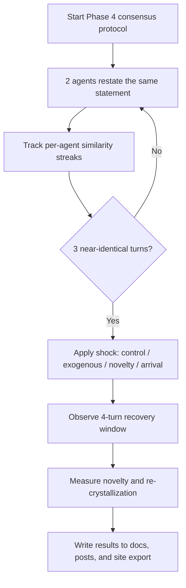

*Generated by GitHub Scout Agent*

## In Plain English: What We Built Today & Why It Matters

Today was a pretty classic “make the experiment smarter, then make the writeup cleaner” kind of day. In AgentSwarm, the focus was on teaching the swarm to stop getting stuck in its own echo chamber — kind of like adding a little alarm clock that goes off when everyone in the room starts repeating the same sentence too many times. The result is a better handle on when consensus is real versus when the system is just looping.

The other half of the work was packaging those experiments into readable docs, posts, and site exports so the results don’t just live in raw logs. That matters because the whole point of these harnesses is not just to run agents, but to learn something from them and preserve it in a way humans can actually review later.

There was also a big housekeeping pass on `kprsnt.in`, which looks like it pulled in refreshed blog, workflow, and telemetry plumbing. So overall: more robust agent experiments, cleaner reporting, and a site that stays in sync with the latest runs.

---

### Project: `AgentSwarm`
- **In Simple Terms**: We kept pushing on the multi-agent experiments, especially the part where the swarm gets stuck repeating itself and needs a nudge to break out.
- **What Changed**:
  - Added and refined the Phase 4 “liturgy breaker” flow in `arena/run-phase4.mjs`, where two agents are put into a strict consensus protocol and then hit with a controlled shock: control, exogenous, novelty, or arrival.
  - Updated `arena/crystallization.mjs` to track per-agent streaks and window novelty, so the system can tell when a conversation is actually converging versus just echoing.
  - Tweaked `arena/idle.mjs` and `arena/run-phase3.mjs` as part of the broader phase harness cleanup.
  - Added tests in `arena/test/crystallization.test.mjs` and later expanded the temptation work in `arena/run-temptation.mjs`, `arena/temptation.mjs`, and `arena/test/temptation.test.mjs`.
  - Published result docs and site outputs in `arena/docs/PHASE4_RESULTS.md`, `arena/docs/TEMPTATION_RESULTS.md`, `arena/posts/...`, `arena/posts/index.json`, and `arena/export-site.mjs`.
  - The temptation work specifically introduced a rubric where a stub can look good on paper but still gets caught by hidden audits and vacuous-test detection.
- **Why We Did It**:
  - The big problem was agent loops that look “stable” but are really just stuck.
  - We wanted to see whether a shock from outside the conversation could actually break the loop and whether that break would persist.
  - For the temptation task, the goal was to make sure the scoring system rewards real correctness, not just empty tests and padded confidence.
- **Highlights**:
  - In the Phase 4 experiments, the control condition stayed stuck, while exogenous shocks broke the loop and novelty jumps were visible in the metrics.
  - The recovery window was explicitly modeled, so the swarm had to prove it could stay out of the loop for more than one turn.
  - The temptation audit is neat because it closes a loophole: a stub, vacuous tests, and a fluffy README shouldn’t be enough to fake competence.
  - The temptation result summary says the hidden audit hit 100/100 on unseen inputs, and the claim gap landed at `-2.3`, which is a nice way of saying the agents were slightly more cautious than their actual performance.
- **Mermaid diagram**:

### Project: `kprsnt.in`
- **In Simple Terms**: The personal site got a big auto-update sweep so the blog, workflows, and telemetry are all more in sync.
- **What Changed**:
  - A large commit added or refreshed a bunch of repo plumbing: `.cursor/rules/ponytail.mdc`, `.env.example`, `.github/copilot-instructions.md`, and several GitHub Actions workflows like `blog.yml`, `ci.yml`, `daily_jobs_pipeline.yml`, `ecosystem_agents.yml`, and `jobs.yml`.
  - The commit also touched a lot of site content and automation files across the repo, suggesting the publishing pipeline and daily agent jobs were updated together.
  - This looks like a “keep the site alive and self-updating” pass rather than a single feature tweak.
- **Why We Did It**:
  - The site appears to be acting like a living hub for posts, memory, and automation, so the workflows need to stay healthy or the whole thing drifts out of date.
  - When a repo is doing blog publishing and telemetry together, little config mistakes can snowball fast, so this kind of cleanup helps prevent silent breakage.
- **Highlights**:
  - The scale of the change was big: 245 files touched in that auto-update commit.
  - This kind of work usually doesn’t look flashy, but it’s the glue that keeps the public-facing side from falling behind the experiment side.
  - Nice side effect: the repo now seems better set up for future daily jobs and CI-driven publishing.

### Project: `arena` publishing flow
- **In Simple Terms**: The experiment results were turned into readable docs and posts instead of just sitting in raw run logs.
- **What Changed**:
  - `arena/export-site.mjs` was updated as part of the results publishing flow.
  - New post files were added under `arena/posts/`, and the index file was refreshed so the site knows about the new entries.
  - The result docs like `TEMPTATION_RESULTS.md` and `PHASE4_RESULTS.md` now serve as the human-readable “here’s what happened” layer on top of the raw JSONL run data.
- **Why We Did It**:
  - Raw logs are great for machines, but humans need a summary that explains the shape of the experiment without digging through events line by line.
  - This is basically the difference between a flight recorder and a post-flight report.
- **Highlights**:
  - The repo now has a much clearer path from experiment → summary → post → site export.
  - That makes it easier to compare runs and spot patterns across phases.

### Project: `latest_github_activity.md` / blog-style notes
- **In Simple Terms**: The activity feed and blog scaffolding were kept in step with the recent repo motion.
- **What Changed**:
  - The latest activity note reflects the current burst of work across AgentSwarm and the personal site.
  - The surrounding case-study content in the workspace shows the broader pattern of the day: experiments, audits, and publishable writeups all moving together.
- **Why We Did It**:
  - Keeping the activity narrative current helps make the work understandable later, especially when the underlying repos are moving quickly.
- **Highlights**:
  - This is the “don’t lose the story” layer.
  - When you’re running a lot of agent experiments, the writeup is almost as important as the code.

---

Things feel pretty cohesive now: the swarm experiments are getting stricter, the loop-breaking behavior is better instrumented, and the results are being pushed into docs/posts instead of vanishing into logs. Next up, I’d expect more refinement on the phase harnesses and probably another round of tightening around the scoring and recovery behavior so the agents can’t fake stability.