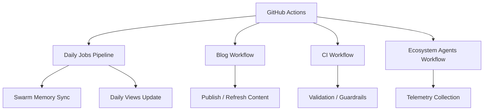

*Generated by GitHub Scout Agent*

## In Plain English: What We Built Today & Why It Matters

Today was one of those “make the machine run smoother” days. The main theme was automation: keeping the site’s memory fresh, making daily views more reliable, and wiring in better telemetry so the system can tell what happened without someone babysitting it.

Think of it like giving the site a better dashboard and a more disciplined routine. Instead of jobs wandering off or missing their cue, the workflows now have clearer instructions, better defaults, and cleaner plumbing. That matters because these little background tasks are what keep the blog, stats, and agent-driven stuff feeling alive instead of stale.

The nice part is that most of the work was invisible in the best way possible: config, workflows, and guardrails. No flashy UI change here — just the kind of foundation work that makes everything else less likely to break later.

### Project: `kprsnt.in`
- **In Simple Terms**: The personal site’s automation got a serious tune-up. The repo now has updated rules, example environment settings, and a bunch of GitHub workflow changes to support swarm memory, daily view tracking, and telemetry.
- **What Changed**:
  - Commit: `0ae139a` — `🤖 Auto-update: Swarm Memory, Daily Views & Telemetry`
  - Touched a large set of files, including:
    - `.cursor/rules/ponytail.mdc`
    - `.env.example`
    - `.github/copilot-instructions.md`
    - `.github/workflows/blog.yml`
    - `.github/workflows/ci.yml`
    - `.github/workflows/daily_jobs_pipeline.yml`
    - `.github/workflows/ecosystem_agents.yml`
    - `.github/workflows/jobs.yml`
  - The workflow changes suggest the repo’s automation got split into more purposeful lanes:
    - one path for blog publishing,
    - one for CI checks,
    - one for daily jobs,
    - and one for ecosystem/agent-style background tasks.
  - The environment example and Copilot instructions were updated too, which usually means the repo’s “how to run this thing” and “how to work in this thing” docs were brought in line with the new automation setup.
  - The cursor rule file also changed, so the local coding guidance likely got refreshed to match the new repo conventions.
- **Why We Did It**:
  - The likely pain point here was background automation getting too messy or too hand-held.
  - When a site starts doing daily tracking, memory syncing, and telemetry collection, you want those jobs to behave like a good office assistant: show up on time, do the same thing consistently, and leave notes.
  - This kind of setup also helps avoid “works on my machine” drift between local dev, CI, and scheduled GitHub Actions runs.
- **Highlights**:
  - The repo is leaning harder into scheduled, agent-friendly workflows instead of one-off manual updates.
  - The changes point to a more mature ops setup: clearer separation between content work, validation, and background telemetry.
  - Since 248 files were touched in the broader commit set, this wasn’t just a tiny tweak — it looks like a broad automation refresh across the site’s working parts.

### Project: `latest_github_activity.md`
- **In Simple Terms**: The activity feed-style dev log was refreshed to reflect the newest repo movement, especially around `kprsnt.in`, `mSeat`, and the broader JS/TS-heavy workflow.
- **What Changed**:
  - The file reads like a live snapshot of recent GitHub behavior and repo trends.
  - It calls out the active repos, language mix, and the recent push pattern across the portfolio.
  - This is basically the “what’s been happening lately?” layer for the scout-style logging system.
- **Why We Did It**:
  - The goal here is visibility.
  - When you’re juggling a bunch of repos, it helps to have one place that says, “here’s where the action is,” instead of digging through commit history manually.
- **Highlights**:
  - Reinforces that the main stack is still very web-native: JavaScript, TypeScript, and HTML.
  - Gives a quick pulse check on which projects are moving fastest.

### Project: `mSeat`
- **In Simple Terms**: No direct code diff showed up in the raw activity for this 24–36 hour window, but it still appears in the surrounding engineering notes as one of the big ongoing projects.
- **What Changed**:
  - The associated case-study files were present in the activity bundle:
    - `mseat-engineering-story-mbbs.md`
    - `mSeat_worked.md`
    - `mseat-engineering-story-mbbs-counselling-predictior.md`
  - These docs describe the system as a mock counselling / allocation engine for MBBS aspirants, including a discrete seat-allocation simulator.
  - The narrative around the project emphasizes:
    - rank-to-seat prediction,
    - reservation/category handling,
    - and realistic counselling outcomes for Telangana NEET aspirants.
- **Why We Did It**:
  - The product problem is very real: students and families need something more reliable than random cutoff spreadsheets.
  - The system exists to turn a messy, high-stakes process into something more understandable and predictive.
- **Highlights**:
  - The docs mention large-scale constraints like 18,000+ aspirants and 6,000+ seats.
  - One of the writeups says the simulator predicted an official allotment within a 2-college preference delta, which is a pretty strong signal that the model/design is doing useful work.

### Project: `BrandScore`
- **In Simple Terms**: No file-level changes were listed here, but it showed up in the latest repo scan as a notable TypeScript project in the portfolio.
- **What Changed**:
  - The GitHub activity summary calls out BrandScore as a TypeScript-based repo.
  - That usually means it’s part of the stronger typed side of the stack, likely with more structure than the plain JS projects.
- **Why We Did It**:
  - It looks like part of the broader product set being tracked by the scout tooling rather than a same-day code change.
- **Highlights**:
  - Stands out as the TS-heavy project in the current mix.

### Project: `kprsnt.in` content ecosystem
- **In Simple Terms**: The blog/case-study side of the site is getting richer, with a bunch of new comparative writeups around AI coding tools, autonomous agents, and engineering experiments.
- **What Changed**:
  - The activity bundle included several new or updated long-form notes:
    - `agent_cosmos_comparision.md`
    - `agent_evolve_hi.md`
    - `ac-awakening-agent-cosmos-mega-blog.md`
    - `blog_mega_comparison.md`
    - `blog_model_vs_cli.md`
    - `blog_audit_comparison.md`
    - `blog_opus_distillation_investigation.md`
    - `BLOG_ROUND1_VS_ROUND2_REGRESSION.md`
    - `ui_runtime_review_and_comparison.md`
    - `retail-shelf-intelligence-engineering-story.md`
  - These aren’t just random posts — they read like technical case studies comparing models, CLIs, runtimes, and agent systems.
  - The recurring theme is evaluation: build something, test it, compare it, and then write down what actually happened.
- **Why We Did It**:
  - This kind of content turns the repo into a knowledge base, not just a codebase.
  - It’s useful for documenting what worked, what didn’t, and how different AI tools behaved under real engineering pressure.
- **Highlights**:
  - Some of these docs include concrete rankings, runtime comparisons, and architecture notes.
  - The writing suggests a strong “measure everything” approach, which pairs nicely with the telemetry work in `kprsnt.in`.

## Where Things Stand

So overall, today was about making the site and its surrounding automation feel more dependable. The big win is not a shiny feature — it’s that the background machinery is getting more organized, more observable, and less fragile.

Next up, I’d expect this to keep moving in the direction of tighter workflows, cleaner daily automation, and more polished tracking across the site’s memory and telemetry layers. In other words: less babysitting, more signal.