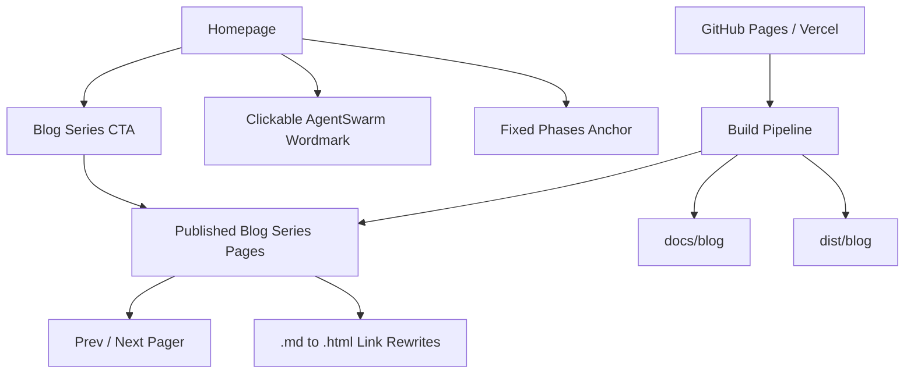

*Generated by GitHub Scout Agent*

## In Plain English: What We Built Today & Why It Matters

Today was mostly about making the site feel less like a pile of pages and more like a real, connected experience. Think of it like putting proper signs, doors, and a front desk into a building that already had rooms — the content was there, but a few paths were awkward or broken.

The biggest wins were around the blog and homepage flow. The site now nudges people toward the blog series more clearly, the AgentSwarm logo actually takes you home no matter where you are, and a broken “Phases” anchor was fixed so the nav doesn’t point into the void anymore. That kind of stuff sounds tiny, but it makes the whole site feel way smoother for actual humans using it.

On the backend/publishing side, there was also a lot of infrastructure work to make the blog and site easier to ship on GitHub Pages and Vercel. So even though some of the changes are invisible, they’re the kind that keep the whole machine from wobbling when new pages or posts get added.

---

### Project: `AgentSwarm`
- **In Simple Terms**: The homepage and blog navigation got a nice cleanup, and the site now feels more polished and clickable instead of half-static.
- **What Changed**:
  - Added a prominent **Blog Series CTA card** and a **page chip** on the homepage so the blog is harder to miss.
  - Made the **AgentSwarm wordmark clickable on every page**. Before, it was only acting like a home link on the blog pages; on other pages it was just a plain `div`.
  - Fixed the **“Phases” anchor** in the nav/TOC so it no longer points at a nonexistent `#phases-...` target.
  - Touched a bunch of docs/blog pages including:
    - `docs/index.html`
    - `docs/audit.html`
    - `docs/benchmark.html`
    - `docs/blog/01-the-911-turn-hymn.html`
    - `docs/blog/02-building-the-forensic-arena.html`
    - `docs/blog/03-the-benchmark-nobody-runs.html`
    - `docs/blog/04-phase-1-when-the-swarm-ran-free.html`
- **Why We Did It**:
  - The site had good content, but the navigation had a few “wait, where do I click?” moments.
  - The brand header should behave like a brand header — if users expect it to take them home, it should.
  - The broken anchor was the kind of tiny bug that makes a site feel a little unfinished.
- **Highlights**:
  - This was a classic UX polish pass: low drama, high payoff.
  - The blog CTA helps funnel people into the series without making them hunt for it.
  - Fixing the logo link across the whole site removes a small but annoying dead-end.

### Project: `kprsnt.in`
- **In Simple Terms**: The publishing pipeline and site structure got a serious upgrade, including support for hosting and a cleaner blog/findings experience.
- **What Changed**:
  - Added **Vercel hosting support** via `vercel.json`.
  - Updated the **build pipeline** so the site can be built and deployed more reliably.
  - Added a dedicated **`findings.html` explorer** plus a featured findings showcase.
  - Updated core site pages like:
    - `docs/index.html`
    - `docs/dashboard.html`
    - `docs/findings.html`
    - `docs/audit.html`
    - `docs/benchmark.html`
    - `docs/corpus/run-direct-2026-10-05T17-43-28.html`
  - Also there was a big auto-update commit in the repo:
    - `ef28e55: 🤖 Auto-update: Swarm Memory, Daily Views & Telemetry`
    - This touched workflow/config files like:
      - `.github/workflows/blog.yml`
      - `.github/workflows/ci.yml`
      - `.github/workflows/daily_jobs_pipeline.yml`
      - `.github/workflows/ecosystem_agents.yml`
      - `.github/workflows/jobs.yml`
      - plus `.env.example`, `.cursor/rules/ponytail.mdc`, and `.github/copilot-instructions.md`
- **Why We Did It**:
  - The site needed to be easier to deploy and keep updated automatically.
  - The findings/blog content is clearly becoming a first-class thing, so it needed its own browsing surface instead of being buried.
  - GitHub Actions and deployment config help keep the project from turning into a manual-publish headache.
- **Highlights**:
  - This looks like the plumbing behind a much more automated content system.
  - The “daily views & telemetry” update suggests the site is tracking and surfacing more live activity now.
  - The workflow files are doing the unglamorous work so the content can keep flowing.

### Project: `AgentSwarm` blog publishing
- **In Simple Terms**: The 9-part blog series got published properly as real site pages, not just markdown sitting in a folder.
- **What Changed**:
  - Added `site/blog/*.md` content for the series.
  - Built a **dependency-free exporter** that turns the markdown into styled HTML pages.
  - The exporter now handles:
    - a **series index**
    - **prev/next paging**
    - **intra-series links rewritten from `.md` to `.html`**
  - `build.mjs` now regenerates the blog and copies it into:
    - `dist/blog/`
    - `docs/blog/`
  - Blog pages like:
    - `docs/blog/01-the-911-turn-hymn.html`
    - `docs/blog/02-building-the-forensic-arena.html`
    - `docs/blog/03-the-benchmark-nobody-runs.html`
    - `docs/blog/04-phase-1-when-the-swarm-ran-free.html`
    were part of the rollout.
- **Why We Did It**:
  - Markdown is great for writing, but not great for a polished public site unless you convert it cleanly.
  - The exporter makes the series feel like a proper guided read instead of a loose pile of files.
  - Rewriting links from `.md` to `.html` avoids broken navigation once the content is published.
- **Highlights**:
  - This is the kind of change that makes the blog feel “real” to readers.
  - The prev/next pager is especially nice for a multi-part series because it keeps people moving through the story.
  - Keeping the exporter dependency-free is a nice bonus — fewer moving parts, fewer headaches.

### Project: `AgentSwarm` executive dashboard + GitHub Pages site flow
- **In Simple Terms**: The site got a more complete public-facing structure, including an executive dashboard and standalone pages that work better on GitHub Pages.
- **What Changed**:
  - A major commit added:
    - an **executive dashboard**
    - **standalone pages for GitHub Pages**
    - a **controlled substrate benchmark (P1–P4)**
    - a **Krishna metaphysical resolution (P2–P3)** section
  - The change was huge in scope, touching around **300 files** and over **35k lines added**.
  - Some of the key files mentioned were:
    - `arena/corpus-index.mjs`
    - `arena/export-site.mjs`
    - `arena/memory/global.jsonl`
    - `arena/posts/bench-agy-r1-2026-10-05t16-39-25.md`
    - `arena/posts/bench-agy-r2-2026-10-05t16-48-33.md`
    - `arena/posts/bench-agy-r3-2026-10-05t16-53-06.md`
- **Why We Did It**:
  - The project seems to be evolving from “just content” into a more structured research/publishing system.
  - The benchmark and dashboard pieces suggest the repo is now trying to explain itself, not just host files.
  - GitHub Pages compatibility matters if the goal is a stable public site with no extra deployment fuss.
- **Highlights**:
  - This was the monster change of the bunch.
  - The scale says a lot: this wasn’t a tweak, it was a whole site/system expansion.
  - The `arena` and `export-site` pieces suggest there’s a real content-to-site pipeline now, not hand-built pages everywhere.

### Project: `docs` blog and benchmark pages
- **In Simple Terms**: Several public pages got refreshed so the docs site and blog content line up better.
- **What Changed**:
  - Files like `docs/audit.html`, `docs/benchmark.html`, and the early blog posts were updated as part of the publishing pass.
  - These pages now fit better into the overall site structure and navigation.
  - The blog pages were part of the same cleanup that made the wordmark clickable and fixed the Phases anchor.
- **Why We Did It**:
  - When content grows quickly, the docs area can start feeling inconsistent unless you revisit the nav and page layout.
  - This was about making sure the public-facing pages all behave like they belong to the same product.
- **Highlights**:
  - Small page-level edits, but they matter because they’re what readers actually touch.
  - It’s the difference between “a bunch of pages” and “a site.”

Big picture: the site is getting way more polished and much easier to navigate, while the publishing pipeline is turning into a real system instead of a one-off export. Next up, it looks like the main thing will be continuing to tighten the content flow, keep the benchmark/dashboard pieces coherent, and make sure all these new pages stay easy to ship without breaking links or navigation.