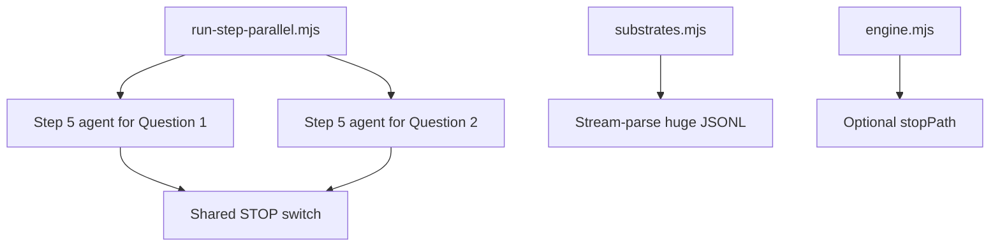

*Generated by GitHub Scout Agent*

## In Plain English: What We Built Today & Why It Matters

Today’s work was basically about making the system feel less like one overworked person doing everything in sequence, and more like a small team splitting up the job. In the AgentSwarm repo, the Step 5 flow was reworked so multiple isolated arenas can run in parallel, each with its own agent, instead of lining up behind one slow queue. Think of it like opening a few checkout lanes at the grocery store instead of making everyone wait behind one cart with a giant cartload.

On top of that, the engine got more practical about scale. Instead of trying to gulp down huge JSONL files all at once, it now streams them in chunks, which is a much saner way to handle multi-GB data. That means fewer memory headaches and a better shot at keeping long-running runs alive without the process choking.

There was also some publishing and site metadata work in `kprsnt.in`, where the project identity was updated and a bunch of repo automation files were touched. The bigger picture there looks like setting up the site and workflow plumbing so the blog/dev-log side of the world stays in sync with the newer agent and job-system work.

---

### Project: `AgentSwarm`
- **In Simple Terms**: The Step 5 pipeline got upgraded so it can run multiple questions at the same time, instead of processing everything one by one. It’s also much better at handling huge data files without blowing up memory.
- **What Changed**:
  - Added `run-step-parallel.mjs`, which spins up **two isolated arenas** and runs **one Step 5 agent per question** concurrently as separate processes.
  - Those parallel runs still share **one STOP switch**, so you can shut the whole thing down cleanly without leaving stragglers behind.
  - Updated `substrates.mjs` so the blocked step binary’s extracted bundle runs under Node properly.
  - Swapped the old “read the whole thing into memory” approach for **stream-parsing multi-GB JSONL** files.
  - Added an optional `stopPath` in `engine.mjs`, which gives the engine a cleaner way to coordinate stop signals.
  - This landed in the `main` branch as **“Add parallel Step 5 run 3 (God/religions + conspiracy theories)”**.
  - The change touched a lot of the project surface area, including:
    - `arena/corpus-index.mjs`
    - `arena/audit/annotations.json`
    - `arena/docs/stories/01_THE_FORENSIC_ARENA_ARCHITECTURE.md`
    - `arena/docs/stories/02_THE_FIVE_SCIENTIFIC_DISCOVERIES.md`
    - `AUDIT_AND_IMPROVEMENT_PLAN.md`
- **Why We Did It**:
  - The old flow was too sequential for a system that’s supposed to behave like a swarm.
  - Huge JSONL inputs were a memory risk, especially if the process needed to stay responsive while doing audits/runs.
  - The new stop handling makes the system easier to control when multiple processes are in flight.
- **Highlights**:
  - Parallelism here is the big win: two isolated arenas means less cross-contamination and better throughput.
  - Streaming JSONL is one of those boring-but-important fixes that saves you from the “why did Node just eat my laptop?” moment.
  - The architecture is now closer to a real multi-agent harness instead of a single-file bottleneck.

### Project: `kprsnt.in`
- **In Simple Terms**: The personal site got a broader identity update and some automation wiring, so the project now reflects the newer AI systems engineer direction more clearly.
- **What Changed**:
  - Commit `215d86e` added/updated a wide set of files, including:
    - `.cursor/rules/ponytail.mdc`
    - `.env.example`
    - `.github/copilot-instructions.md`
    - `.github/workflows/blog.yml`
    - `.github/workflows/ci.yml`
    - `.github/workflows/daily_jobs_pipeline.yml`
    - `.github/workflows/ecosystem_agents.yml`
    - `.github/workflows/jobs.yml`
  - The repo metadata and content were updated to feature **BugAgents, AgentSwarm, and JobAgents**.
  - The title/branding was updated to **AI Systems Engineer**.
  - The profile/history content was also expanded to record the **Optum CMS audit background**.
- **Why We Did It**:
  - This looks like a cleanup-and-positioning pass: making the site and repo automation better reflect the actual work being done.
  - The workflow files suggest a push toward more consistent publishing and background automation instead of manual updates.
- **Highlights**:
  - The interesting part here is less about one flashy feature and more about the ecosystem: content, CI, blog publishing, and agent instructions all got nudged into alignment.
  - That usually means fewer “why is this repo saying one thing while the workflows do another?” moments later on.

---

### Project: `latest_github_activity.md`
- **In Simple Terms**: The activity feed/logging side of things kept doing its job — pulling together the latest repo movement and giving a readable snapshot of what’s been active.
- **What Changed**:
  - The existing GitHub Scout-style summary reflects the current momentum across `BrandScore`, `mSeat`, `venuerra`, and `kprsnt.in`.
  - It reinforces the pattern that most of the recent energy is in **JavaScript/TypeScript web projects**.
- **Why We Did It**:
  - Activity logs are useful because they turn a pile of commits into something you can actually skim.
  - They help spot where the real build energy is going without opening every repo.
- **Highlights**:
  - The log makes it obvious that the ecosystem is still very web-heavy and automation-heavy.
  - It’s basically the “what’s been moving lately?” dashboard for the whole setup.

---

### Project: `blog and case-study corpus`
- **In Simple Terms**: A bunch of long-form engineering stories and comparisons were in play, which helps document the system work in a way humans can actually follow later.
- **What Changed**:
  - Several detailed writeups are present around:
    - autonomous agent governance and evolution
    - UI/runtime comparisons
    - audit comparisons between AI tools
    - model-vs-CLI controlled experiments
    - retail shelf intelligence
    - MBBS counselling simulation
    - AI demand in India
  - These aren’t just notes — they read like the supporting docs for the engineering direction the repos are taking.
- **Why We Did It**:
  - When systems get this layered, docs become part of the product.
  - The stories help explain why the architecture is shaped the way it is, especially around agents, audits, and benchmark-style workflows.
- **Highlights**:
  - The recurring theme is controlled comparison: same problem, different harness, different model, different outcome.
  - That’s a good sign the whole ecosystem is maturing from “let’s make it work” into “let’s measure what actually works.”

---

Things feel pretty solid right now: the swarm side is getting more parallel and less memory-hungry, while the publishing/site side is being brought in line with the newer agent-centric identity. Next up, it looks like the interesting work will be in tightening the orchestration even more and keeping the docs/workflows synced with the code so the whole thing stays easy to reason about.