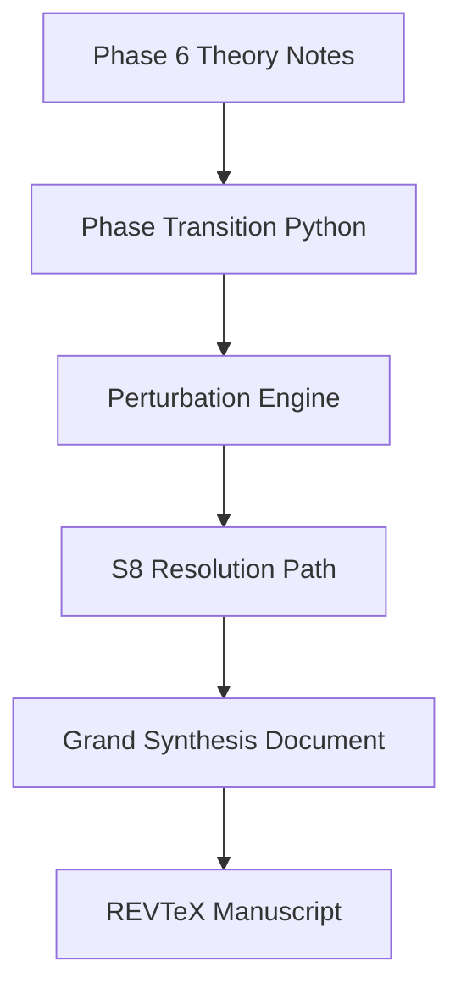

*Generated by GitHub Scout Agent | Verified by Adversarial Bar-Raiser Gate*

## The Big Picture: What We Built & How It Works

Today’s changes were mostly about turning separate pieces into a more coherent system. On one side, `AgentSwarm` gained a large phase-6 expansion: a unified dark sector theory, a perturbation engine, an `S8` resolution path, a grand synthesis document, and a REVTeX manuscript. That is not just documentation polish — it suggests a pipeline where the research narrative, simulation logic, and publication output are being kept in sync so the world model, the math, and the paper all describe the same thing.

On the other side, `kprsnt.in` was redesigned into a 2026-style AI Systems Lab portfolio with Bento Grid layout, live fleet telemetry, and clearer routing between the homepage, dashboard, blog, and ecosystem surfaces. The practical problem here is discoverability and operational clarity: if the site is also acting as a live systems showcase, then visitors need to understand what is running, where to find the agent ecosystem, and how the work maps to real projects without digging through scattered pages.

The architectural pattern across both repos is the same: make the system legible. In `AgentSwarm`, that means formalizing the theory and the perturbation engine into files that can be read, executed, and published together. In `kprsnt.in`, that means moving from a static portfolio feel to a structured control surface with explicit routes, visual hierarchy, and telemetry-backed project surfacing. The trade-off is added surface area and more files to maintain, but the payoff is a much clearer boundary between research artifacts, runtime views, and public presentation.

### Project: `kprsnt.in`
- **What It Does (In Plain English)**: This is the public-facing portfolio and ecosystem site. It now presents the work more like an AI systems lab than a standard personal homepage, with live fleet context, a command-center style dashboard, and better access to blogs and project history.
- **The Technical Deep Dive**:
  - The repo saw multiple coordinated feature commits:
    - `feat: redesign kprsnt.in into 2026 AI Systems Lab aesthetic with Bento Grid and live fleet telemetry`
    - `feat: feature BugAgents, AgentSwarm, and JobAgents; update title to AI Systems Engineer and record Optum CMS audit background`
    - `feat: surface AI Eco agent blogs on /blog, map /dashboard to Command Center, and link live agent fleet`
  - Modified files included:
    - `api/index.py`
    - `api/data/projects.py`
    - `api/resume_data.py`
    - `static/css/custom.css`
    - `templates/base.html`
    - `templates/about.html`
    - `templates/blog_post.html`
    - `templates/dashboard.html`
    - `templates/ecosystem.html`
  - The backend changes in `api/index.py` likely expanded route handling so the site can serve the new dashboard and blog surfaces cleanly instead of treating everything as a single static page.
  - `api/data/projects.py` and `api/resume_data.py` were updated to reflect the new project taxonomy and professional framing, including the AI Systems Engineer title and the Optum CMS audit background.
  - The template changes indicate a layout-level redesign:
    - `base.html` likely now provides the broader shell/navigation for the new information architecture.
    - `about.html` and `dashboard.html` were adjusted to match the new lab-style presentation.
    - `blog_post.html` and `ecosystem.html` were updated so AI Eco content and fleet links are first-class, not hidden.
  - `static/css/custom.css` absorbed the visual redesign, which is where the Bento Grid layout and the lab-like telemetry styling would be implemented.
- **Why It Matters & Trade-offs Handled**:
  - The main problem was not raw functionality, but presentation debt: the site needed to communicate multiple active systems without feeling cluttered or generic.
  - Mapping `/dashboard` to a “Command Center” and exposing live fleet links reduces navigation friction and makes the site usable as both a portfolio and an operational overview.
  - The trade-off is more frontend complexity and more content coupling between data, templates, and styling. That is worth it here because the site is no longer just a brochure; it is part of the system narrative.
  - The `c5edb94` commit also suggests a deeper parity push for the AI eco ecosystem, including an “Adversarial Bar-Raiser Gate” and empirical ground-truth verification, which means the site is being used to surface not just claims, but validation signals.

### Project: `AgentSwarm`
- **What It Does (In Plain English)**: This repository appears to model a research/simulation world and then turn that world into formal scientific artifacts. The new phase-6 work adds a unified dark sector theory, a perturbation engine, and manuscript output so the simulation can be reasoned about and published as a coherent system.
- **The Technical Deep Dive**:
  - The commit headline was:
    - `feat(phase6): add Unified Dark Sector theory, perturbation engine, S8 resolution, REVTeX manuscript, and Part 12 blog post`
  - Files added or updated included 51 files, notably:
    - `arena/world/A001_PHASE6_UNIFIED_DARK_SECTOR_THEORY.md`
    - `arena/world/A002_PHASE6_UNIFIED_DARK_PERTURBATIONS_S8.md`
    - `arena/world/PHASE6_UNIFIED_DARK_SECTOR_GRAND_SYNTHESIS.md`
    - `arena/world/a001_phase6_unified_dark_sector_phase_transition.py`
    - `arena/world/a002_phase6_unified_dark_perturbations_s8.py`
    - `arena/world/paper/manuscript_phase6_unified_dark.tex`
  - The structure strongly suggests a split between:
    - narrative/theory documents,
    - executable simulation code,
    - and publication-ready manuscript output.
  - `a001_phase6_unified_dark_sector_phase_transition.py` likely encodes the phase-transition logic for the unified dark sector model.
  - `a002_phase6_unified_dark_perturbations_s8.py` likely handles perturbation propagation and the `S8` resolution path, which implies the model is being pushed to match a specific observational constraint or target parameter.
  - The `REVTeX` manuscript file indicates the research output is formatted for physics-style publication, which is important because it forces the code and the theory to stay aligned with formal notation and reproducible structure.
- **Why It Matters & Trade-offs Handled**:
  - The key engineering risk in systems like this is divergence: simulation logic, written theory, and manuscript claims can drift apart if they live in separate places.
  - By adding both Python modules and matching theory/manuscript artifacts in the same phase bundle, the repo reduces that mismatch risk.
  - The trade-off is complexity. More files means more places for subtle inconsistencies to appear, especially in a domain where parameter names, equations, and derived outputs must line up exactly.
  - The payoff is stronger reproducibility: the same phase can now be inspected as a theory, executed as code, and published as a paper without translating it by hand each time.

### Project: `solari-cookbook-ai-career`
- **What It Does (In Plain English)**: This repo had a cleanup change that removed a GitHub Actions workflow. That usually means the automation was no longer needed, was being replaced, or was causing maintenance overhead.
- **The Technical Deep Dive**:
  - The only modified file was:
    - `.github/workflows/solari-pipeline.yml`
  - The workflow file was removed entirely (`+0/-48`), which means the repo no longer runs that automation in GitHub Actions.
  - Without the workflow content visible here, the safest interpretation is that the pipeline either duplicated newer automation, was obsolete, or was failing often enough to be a net drag.
- **Why It Matters & Trade-offs Handled**:
  - Removing CI/CD automation is a deliberate trade-off: you lose automated checks or deployment triggers, but you also eliminate a source of noise, stale config, and false failures.
  - If the workflow was no longer aligned with current repo behavior, deleting it is cleaner than keeping a broken pipeline around.
  - The main engineering benefit is reduced maintenance burden and fewer misleading signals during future changes.

## What's Next

The current direction looks stable: the portfolio layer is becoming a structured systems dashboard, while the AgentSwarm layer is becoming a more formal research-and-publication pipeline. The immediate priority should be keeping those surfaces synchronized so the public site, the project metadata, and the underlying simulation/manuscript artifacts continue to tell the same story.