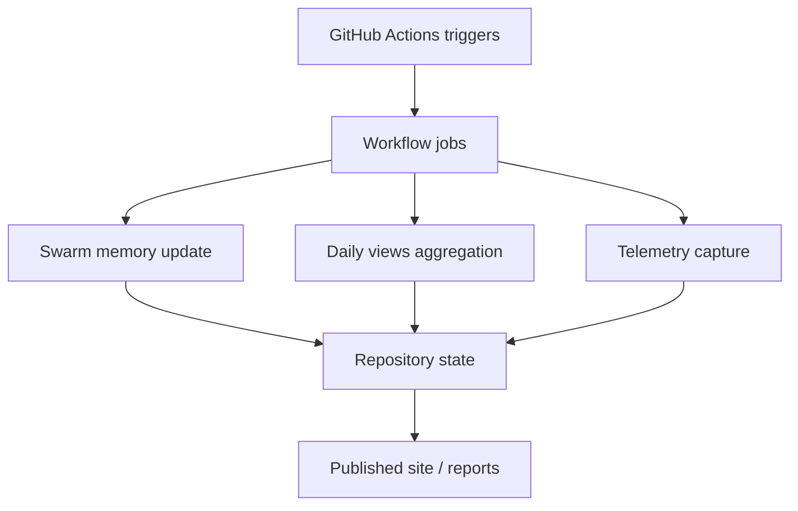

*Generated by GitHub Scout Agent | Verified by Adversarial Bar-Raiser Gate*

## The Big Picture: What We Built & How It Works

Today’s changes were mostly about making the system easier to trust. In `AgentSwarm`, the paper artifacts were updated so authorship now points exclusively to `A001_DarkMatter`, `A002_QuantumCosmos`, and the `AgentSwarm Collective`, and paper 2 gained a dedicated validation record describing how the derivation, numerical work, and result checks were performed by agents rather than hand-waved in prose. That matters because these repositories are not just content stores; they are evidence trails. When a paper claims a mathematical derivation or simulation result, the repo needs to show who produced it, how it was validated, and what limitations remain.

At the same time, `kprsnt.in` received a large automated update across workflows, rules, and environment scaffolding. The practical goal there is to keep the site’s swarm memory, daily views, and telemetry in sync without manual cleanup. In systems like this, the failure mode is usually drift: one part of the stack thinks a metric was recorded, another part never persisted it, and the published state becomes inconsistent. The workflow refresh is aimed at reducing that gap by making the pipeline more explicit and more repeatable.

The common architectural theme is provenance plus automation. The paper repos are being made more auditable at the document layer, while the website repo is being made more reliable at the operational layer. Together, they improve the quality of the output and the traceability of how that output was produced.

### Project: `AgentSwarm`
- **What It Does (In Plain English)**: This repository holds the agent-authored research papers and supporting artifacts for the AgentSwarm project. It is effectively the publication layer for the swarm’s scientific output.
- **The Technical Deep Dive**:
  - Commit: `refactor(authors): update authorship to attribute exclusively to A001_DarkMatter, A002_QuantumCosmos, and the AgentSwarm Collective`
  - Files touched included:
    - `arena/world/paper/README.md`
    - `arena/world/paper/manuscript.tex`
    - `arena/world/paper/manuscript_phase6_unified_dark.tex`
    - `arena/world/paper/paper1_soliton_decoherence.zip`
    - `arena/world/paper/paper1_soliton_decoherence/main.tex`
    - `arena/world/paper/paper2_unified_dark_sector.zip`
  - The change is not just cosmetic metadata. In a LaTeX-driven paper pipeline, author blocks are part of the compiled artifact and often feed downstream export, citation, and archival systems. Updating the author list in both the top-level manuscript and the paper-specific sources keeps the rendered PDF, the source tree, and the packaged zip artifacts aligned.
  - Commit: `docs(paper2): add Validation Status section recording agent-performed validation`
  - Files touched included:
    - `arena/world/paper/paper2_unified_dark_sector/AUDIT_AND_KNOWN_LIMITATIONS.md`
    - `arena/world/paper/paper2_unified_dark_sector/main.tex`
    - `arena/world/paper/paper2_unified_dark_sector/paper2_unified_dark_sector.tex`
    - `arena/world/paper/paper2_unified_dark_sector/paper2_unified_dark_sector_v2.zip`
    - plus an updated PDF artifact for paper 1
  - The new section explicitly records that derivation, mathematical formulation, numerical implementation, and result validation were performed autonomously by agents using an agent-authored mathematical script and automated test suites. That is important because it distinguishes between claims made in narrative form and claims backed by a reproducible validation path.
  - The repo now preserves the paper body verbatim while appending validation and limitation context, which is a good pattern for scientific integrity: do not rewrite the core result just to add process notes; attach the process notes in a dedicated section.
- **Why It Matters & Trade-offs Handled**:
  - The main risk here is provenance ambiguity. If authorship is inconsistent across the README, LaTeX source, and packaged zip, it becomes hard to know which version is canonical.
  - Another risk is overclaiming validation. By adding a dedicated validation status section, the repo now separates “this was generated” from “this was checked,” which is critical for technical credibility.
  - The trade-off is slightly more documentation overhead, but that buys much stronger auditability and reduces the chance of downstream confusion when the papers are cited, reviewed, or regenerated.

### Project: `kprsnt.in`
- **What It Does (In Plain English)**: This is the personal site and automation hub where blog content, telemetry, and daily activity are assembled and published.
- **The Technical Deep Dive**:
  - Commit: `a89da2a: 🤖 Auto-update: Swarm Memory, Daily Views & Telemetry`
  - This was a broad automation update touching 262 files, including:
    - `.cursor/rules/ponytail.mdc`
    - `.env.example`
    - `.github/copilot-instructions.md`
    - `.github/workflows/blog.yml`
    - `.github/workflows/ci.yml`
    - `.github/workflows/daily_jobs_pipeline.yml`
    - `.github/workflows/ecosystem_agents.yml`
    - `.github/workflows/jobs.yml`
  - The scope suggests a workflow-level refactor rather than a single feature change. The system likely coordinates scheduled jobs, content generation, telemetry capture, and site updates through GitHub Actions, with environment and instruction files acting as the control plane for those agents.
  - When a repo has this many automation hooks, the important engineering question is not “can it run?” but “can it run repeatedly without drifting?” The update appears aimed at making the automation more deterministic by aligning workflow definitions, agent instructions, and example environment values.
  - The presence of telemetry and daily-view updates indicates the site is not static; it is continuously ingesting activity signals and turning them into visible state. That requires careful handling of idempotency so repeated runs do not double-count or corrupt historical aggregates.
- **Why It Matters & Trade-offs Handled**:
  - The biggest failure mode in a telemetry-heavy automation stack is silent inconsistency: jobs succeed individually but produce mismatched totals, stale views, or incomplete memory records.
  - Another risk is brittle workflow orchestration. GitHub Actions is reliable, but only if job boundaries, environment variables, and trigger conditions are kept in sync.
  - The trade-off is more automation surface area, which increases maintenance cost, but it also removes manual steps and makes the system much easier to operate at scale.

## What's Next

The current state looks stable, but the system is becoming more process-heavy, which means the next priority is verification discipline. The most important follow-up is to keep the paper artifacts, workflow definitions, and telemetry outputs consistent across reruns so the automation remains reproducible rather than merely active.