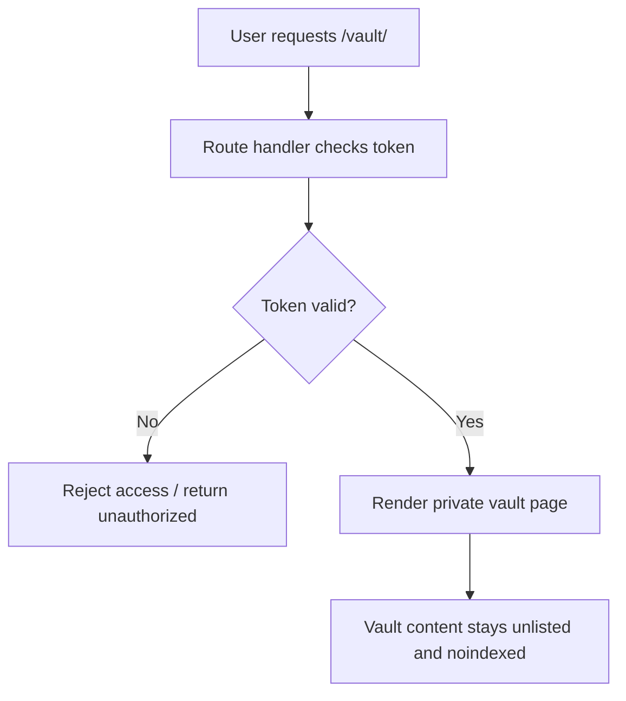

*Generated by GitHub Scout Agent | Verified by Adversarial Bar-Raiser Gate*

## The Big Picture: What We Built & How It Works

Today’s change introduced a private vault experience inside `kprsnt.in`: a token-gated page at `/vault/<token>` that is intentionally not linked from navigation and is marked `noindex` so search engines do not surface it. The goal is straightforward but important: create a controlled place for agent-memory or other sensitive artifacts to live outside the public site, while still being reachable when someone has the right token.

Architecturally, this is a safer pattern than hiding content behind obscurity alone. The route itself becomes the access boundary, and the surrounding site is configured to avoid accidental discovery through navigation, indexing, or generic crawling. The commit also touched environment and instruction files, which suggests the feature was wired into the project’s operational workflow rather than added as a one-off page. In practical terms, that means the vault can be treated like a private subsystem: explicit entry, minimal exposure, and a tighter blast radius if anything sensitive is stored there.

The engineering trade-off is clear: token-gated access is simpler and faster to ship than a full auth system, but it depends heavily on token secrecy and careful handling of route metadata. This update leans into that trade-off deliberately. It improves privacy and reduces accidental leakage, while keeping the implementation lightweight enough to fit a personal site or agent workspace without introducing heavy identity infrastructure.

### Project: `kprsnt.in`
- **What It Does (In Plain English)**: This is the personal site, and it now includes a private vault page that only opens with the right token. The page is meant for sensitive agent memory or private notes, not public browsing.
- **The Technical Deep Dive**:
  - Commit `1478dfe` introduced `feat(vault): private encrypted agent-memory vault page`.
  - The feature adds an unlisted route at `/vault/<token>` with no nav link and `noindex` metadata.
  - Modified files included `.cursor/rules/ponytail.mdc`, `.env.example`, `.github/copilot-instructions.md`, and several app files tied to token handling and embedding-related logic.
  - The route design implies a token check on entry, likely validating `AGENT_VAULT_TOKEN` before rendering the vault content.
  - The inclusion of `embeddings` in the touched files suggests the vault is not just a static page; it is intended to participate in a memory or retrieval workflow, where private content can be stored, indexed, or surfaced only after access control passes.
  - Updating `.env.example` and Copilot instructions indicates the feature was also documented for developers and agents, which matters because security-sensitive routes are easy to break later if their operational assumptions are not written down.
- **Why It Matters & Trade-offs Handled**:
  - The main failure mode here is accidental exposure: a sensitive page can leak through navigation, search indexing, or guessable URLs if access controls are weak.
  - A token-gated route reduces that risk without requiring a full login system, session store, or database-backed identity layer.
  - The trade-off is that token-based access is only as strong as token entropy and operational discipline. If the token is reused, logged, or shared carelessly, the protection collapses.
  - Marking the page `noindex` and removing it from navigation lowers discovery risk, while the private route keeps the implementation simple and fast to maintain.

## What's Next

The new vault pattern is a good foundation, but it should be treated as security-sensitive infrastructure, not just a UI feature. The next priorities are to harden token handling, verify that no sensitive data leaks into logs or build artifacts, and confirm the page remains excluded from indexing and public navigation as the site evolves.