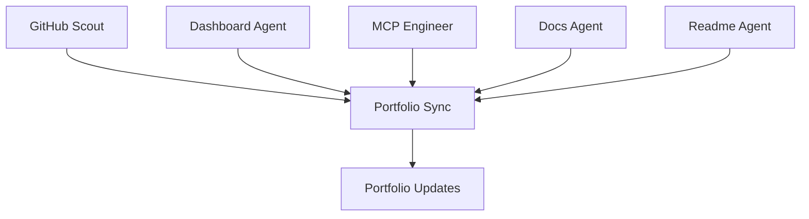

# Prashanth Kumar Kadasi — Portfolio

Data Analyst & AI Systems Engineer based in Hyderabad, India.

This repository powers my personal portfolio at **[kprsnt.in](https://kprsnt.in)** — a Flask app deployed on Vercel with a built-in RAG chatbot, live AI dashboards, REST APIs, and an MCP server. It is continuously updated by a team of autonomous AI agents.

## Key Projects

*   **🎓 mSeat — MBBS Mock Counselling Predictor**
    High-performance Telangana MBBS simulator with O(1) multi-quota ranking and a 545 KB dataset for 18,000+ aspirants. Validated against official KNRUHS 2026 Phase 1 results.
*   **🔬 BrandXY — LLM Brand Recommendation**
    Fine-tuned GPT-OSS-20B to steer brand recommendations. Achieved 76.47% vs 25.49% (+51% improvement). Includes evaluation scripts and an arXiv paper draft.
*   **🧬 Drug Discovery GPT-20B**
    Fine-tuned GPT-OSS-20B on AMD MI300X for drug discovery: novel molecules, SMILES analysis, ADMET prediction.
*   **💻 MyLocalCLI — AI Coding Assistant**
    A Claude Code alternative with 6 AI providers, 26 tools, 5 agents, and 22 skills. Local-first and private.

## Features

*   **AI Chatbot** — context-aware RAG bot grounded on my resume, projects, and live pipeline data (`/api/chat`).
*   **Dynamic Blogs** — Markdown/JSON posts from `blog_inputs/` and `blog_data/`, plus AI Eco agent dev logs.
*   **REST API** — blogs, case studies, hiring evidence, jobs/brand/pharma data, and mSeat prediction (`/docs`).
*   **MCP Server** — exposes portfolio data and tools over the Model Context Protocol (`/mcp`). Recommended transport: streamable HTTP (`POST /api/mcp`, JSON-RPC 2.0).
*   **Live Dashboards** — `/jobs`, `/brand`, `/pharma`, `/ecosystem`, `/aie`.

## Architecture

```
api/
  index.py            # Flask app + all HTTP routes (Vercel serverless entrypoint)
  ai_config.py        # LLM provider chain (OpenAI -> NVIDIA -> Groq) + embeddings
  bot_utils.py        # Chat/interview prompt assembly, tool calls, email
  ai_eco_mcp.py       # MCP tools/resources/prompts + JSON-RPC dispatcher
  mseat_mcp.py        # mSeat prediction engine + MCP handlers
  mseat_rest.py       # mSeat OpenAPI 3.1 spec
  data/               # Canonical static data (projects, skills, case studies)
  services/           # insights, live_data, rag, security
  skills/             # Per-agent prompt "skill" files
templates/            # Jinja2 templates (Bootstrap 5 Darkly)
static/               # CSS/JS, resume PDF
scripts/              # Local + CI data pipelines (not deployed)
job_data/             # Pipeline output: daily/, brand, pharma, telemetry
blog_inputs/ blog_data/ AI_Eco_Blogs/ ecosystem_swarm/
tests/                # pytest smoke + data-consistency tests
```

## Local Setup

```bash
python -m venv venv
# Windows: venv\Scripts\activate   |   macOS/Linux: source venv/bin/activate
pip install -r requirements-dev.txt

cp .env.example .env   # fill in the keys you need (see below)
python api/index.py     # http://127.0.0.1:5000
```

The app degrades gracefully without API keys: pages still render, and AI
endpoints return a 503-style message.

### Environment Variables

See `.env.example`. The important ones:

| Variable | Purpose |
| --- | --- |
| `OPENAI_API_KEY` | Primary LLM + embeddings |
| `NVIDIA_API_KEY` | Fallback LLM provider |
| `GROQ_API_KEY` | Last-resort LLM provider |
| `RESEND_API_KEY` | Sending bot replies / resume emails |
| `INTERVIEW_FROM_EMAIL` | Verified sender for bot emails |
| `OWNER_NOTIFY_EMAIL` | Where usage notifications go |
| `GEMINI_API_KEY`, `TAVILY_API_KEY`, `GITHUB_TOKEN` | Used by pipeline scripts / Actions |

## Testing & Lint

```bash
pytest -q
ruff check api tests --select E9,F63,F7,F82
```

CI (`.github/workflows/ci.yml`) runs both on every push and pull request.

## Deployment

Vercel builds `api/index.py` as a Python serverless function. `vercel.json`
`includeFiles` lists the data directories that must ship with the function
(`blog_data/`, `blog_inputs/`, `templates/`, `job_data/` including `daily/` and
`pharma_data/`, `ecosystem_swarm/`, `AI_Eco_Blogs/`). If you add a new data
directory the app reads, add it there too or it will be missing in production.

## Data Pipelines

`scripts/` contains the job, brand, pharma, blog, and ecosystem-agent pipelines
run by GitHub Actions. Daily swarm output is retention-pruned (60 daily views /
chronicles, 90 dev logs) to bound repository and deployment growth.

### Data model note

`api/data/projects.py` (`PROJECTS`, `SKILLS`, `EXPERIENCES`) is the canonical
project/skill source. `api/resume_data.py` holds role-specific resume variants
that overlap in content. `tests/test_data_consistency.py` guards structure; full
consolidation into a single source of truth is a tracked follow-up.

## Multi-Agent Ecosystem



## Contact

- Website: [kprsnt.in](https://kprsnt.in)
- Email: interview@kprsnt.in
- GitHub: [kprsnt2](https://github.com/kprsnt2)
- HuggingFace: [kprsnt](https://huggingface.co/kprsnt)
