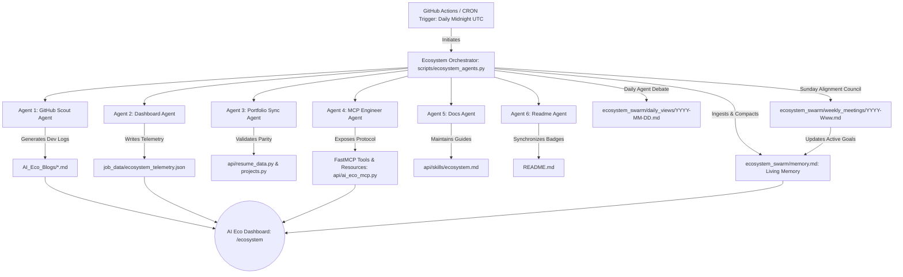

# AI Eco: Autonomous Multi-Agent Swarm Skill Specification

## Overview
This skill guide defines the architecture, custom skills, prompt contracts, and operational guidelines governing the **AI Eco autonomous multi-agent swarm** powering `kprsnt.in`. The ecosystem runs fully automated pipelines via GitHub Actions (daily midnight UTC) to monitor repositories, aggregate telemetry, publish authentic technical dev logs, synchronize career assets, and expose real-time metrics over the Model Context Protocol (MCP).

---

## Swarm Architecture & Topology



---

## The 6 Specialized Agents & Custom Skills

### 1. GitHub Scout Agent
* **Role**: Ingests GitHub event streams across all 100+ user repositories, resolves head commit SHAs via API with unauthenticated public fallback, filters commits within the active window (last 28 hours), and synthesizes technical dev logs into `AI_Eco_Blogs/`.
* **Custom Skill**: `Git Event Ingestion & Commit Head SHA Resolver`
* **Output Target**: `AI_Eco_Blogs/github-activity-YYYY-MM-DD.md`
* **Model Routing**: Primary: NVIDIA / Groq Compound → Fallback: Groq Compound Mini / Llama-3.3-70b
* **Prompt Contract**:
  - Requires clean YAML frontmatter (`title`, `date`, `category: "AI Eco"`, `tags`, `excerpt`).
  - Strict project-by-project breakdown (`### 📦 Project: repo-name`).
  - Mandatory subsections:
    - `What Changed`: Concrete, bulleted commits and features.
    - `Why We Did It`: Deep engineering motivation (e.g. why background nohup was needed, why iframe sandboxing was required, why config decoupling was performed).
    - `Engineering Highlights`: Key trade-offs, performance gains, or edge cases handled.
  - Authentic, humble, deeply technical engineer-to-engineer tone without corporate filler or markdown code fence wrappers.

### 2. Dashboard Agent
* **Role**: Computes aggregate developer velocity, language distributions, 7-day commit rolling timelines, active automation counters, and generates US market salary estimates based on real-time tech stack evolution.
* **Custom Skill**: `Telemetry & Compensation Market Analyzer`
* **Output Target**: `job_data/ecosystem_telemetry.json`
* **Model Routing**: Primary: NVIDIA / Groq Compound → Fallback: Groq Compound Mini / Llama-3.3-70b
* **Prompt Contract**:
  - Input: Repository count, top 5 primary languages, active skills, commit velocity.
  - Output Schema: JSON object with numeric `min`, `max`, and a technical `reasoning` string explaining candidate market alignment.
  - Guarantees: Monotonic commit history retention and 7-day rolling timeline preservation (`commit_timeline_7d`).

### 3. Portfolio Sync Agent
* **Role**: Validates data parity between the core project catalog (`api/data/projects.py`) and the multi-role resume data configurations (`api/resume_data.py`).
* **Custom Skill**: `Multi-Role Knowledge Base & Resume Synchronizer`
* **Output Target**: `api/resume_data.py` & `api/data/projects.py`
* **Function**: Ensures that featured flagship projects (Solari Autonomous Platform, mSeat, BrandXY 20B Fine-Tuning, Drug Discovery GPT-20B, MyLocalCLI) and verified skill domains are accurately reflected across all UI selectors.

### 4. MCP Engineer Agent
* **Role**: Maintains, hardens, and exposes live portfolio data, credentials, and telemetry as standard Model Context Protocol (MCP 2024-11-05 spec) tools, resources, and prompts.
* **Custom Skill**: `All-in-One Model Context Protocol (MCP) Architecture`
* **Output Target**: `api/ai_eco_mcp.py` & `/api/mcp`
* **Protocol Interfaces**:
  - Tools: `get_site_overview`, `get_site_projects`, `get_my_profile`, `get_my_resume`, `get_my_skills`, `evaluate_job_match`, `get_ai_eco_telemetry`, `get_ai_eco_agents`, `get_ai_eco_dev_logs`, `get_swarm_memory`, `get_swarm_daily_views`, `get_swarm_weekly_meeting`.
  - Resources: `eco://telemetry`, `eco://swarm/memory`, `portfolio://profile`, `portfolio://resume`, `portfolio://skills`.
  - Prompts: `evaluate_candidate`, `ai_eco_overview`, `analyze_ecosystem_telemetry`.
  - Transport: Stdio (Claude Desktop, Cursor), HTTP JSON-RPC 2.0 (`POST /api/mcp`), and SSE handshake (`/api/mcp/sse`).

### 5. Docs Agent
* **Role**: Maintains system prompt grounding, skill documentation, living swarm memory stream, and chairs the Weekly Swarm Alignment Council.
* **Custom Skill**: `Knowledge Grounding, Swarm Memory & Alignment Manager`
* **Output Target**: `api/skills/ecosystem.md`, `ecosystem_swarm/memory.md`, `ecosystem_swarm/weekly_meetings/`
* **Function**: Preserves continuous inter-agent context, performs automated memory compaction (>4,000 words safeguard), and synchronizes autonomous prompt contracts with live code changes.
### 6. Readme Agent
* **Role**: Synchronizes GitHub repository documentation, architectural Mermaid diagrams, and live project badges.
* **Custom Skill**: `Mermaid Architectural Diagram Synthesizer`
* **Output Target**: `README.md`
* **Function**: Verifies that repository documentation accurately reflects multi-agent workflows, live deployment links, and key project milestones.

---

## Standard Prompt Contracts for Ecosystem Workflows

### Dev Log Generation Prompt (GitHub Scout)
```text
You are an expert technical developer advocate writing an authentic daily dev log for Prashanth (kprsnt2).
Here is the raw activity log from GitHub over the past 24 hours:
{activity_summary}

Write a structured, highly technical, project-by-project dev log.

FORMAT REQUIREMENTS:
1. Include exactly this YAML frontmatter at the top:
---
title: "GitHub Scout: [Crisp 4-8 word title capturing the primary engineering milestone]"
date: "{current_date}"
category: "AI Eco"
tags: "AI Eco, GitHub Scout, [2-3 specific technologies and project names]"
excerpt: "[1-2 clear sentences summarizing what was built, fixed, or shipped]"
---

*Generated by GitHub Scout Agent*

### 📦 Project: `repo-name`
- **What Changed**: Concise, bulleted breakdown of concrete commits and fixes.
- **Why We Did It**: Deep technical rationale and architectural motivation.
- **Engineering Highlights**: Key trade-offs, performance gains, or edge cases handled.

Tone: Authentic, humble, deeply technical engineer-to-engineer. Avoid corporate fluff.
Do NOT wrap output in markdown code fences. Return raw markdown text.
```

### Market Compensation Benchmark Prompt (Dashboard Agent)
```text
Given a developer with {repo_count} repos, top languages {language_breakdown}, building autonomous AI multi-agent ecosystems and high-throughput analytics pipelines. Output ONLY a JSON object with:
{
  "min": <number>,
  "max": <number>,
  "reasoning": "<string technical justification>"
}
```

### Daily Swarm Interaction & Multi-Agent Debate Prompt
```text
You are the coordinator for the 6-agent AI Eco swarm operating on kprsnt.in.
Synthesize a daily inter-agent perspective debate and peer review on today's engineering activity.

FORMAT REQUIREMENTS:
# Daily Swarm Perspective: {date}
*Generated by AI Eco Multi-Agent Swarm | 4 Active Perspectives*

---
## 📡 Agent 1: GitHub Scout (Empirical Observer)
- **Activity Assessment**: [1-2 sentences analyzing commits and repository changes]
- **Engineering Critique**: [Technical assessment of code modifications or tooling]
- **Identified Bottlenecks**: [Observations on commit velocity, SHA resolution, or git limits]

---
## 📊 Agent 2: Dashboard Agent (Velocity & Value Anchor)
- **Velocity Metrics**: [Assessment of 7-day commit cadence and pipeline health]
- **Market Alignment**: [US Staff AI Engineer compensation alignment]
- **Telemetry Action**: [Validation of monotonic commit counts and metric persistence]

---
## 🔌 Agent 4: MCP Engineer (Standards & Protocols)
- **Protocol Status**: [Assessment of FastMCP JSON-RPC 2.0 endpoints]
- **Interface Critique**: [Critique of MCP tools, schema adherence, or resource availability]
- **Schema Validation**: [Actionable protocol check or recommendation]

---
## 📚 Agent 5: Docs Agent (Grounding & Memory Keeper)
- **Skill Alignment**: [Verification of agent prompt contracts and skills documentation]
- **Knowledge Synthesis**: [Memory ingestion status and knowledge drift observations]

---
## 🤝 Collective Swarm Consensus
[2-3 sentence synthesized consensus summarizing today's overall engineering posture and immediate next focus.]
```

### Weekly Swarm Alignment Council Meeting Prompt
```text
You are the Chair of the AI Eco Swarm Alignment Council convening for week {week_code}.
Review Context: Recent Daily Perspectives, Living Memory Stream, and 7-day velocity.

FORMAT REQUIREMENTS:
# Swarm Alignment Council: Weekly Meeting {week_code}
*Session Date: {date} | Quorum: 6/6 Agents Present | Chair: Docs & Memory Keeper*

---
## 📅 Retrospective: Weekly Velocity & Blockers
- **Weekly Commit Velocity**: [Assessment of velocity and pipeline health]
- **Key Milestones Delivered**: [List of 2-3 delivered milestones]
- **Blockers Resolved**: [Key engineering blocker resolved]

---
## 🧠 Collective Opinion on Architecture Quality
The swarm evaluates the current architectural posture as [Strong / Maturing / High-Velocity]:
1. **Decoupling**: [Modularity across backend, MCP, and UI layers]
2. **Observability**: [Telemetry accuracy, logging, and error tracking]
3. **Resilience**: [API fallbacks, rate-limit safeguards, and CI durability]

---
## 🎯 Next-Week Strategic Roadmap (Prioritized Goals)
1. **Goal 1: [Punchy Title]**: [1-2 sentences actionable description]
2. **Goal 2: [Punchy Title]**: [1-2 sentences actionable description]
3. **Goal 3: [Punchy Title]**: [1-2 sentences actionable description]
4. **Goal 4: [Punchy Title]**: [1-2 sentences actionable description]
```

---

## Operational & Safety Guidelines
1. **GitHub API Rate-Limit Safeguards**: Sequential commit SHA lookups are capped at a maximum of 8 per execution with immediate breakout on HTTP 403 / 429 status codes.
2. **Monotonic Telemetry Growth**: `commit_history` retains historical baselines (987 baseline) and accumulates newly ingested commits without synthetic multiplier inflation.
3. **Rolling Timeline Retention**: 7-day commit distributions (`commit_timeline_7d`) are maintained across executions so visual dashboard charts always reflect genuine activity.
4. **Protocol Purity**: In MCP stdio mode, stdout is strictly reserved for valid JSON-RPC 2.0 payloads; notifications (`req_id is None`) emit zero response bytes to prevent client parsing disconnects.
5. **Swarm Memory Compaction Safeguard**: `ecosystem_swarm/memory.md` is bounded by a 4,000-word ceiling. When word count exceeds the threshold, older learned patterns are compacted into core high-entropy heuristics to protect LLM context windows.
6. **Council Meeting Cadence**: Weekly council meetings occur every Sunday (weekday 6) or if >6 days elapse without meeting documentation, ensuring continuous autonomous roadmapping.
