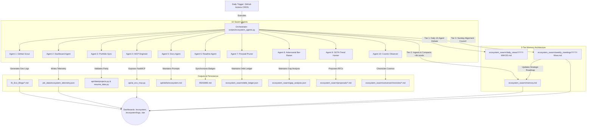

# AI Eco Subproject: Comprehensive Audit Review & Evolutionary Master Plan

**Repository:** Prashanth Kumar Kadasi — Portfolio (`kprsnt.in`)  
**Audited Subproject:** `AI Eco` Autonomous Multi-Agent Swarm & FastMCP Protocol Layer  
**Audit Date:** 2026-09-21  
**Architecture Spec:** Model Context Protocol (MCP 2024-11-05 JSON-RPC 2.0 / SSE) & 10-Agent Autonomous Swarm  
**Status:** Complete Audit & Production-Ready Upgrade Plan

---

## 1. Executive Summary & Subproject Topology

The **AI Eco** subproject powers autonomous telemetry aggregation, daily technical dev log synthesis, multi-agent dialectical perspectives, skill prompt contract grounding, and open protocol exposure for `kprsnt.in`.

Operating on a scheduled daily midnight UTC trigger via GitHub Actions (`.github/workflows/ecosystem_agents.yml`), the system initiates an orchestrator (`scripts/ecosystem_agents.py`) that coordinates **10 specialized agent personas** across three memory tiers:



---

## 2. Comprehensive Component Inventory

| Component | File Path | Current Status | Operational Function |
|:---|:---|:---|:---|
| **Pipeline Orchestrator** | `scripts/ecosystem_agents.py` | Operational (Needs Fixes) | Runs all 10 agents, aggregates commits, updates telemetry, runs daily debate, triggers Sunday council, enforces memory compaction (<4,000 words). |
| **CI/CD Workflow** | `.github/workflows/ecosystem_agents.yml` | Operational (Minor Gaps) | Daily runner (midnight UTC) with 60/90-day retention pruning and atomic git push. |
| **FastMCP Protocol Server** | `api/ai_eco_mcp.py` | Operational (Metadata Drift) | Exposes 17 tools, 8 resources, and 6 prompts over JSON-RPC 2.0 (Stdio, HTTP `/api/mcp`, SSE `/api/mcp/sse`). |
| **Model Configuration** | `api/ai_config.py` | Needs Tuning | Provider fallback chain (NVIDIA NIM → Groq Compound → OpenAI). Contains 300s timeout hazard for Vercel. |
| **Living Memory Stream** | `ecosystem_swarm/memory.md` | Polluted (Scope Leak) | Tier-2 memory consolidating learned heuristics, active constraints, and weekly strategic roadmaps. |
| **Evolutionary Targets** | `ecosystem_swarm/targets.json` | 60% Static/Frozen | Tracks 10-agent evolutionary metrics, overall swarm fitness score, and multi-level evolutionary milestones. |
| **Technical Debt Ledger** | `ecosystem_swarm/debt_ledger.json` | Corrupted (Self-Match) | Maintained by Agent 7 (Ponytail Pruner), auditing deliberate `# ponytail:` debt markers. |
| **Architectural Gap Analysis**| `ecosystem_swarm/gap_analysis.json` | Operational | Maintained by Agent 8 (Adversarial Bar-Raiser) probing serverless ceilings, rate limits, and latency boundaries. |
| **Skill Prompt Contracts** | `api/skills/*.md` (12 files) | Operational (Unbundled) | Grounds each agent persona with role-specific system prompt boundaries and instructions. |
| **Frontier Proposals & Cosmos**| `ecosystem_swarm/proposals/`, `universe/` | Operational | RFC proposals (Agent 9) and daily cosmological chronicles & codex (Agent 10). |
| **Web Endpoints & Templates** | `api/index.py`, `templates/ecosystem.html`, `templates/swarm_logs.html` | Operational | Interactive dashboards displaying live swarm consensus, full logs, council minutes, and MCP documentation. |
| **Test Suite** | `tests/` | **Deficient** | Zero tests for AI Eco swarm, targets, debt scanning, or FastMCP JSON-RPC execution. |

---

## 3. Detailed Audit Findings & Architectural Gaps

### 🔴 Critical Severity

#### 1. Self-Match Scanner Bug in Ponytail Pruner (`debt_ledger.json`)
* **Location:** `scripts/ecosystem_agents.py` (lines 748, 750, 1080, 1172)
* **Root Cause:** `run_pruner_agent()` searches for `"ponytail:" in line` across all Python files in `api/` and `scripts/`. Because `scripts/ecosystem_agents.py` itself contains the string literal `"ponytail:"` in the scanner implementation (`if "ponytail:" in line:`, `parts = line.split("ponytail:", 1)`) as well as in prompt templates, **it flagged its own scanner code as technical debt**!
* **Impact:** `ecosystem_swarm/debt_ledger.json` recorded 4 false-positive debt markers (all pointing to lines inside `ecosystem_agents.py`). Because 3 of these lines lacked commas, `evaluate_swarm_targets()` calculated debt coverage as `(4 - 3)/4 = 25%`, artificially tanking Agent 7's progress score to 25.0% despite clean codebase debt.

#### 2. Strategic Roadmap Parser Scope Leak (`memory.md`)
* **Location:** `scripts/ecosystem_agents.py` (lines 1357–1363)
* **Root Cause:** When parsing weekly council meeting minutes, the script searches the entire document for numbered lines (`line_s.startswith("1. **")` etc.) instead of scoping only within the `## 🎯 Next-Week Strategic Roadmap` section.
* **Impact:** The meeting template contains numbered items in two places:
  1. `## 🧠 Collective Opinion on Architecture Quality` (`1. **Decoupling**...`, `2. **Observability**...`, `3. **Resilience**...`)
  2. `## 🎯 Next-Week Strategic Roadmap` (`1. **Goal 1**...`, `2. **Goal 2**...`)
  The parser scooped up both sections, resulting in `ecosystem_swarm/memory.md` having 7 goals where Goals 1–3 are actually architectural evaluations ("Decoupling", "Observability", "Resilience") rather than actionable roadmap goals.

---

### 🟠 High Severity

#### 3. Flawed Commit Math & Duplicate Ingestion in GitHub Scout
* **Location:** `scripts/ecosystem_agents.py` (lines 353–424)
* **Root Causes:**
  - **Duplicate Ingestion:** GitHub Events API captures full 40-character commit SHAs (`payload.get("head")`), storing them in `seen_commits`. Then `fetch_local_git_activity` runs `git log --format=COMMIT_META:%h...` which yields 7-character short SHAs. `"abc1234"` is not in `seen_commits` (which has `"abc1234567..."`), causing the exact same commit to be added twice to `recent_activity`.
  - **Non-Commit Inflation:** `recent_activity` includes PR events, repository creations, branch creations, and fork events. Line 423 calculates `total_commits = existing_commits + len(recent_activity)`, which inadvertently counts forks and PR reviews as git commits.
  - **Idempotency Flaw:** Triggering the workflow twice on the same day re-reads yesterday's total and adds the same commits again, inflating the total count monotonically.

#### 4. Incomplete Target Evaluation (6 of 10 Agents Frozen)
* **Location:** `scripts/ecosystem_agents.py` (lines 927–987)
* **Root Cause:** `evaluate_swarm_targets()` dynamically computes metrics for only **4 of the 10 agents** (Agent 1, Agent 5, Agent 7, Agent 10). Agents 2 (Dashboard), 3 (Portfolio Sync), 4 (MCP Engineer), 6 (Readme), 8 (Critic), and 9 (Trend Hunter) remain hardcoded static values in `ecosystem_swarm/targets.json`.
* **Impact:** The "Overall Swarm Fitness" metric (74.2%) is partially an uncalculated placeholder rather than a dynamic assessment of telemetry, parity, MCP latency, and RFC cadence.

#### 5. Serverless Timeout Hazards in `api/ai_config.py`
* **Location:** `api/ai_config.py` (lines 47, 55, 63, 88, 98)
* **Root Cause:** All OpenAI, Groq, and NVIDIA client instances specify `timeout=300.0` (5 minutes).
* **Impact:** On Vercel serverless functions (10s execution ceiling on free tiers), if an upstream AI provider hangs, the function terminates with a 504 Gateway Timeout instead of failing fast (<8s) to the next fallback model or local context.

---

### 🟡 Medium Severity

#### 6. Stale "6 Agents" Metadata Across Memory & MCP Prompt Contracts
* **Locations:** 
  - `ecosystem_swarm/memory.md` line 3: `*Swarm Size: 6 Agents*`
  - `scripts/ecosystem_agents.py` lines 74 & 115: `Swarm Size: 6 Agents`
  - `api/ai_eco_mcp.py` line 600: `AI Eco 6-Agent Autonomous Swarm`
  - `api/ai_eco_mcp.py` line 1444: `Inspect its 6 specialized agents...`
* **Impact:** External clients (Claude Desktop, Cursor, Antigravity) calling `ai_eco_overview` or reading `eco://swarm/memory` receive obsolete metadata indicating 6 agents, omitting Ponytail Pruner, Adversarial Bar-Raiser, SOTA Trend Hunter, and Cosmic Observer.

#### 7. Vercel Serverless Function Missing `api/skills/**` in `includeFiles`
* **Location:** `vercel.json` line 8
* **Root Cause:** `vercel.json` includes `blog_data/**`, `blog_inputs/**`, `templates/**`, `job_data/*.json`, `job_data/daily/**`, `ecosystem_swarm/**`, `AI_Eco_Blogs/**`. It omits `api/skills/**`.
* **Impact:** While Python code is bundled, non-Python assets (`.md` skill prompt contracts like `ponytail.md`, `cosmic.md`, `ecosystem.md`) risk being omitted from the deployment container, causing MCP resource queries (`portfolio://skills/*`) to fall back to empty placeholders.

#### 8. Complete Test Suite Gap for Swarm & MCP Layer
* **Location:** `tests/`
* **Root Cause:** Existing tests only cover general HTTP status codes (`tests/test_smoke.py`) and static resume dictionaries (`tests/test_data_consistency.py`). There are zero tests asserting:
  - Valid FastMCP request/response execution (`tools/list`, `resources/read`, `prompts/list`).
  - Swarm JSON schema validity (`targets.json`, `debt_ledger.json`, `gap_analysis.json`).
  - `load_swarm_data()` or `load_full_swarm_audit()` dictionary structure.
  - Absence of self-matching in debt scanning.

#### 9. CI/CD Git Concurrency Race Condition
* **Location:** `.github/workflows/ecosystem_agents.yml` (line 56)
* **Root Cause:** Workflow executes `git add ... && git commit ... && git push` without running `git pull --rebase` first.
* **Impact:** If another commit lands on `main` while the pipeline runs, the automated push is rejected, causing silent data loss of that day's dev log and telemetry.

---

## 4. Remediation & Action Plan

### Action 1: Fix Ponytail Pruner Self-Matching (P0)
Update `run_pruner_agent()` in `scripts/ecosystem_agents.py`:
1. Skip `ecosystem_agents.py` and test files explicitly.
2. Match only actual code comment lines using regex: `r'^\s*(?:#|//)\s*ponytail:\s*(.*)'`.

```python
# In scripts/ecosystem_agents.py: run_pruner_agent()
for fpath in s_dir.rglob("*"):
    if fpath.is_file() and fpath.suffix in extensions:
        # Exclude self and tests to avoid false-positive debt matching
        if fpath.name in ("ecosystem_agents.py", "test_ecosystem.py", "ai_eco_mcp.py"):
            continue
        try:
            lines = fpath.read_text(encoding="utf-8", errors="ignore").splitlines()
            for idx, line in enumerate(lines, 1):
                m = re.search(r'^\s*(?:#|//)\s*ponytail:\s*(.*)', line, re.IGNORECASE)
                if m:
                    rel_path = str(fpath.relative_to(BASE_DIR)).replace("\\", "/")
                    markers.append({
                        "file": rel_path,
                        "line": idx,
                        "annotation": m.group(1).strip()
                    })
        except Exception:
            pass
```

### Action 2: Restrict Strategic Roadmap Extraction Scope (P0)
In `scripts/ecosystem_agents.py` (`run_weekly_swarm_meeting()`):
```python
goals = []
if "## 🎯 Next-Week Strategic Roadmap" in meeting_content:
    roadmap_part = meeting_content.split("## 🎯 Next-Week Strategic Roadmap", 1)[1]
    if "\n## " in roadmap_part:
        roadmap_part = roadmap_part.split("\n## ", 1)[0]
    for line in roadmap_part.splitlines():
        line_s = line.strip()
        m = re.match(r'^\d+\.\s+(.*)', line_s)
        if m:
            goals.append(m.group(1).strip())
```

### Action 3: Normalize Commit Ingestion & Ensure Idempotent Telemetry Math (P1)
1. Normalize all SHAs to 7 lowercase characters: `seen_commits.add(sha[:7].lower())`.
2. Separate `recent_commits` from other GitHub events (`CreateEvent`, `ForkEvent`, `PullRequestEvent`).
3. Store the set of `counted_commit_shas` in `ecosystem_telemetry.json` so rerunning the orchestrator on the same day never multiplies the count.

### Action 4: Synchronize Swarm Size to 10 Agents Across All Contracts (P1)
1. In `scripts/ecosystem_agents.py` lines 74 & 115 and `ecosystem_swarm/memory.md`:
   Update `Swarm Size: 6 Agents` to `Swarm Size: 10 Agents`.
2. In `api/ai_eco_mcp.py`:
   Update `AI Eco 6-Agent Autonomous Swarm` to `AI Eco 10-Agent Autonomous Swarm`.
3. In `api/ai_eco_mcp.py` prompt `ai_eco_overview`:
   Include all 10 specialized agents in prompt instructions.

### Action 5: Implement Dynamic Evaluation for All 10 Agents in `targets.json` (P1)
Expand `evaluate_swarm_targets()` to compute real metrics for all 10 agents:
- **Agent 2 (Dashboard):** Check `ecosystem_telemetry.json` existence, freshness (<48h), and 7-day timeline continuity.
- **Agent 3 (Portfolio Sync):** Compare `PROJECTS` count against `RESUME_DATA_AI_ENGINEER["projects"]`.
- **Agent 4 (MCP Engineer):** Invoke `process_mcp_request({"jsonrpc": "2.0", "id": "t", "method": "tools/list"})` and score 100% on clean response.
- **Agent 6 (Readme):** Check `README.md` for Mermaid diagram syntax and verified links.
- **Agent 8 (Critic):** Calculate pass percentage based on zero unhandled HIGH-severity gaps in `gap_analysis.json`.
- **Agent 9 (Trend Hunter):** Count active RFC files in `ecosystem_swarm/proposals/`.

### Action 6: Lower Timeouts in `api/ai_config.py` for Serverless Resilience (P1)
Change timeouts in `api/ai_config.py` from `300.0` to `8.0` seconds:
```python
def get_nvidia_client():
    api_key = os.environ.get("NVIDIA_API_KEY")
    if not api_key:
        return None
    return OpenAI(api_key=api_key, base_url=NVIDIA_BASE_URL, timeout=8.0)

def get_groq_client():
    api_key = os.environ.get("GROQ_API_KEY")
    if not api_key:
        return None
    return OpenAI(api_key=api_key, base_url=GROQ_BASE_URL, timeout=8.0)

def get_openai_client():
    api_key = os.environ.get("OPENAI_API_KEY")
    if not api_key:
        return None
    return OpenAI(api_key=api_key, max_retries=0, timeout=8.0)
```

### Action 7: Include `api/skills/**` in `vercel.json` (P1)
Update `vercel.json`:
```json
"includeFiles": "api/skills/**,blog_data/**,blog_inputs/**,templates/**,job_data/*.json,job_data/daily/**,ecosystem_swarm/**,AI_Eco_Blogs/**"
```

### Action 8: Add Automated Test Suite (`tests/test_ecosystem.py`) (P2)
Create `tests/test_ecosystem.py` covering:
- FastMCP JSON-RPC 2.0 tool execution (`tools/list`, `resources/read`, `prompts/list`).
- Schema validity of `ecosystem_swarm/` JSON files (`targets.json`, `debt_ledger.json`, `gap_analysis.json`).
- Verify `debt_ledger.json` does not flag `ecosystem_agents.py`.
- Verify `load_swarm_data()` and `load_full_swarm_audit()` return 10 agents.

### Action 9: Protect CI/CD Workflow with Rebase Guard (P2)
Update `.github/workflows/ecosystem_agents.yml`:
```yaml
- name: Commit ecosystem updates
  run: |
    git config user.name "github-actions[bot]"
    git config user.email "github-actions[bot]@users.noreply.github.com"
    git add AI_Eco_Blogs/ blog_inputs/ job_data/ ecosystem_swarm/
    git diff --quiet && git diff --staged --quiet || (git pull --rebase origin main && git commit -m "🤖 Auto-update: Swarm Memory, Daily Views & Telemetry" && git push)
```

---

## 5. Prioritized Action Matrix & Implementation Roadmap

| Priority | Action Item | Target File(s) | Expected Outcome |
|:---|:---|:---|:---|
| **P0** | Fix Ponytail Pruner self-matching false positives | `scripts/ecosystem_agents.py`, `ecosystem_swarm/debt_ledger.json` | Debt count drops to true codebase debt; Agent 7 score rises from 25% to 100%. |
| **P0** | Scope Weekly Roadmap extraction strictly to section | `scripts/ecosystem_agents.py`, `ecosystem_swarm/memory.md` | Active goals in `memory.md` cleaned of architecture opinion paragraphs. |
| **P1** | Add `api/skills/**` to Vercel deployment bundle | `vercel.json` | Guarantees all 12 skill prompt contracts are bundled into serverless functions. |
| **P1** | Synchronize 10-Agent metadata across memory & MCP | `api/ai_eco_mcp.py`, `scripts/ecosystem_agents.py`, `ecosystem_swarm/memory.md` | Eliminates stale 6-agent references across external AI client tool calls. |
| **P1** | Implement dynamic evaluation for all 10 agents | `scripts/ecosystem_agents.py`, `ecosystem_swarm/targets.json` | Fitness score becomes a genuine real-time metric (all 10 agents evaluated). |
| **P1** | Lower LLM timeouts to 8s for Vercel serverless | `api/ai_config.py` | Eliminates 504 Gateway Timeout hazards under 10-second serverless execution. |
| **P2** | Normalize commit SHAs & separate non-commit events | `scripts/ecosystem_agents.py` | Eliminates duplicate commits and prevents non-commit event inflation. |
| **P2** | Add comprehensive ecosystem test suite | `tests/test_ecosystem.py` | Full CI regression test coverage for FastMCP and swarm data integrity. |
| **P2** | Add rebase guard to CI/CD push step | `.github/workflows/ecosystem_agents.yml` | Prevents automated git push failures from concurrent branch commits. |
