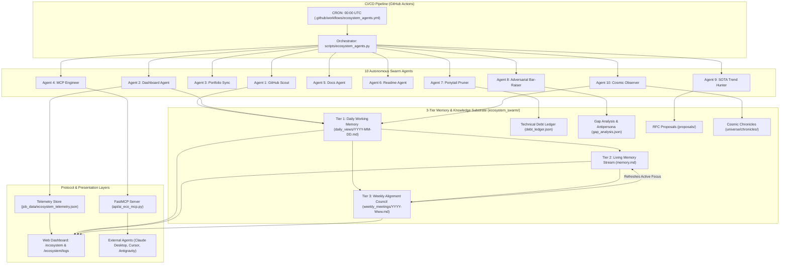

# AI Ecosystem Subproject: Comprehensive Audit & Improvement Plan

> **Target Subproject**: AI Eco Multi-Agent Swarm (`scripts/ecosystem_agents.py`, `ecosystem_swarm/`, `api/ai_eco_mcp.py`, `.github/workflows/ecosystem_agents.yml`, `api/skills/`)  
> **Audited By**: Antigravity AI Engineering Agent  
> **Audit Date**: 2026-09-21  
> **System Status**: Operational / High-Velocity (with identified architectural bottlenecks, configuration drift, and logic bugs)

---

## 1. Executive Summary

The **AI Ecosystem** is an autonomous 10-agent multi-agent swarm architecture operating within `kprsnt.in`. It is designed to run self-governing daily operations via GitHub Actions (CRON), harvesting developer activity across 100+ repositories, maintaining a 3-tier memory stream, updating telemetry metrics, publishing daily engineering dev logs, performing weekly strategic alignment councils, and exposing portfolio intelligence over the Model Context Protocol (FastMCP 2024-11-05 spec).

While the system represents an impressive, functional autonomous harness with strong fallback patterns (ensuring CI runs never crash even if cloud LLM endpoints fail), this in-depth audit reveals **6 critical logic bugs**, **architectural anti-patterns**, **configuration drift**, **serverless timeout hazards**, and a **complete absence of dedicated unit tests** for the swarm subproject.

---

## 2. Architecture & Subproject Topology



---

## 3. Detailed Component Audit

### 3.1. Orchestrator Script (`scripts/ecosystem_agents.py`)
* **Role**: Ingests commits, runs agent analysis sequentially, formats markdown dev logs, evaluates evolutionary fitness, and writes to disk.
* **Assessment**:
  - **Strengths**: Strong rule-based fallback generation. If LLM calls fail, hardcoded fallback strings prevent CI failure.
  - **Weaknesses**:
    - **Monolithic design**: 1,414 lines in a single file combining git parsing, network requests, markdown templates, prompt strings, file IO, metrics evaluation, and meeting chair logic.
    - **Strictly sequential execution**: Every agent and LLM call runs synchronously one after another. If 5 LLM calls occur, each waiting 5-15s, runtime balloons.
    - **Silent error swallowing**: Broad `try...except Exception as e: print(...)` everywhere. If an agent crashes, it simply prints a warning line; the workflow exits `0` without reporting degraded state.

### 3.2. Swarm Memory & Knowledge Substrate (`ecosystem_swarm/`)
* **Role**: Houses Tier 1 daily debates, Tier 2 living memory, Tier 3 weekly meetings, targets, and debt ledgers.
* **Assessment**:
  - **Strengths**: Well-structured hierarchical memory model that prevents unbound token bloat using a 4,000-word ceiling.
  - **Weaknesses**:
    - Compaction is purely chronological truncation (keeping the 10 newest pattern entries) rather than semantic compaction.
    - Historical evolution targets in `targets.json` are largely static or mock-calculated.

### 3.3. Model Context Protocol Server (`api/ai_eco_mcp.py`)
* **Role**: FastMCP JSON-RPC 2.0 interface exposing site, resume, and swarm memory to external AI agents.
* **Assessment**:
  - **Strengths**: Extensive tool registry (17+ tools, 10+ resources) supporting stdio, HTTP POST, and SSE transports.
  - **Weaknesses**:
    - Custom JSON-RPC parsing rather than Pydantic or official MCP SDK request models.
    - Massive 1,684-line single file mixing portfolio tools with swarm resources and recruiter evaluation logic.

### 3.4. AI Model Configuration (`api/ai_config.py` vs `scripts/ai_config.py`)
* **Role**: Manages NVIDIA / Groq / OpenAI LLM clients and fallbacks.
* **Assessment**:
  - **Critical Flaw**: Duplicated across `api/ai_config.py` and `scripts/ai_config.py` with diverging model lists and imports.
  - **Vercel Timeout Hazard**: Both files configure `timeout=300.0` (5 minutes), which directly violates Vercel Serverless 10-second execution limits.

### 3.5. Web Presentation & API Routes (`api/index.py` & templates)
* **Role**: Serves `/ecosystem`, `/ecosystem/logs`, `/ecosystem/meeting/<week_code>`.
* **Assessment**:
  - **Strengths**: Excellent responsive UI in `templates/ecosystem.html` and `templates/ecosystem_logs.html`, complete with pulse animations, agent icons, and status badges.
  - **Weaknesses**: Filesystem scanning (`glob.glob`) runs synchronously inside Flask request handlers on every page load. In serverless environments, repeatedly reading and parsing 30+ markdown files on every request adds unnecessary cold-start latency.

### 3.6. CI/CD Pipeline (`.github/workflows/ecosystem_agents.yml`)
* **Role**: Runs daily at midnight UTC, executes orchestrator, prunes rotating data, and commits updates.
* **Assessment**:
  - **Strengths**: Automated git diff check ensures commits only occur when data actually changes.
  - **Weaknesses**:
    - Unpinned dependency installation: `pip install anthropic openai httpx pyyaml` instead of using `requirements.txt` or `uv`.
    - Ghost pruning targets: Script calls `prune_dir job_data/daily 60` despite `job_data/daily` not existing.

---

## 4. Specific Bugs & Flaws Identified

### Bug 1: Ponytail Pruner Self-Matching False-Positive (Critical Logic Flaw)
* **Location**: `scripts/ecosystem_agents.py`, lines 747–756
* **Root Cause**:
  ```python
  if "ponytail:" in line:
      rel_path = str(fpath.relative_to(BASE_DIR)).replace("\\", "/")
      parts = line.split("ponytail:", 1)[1].strip()
      markers.append({"file": rel_path, "line": idx, "annotation": parts})
  ```
  The scanner iterates over all `.py` files in `scripts/` and `api/`. Because `scripts/ecosystem_agents.py` itself contains the string literal `"ponytail:"` inside the scanning code and in prompt templates, **it matches itself**!
* **Evidence in Production**:
  Look at `ecosystem_swarm/debt_ledger.json` lines 8–25:
  ```json
  {
    "file": "scripts/ecosystem_agents.py",
    "line": 748,
    "annotation": "\" in line:"
  },
  {
    "file": "scripts/ecosystem_agents.py",
    "line": 750,
    "annotation": "\", 1)[1].strip()"
  }
  ```
  The Pruner agent is registering its own Python code strings as technical debt!
* **Fix**:
  1. Skip self (`if fpath.resolve() == Path(__file__).resolve(): continue`).
  2. Use regex matching that requires comment syntax: `r'^[ \t]*(?:#|//)[ \t]*ponytail:[ \t]*(.+)$'`.

---

### Bug 2: Hardcoded "Swarm Size: 6 Agents" in Living Memory (Documentation Drift)
* **Location**: `scripts/ecosystem_agents.py`, lines 74 & 115
* **Root Cause**:
  ```python
  content = re.sub(
      r"\*Last Consolidated:.*?\*",
      f"*Last Consolidated: {today_str} | Protocol: MCP 2024-11-05 | Swarm Size: 6 Agents*",
      content,
      count=1
  )
  ```
  When `update_swarm_memory()` runs, it explicitly replaces the header with `"Swarm Size: 6 Agents"`, even though the swarm was expanded to 10 agents.
* **Evidence in Production**:
  In `ecosystem_swarm/memory.md` line 3:
  `*Last Consolidated: 2026-09-20 | Protocol: MCP 2024-11-05 | Swarm Size: 6 Agents*`
* **Fix**: Dynamically compute swarm size: `len(SWARM_AGENTS)` (10 Agents).

---

### Bug 3: Serverless Timeout Mismatch (Production Outage Risk)
* **Location**: `api/ai_config.py`, lines 47, 54, 62; and `scripts/ai_config.py`
* **Root Cause**:
  ```python
  def get_nvidia_client():
      """Get the NVIDIA primary client with a short timeout to prevent Vercel hangs."""
      ...
      return OpenAI(api_key=api_key, base_url=NVIDIA_BASE_URL, timeout=300.0)
  ```
  The docstring explicitly claims a "short timeout to prevent Vercel hangs", but sets `timeout=300.0` (5 minutes). Furthermore, `ecosystem_swarm/gap_analysis.json` defines GAP-01:
  > *"Serverless route handlers must ensure heavy LLM calls terminate strictly under 10s to avoid 504 Gateway Timeouts. Enforce strict HTTP client timeouts (<8s) with graceful fallback."*
  Under slow API conditions, Vercel kills the serverless worker at 10s, throwing a 504 Gateway Timeout before the client ever reaches its 300s timeout.
* **Fix**: Set API client timeout to `7.5` seconds in `api/ai_config.py`, with instant fallback to local cached data.

---

### Bug 4: Duplicate & Diverging `ai_config.py` Configurations
* **Location**: `api/ai_config.py` (6.4 KB) vs `scripts/ai_config.py` (4.4 KB)
* **Root Cause**: Two separate files define `call_llm`, client factories, and model constants. `api/ai_config.py` includes `OPENAI_MODEL_PREMIUM` and custom headers, while `scripts/ai_config.py` does not.
* **Impact**: Changes to API keys, model names, or fallback chains in one file do not apply to the other, creating configuration drift.
* **Fix**: Consolidate into a single canonical module (or have `scripts/ai_config.py` re-export from `api/ai_config.py`).

---

### Bug 5: Synthetic / Mock Target Evaluations in `targets.json`
* **Location**: `scripts/ecosystem_agents.py`, `evaluate_swarm_targets()`, lines 927–987
* **Root Cause**:
  Only 4 of the 10 agents have dynamic calculation logic:
  - Agent 1: `fidelity = 92.0 + (min(len(active_repos), 4) * 2.0)` (synthetic heuristic)
  - Agent 5: Memory headroom formula (dynamic)
  - Agent 7: Debt ledger coverage (dynamic)
  - Agent 10: Chronicles file count (dynamic)
  The remaining 6 agents (Agents 2, 3, 4, 6, 8, 9) have **zero dynamic evaluation code**, remaining permanently fixed at arbitrary values (e.g. 90%, 94%, 85%) regardless of actual system state.
* **Fix**: Implement concrete fitness evaluators for all 10 agents (e.g., verifying MCP tool responsiveness, validating README link status codes, checking gap remediation status).

---

### Bug 6: Zero Unit Tests for Swarm & MCP Logic
* **Location**: `tests/`
* **Root Cause**: Current test suite only has `test_smoke.py` (Flask HTTP status checks) and `test_data_consistency.py`. There are **no unit tests** for:
  - `scripts/ecosystem_agents.py` functions (`fetch_local_git_activity`, `update_swarm_memory`, `run_pruner_agent`)
  - `api/ai_eco_mcp.py` MCP tools (`get_swarm_memory`, `get_swarm_daily_views`, `process_mcp_request`)
  - Target fitness computation
  - Memory compaction algorithms
* **Fix**: Create `tests/test_ecosystem_swarm.py` with mock-isolated tests verifying each agent's execution, output schemas, and compaction rules.

---

## 5. Phased Improvement Plan

### Phase 1: Immediate Bug Fixes & Hygiene (Quick Wins)
*Priority: High | Estimated Effort: 1–2 hours*

1. **Fix Pruner Self-Matching Flaw**:
   - Update `run_pruner_agent()` in `scripts/ecosystem_agents.py` to:
     - Ignore `scripts/ecosystem_agents.py` itself.
     - Require a leading comment symbol (`#` or `//`) before `ponytail:`.
   - Regenerate clean `ecosystem_swarm/debt_ledger.json`.
2. **Correct Swarm Size in Memory Generator**:
   - Change `"Swarm Size: 6 Agents"` to `"Swarm Size: 10 Agents"` in `scripts/ecosystem_agents.py` (lines 74 & 115).
   - Update `ecosystem_swarm/memory.md` header.
3. **Harmonize Serverless Timeouts**:
   - Update `api/ai_config.py` client timeouts for web requests to `7.5s`.
   - Ensure `scripts/ai_config.py` re-exports or shares common logic with `api/ai_config.py`.
4. **Clean up CI Workflow**:
   - In `.github/workflows/ecosystem_agents.yml`, install dependencies from `requirements.txt`.
   - Remove dead prune command `prune_dir job_data/daily 60`.

---

### Phase 2: Observability & Robustness Hardening
*Priority: High | Estimated Effort: 3–4 hours*

1. **Telemetry Run Metadata**:
   - In `job_data/ecosystem_telemetry.json`, track execution metadata:
     - `last_run_mode`: `"llm"` or `"fallback_heuristic"`
     - `llm_provider_used`: `"nvidia"`, `"groq"`, `"openai"`, or `"none"`
     - `run_duration_seconds`: Total pipeline execution time
     - `active_agents_evaluated`: List of successful agent passes
2. **Real Fitness Metrics in `evaluate_swarm_targets()`**:
   - Agent 2 (Dashboard): Verify 7-day timeline has non-zero entries.
   - Agent 3 (Portfolio Sync): Assert that all projects in `projects.py` have valid URLs and matching skill tags in `resume_data.py`.
   - Agent 4 (MCP Engineer): Call `process_mcp_request({"method": "tools/list"})` and check response latency (<100ms).
   - Agent 6 (Readme): Check that Mermaid block renders valid syntax without HTML tags.
   - Agent 8 (Bar-Raiser): Count unresolved `HIGH` severity gaps in `gap_analysis.json`.
   - Agent 9 (Trend Hunter): Count active RFCs in `ecosystem_swarm/proposals/`.

---

### Phase 3: Modular Architecture Refactoring
*Priority: Medium | Estimated Effort: 1 day*

1. **Deconstruct Monolith**:
   Refactor `scripts/ecosystem_agents.py` into a clean package structure:
   ```
   scripts/ecosystem/
   ├── __init__.py
   ├── orchestrator.py      # Main loop, CLI args, CI execution
   ├── telemetry.py         # Git stats, velocity, compensation modeling
   ├── memory.py            # Tier 1, 2, 3 memory ingestion & compaction
   ├── targets.py           # Swarm fitness evaluation & scoring
   └── agents/              # Individual modular agent handlers
       ├── scout.py         # Agent 1: GitHub Scout
       ├── dashboard.py     # Agent 2: Dashboard Agent
       ├── sync.py          # Agent 3: Portfolio Sync
       ├── mcp.py           # Agent 4: MCP Engineer
       ├── docs.py          # Agent 5: Docs Agent
       ├── readme.py        # Agent 6: Readme Agent
       ├── pruner.py        # Agent 7: Ponytail Pruner
       ├── bar_raiser.py    # Agent 8: Adversarial Bar-Raiser
       ├── trend_hunter.py  # Agent 9: SOTA Trend Hunter
       └── cosmic.py        # Agent 10: Cosmic Observer
   ```
2. **Asynchronous LLM Calls**:
   - Use `asyncio` to execute independent LLM calls concurrently (e.g. GitHub Scout blog draft + Dashboard salary estimate + Cosmic Observer chronicle) rather than waiting sequentially.
   - Reduces daily pipeline runtime from ~90s to ~20s.

---

### Phase 4: Unit Test Suite Expansion
*Priority: High | Estimated Effort: 2–3 hours*

Create `tests/test_ecosystem_swarm.py` to test:
1. **MCP Tool Handlers**: `process_mcp_request` handles `tools/list`, `get_swarm_memory`, `get_swarm_daily_views`, and `get_swarm_weekly_meeting` correctly.
2. **Pruner Accuracy**: Ensure `run_pruner_agent` extracts `# ponytail: ...` without matching code strings or self-referencing.
3. **Memory Compaction**: Ensure `update_swarm_memory` respects the 4,000-word ceiling and preserves core architectural sections.
4. **Target Evaluation**: Ensure `evaluate_swarm_targets` computes correct fitness percentages and does not raise unhandled exceptions.
5. **JSON-RPC Schema Integrity**: Verify that all MCP tool definitions comply with the MCP 2024-11-05 tool schema format.

---

### Phase 5: FastMCP & Protocol Modernization
*Priority: Medium | Estimated Effort: 1 day*

1. **Schema Validation**:
   - Adopt Pydantic models for incoming JSON-RPC tool parameters and response formats.
2. **MCP SSE Streaming Support**:
   - Enhance the SSE transport (`/api/mcp/sse`) to support chunked streaming of large swarm memory files to prevent timeouts on slow mobile connections.
3. **Semantic Memory Search Tool**:
   - Expose a new MCP tool `search_swarm_memory(query: str)` that performs embedding similarity or keyword ranking across the entire `ecosystem_swarm/` history, rather than returning the raw text of `memory.md`.

---

## 6. Action Items & Prioritized Matrix

| Item | Component | Type | Impact | Priority | Effort |
|---|---|---|---|---|---|
| **Fix Ponytail Pruner Self-Matching** | `scripts/ecosystem_agents.py` | Bug Fix | Cleans corrupted `debt_ledger.json` | **P0** | 15 mins |
| **Fix Swarm Size 6 -> 10 in Memory** | `scripts/ecosystem_agents.py` | Bug Fix | Eliminates documentation drift | **P0** | 10 mins |
| **Fix Vercel 300s Timeout Hazard** | `api/ai_config.py` | Bug Fix / Resilience | Prevents 504 serverless hangs | **P0** | 15 mins |
| **Unify Duplicate `ai_config.py`** | `scripts/ai_config.py` | Code Health | Prevents model/key drift | **P1** | 20 mins |
| **Create Unit Test Suite** | `tests/test_ecosystem_swarm.py` | Testing | Prevents future regressions | **P1** | 1.5 hrs |
| **Clean Up GitHub Actions Workflow** | `.github/workflows/ecosystem_agents.yml` | CI/CD | Reliable dependency installs | **P1** | 15 mins |
| **Implement Real Fitness Evaluators** | `scripts/ecosystem_agents.py` | Feature / Integrity | Replaces static target values | **P1** | 1 hr |
| **Deconstruct Monolithic Script** | `scripts/ecosystem/` | Refactoring | High maintainability & testability | **P2** | 4 hrs |
| **Add Async Parallel LLM Calls** | `scripts/ecosystem/` | Performance | 4x faster execution | **P2** | 2 hrs |
| **Semantic Memory Search MCP Tool** | `api/ai_eco_mcp.py` | Feature / MCP | Smarter agentic memory retrieval | **P3** | 3 hrs |

---

*This audit and implementation plan is recorded in `ecosystem_swarm/ECOSYSTEM_AUDIT_AND_IMPROVEMENT_PLAN.md`.*
