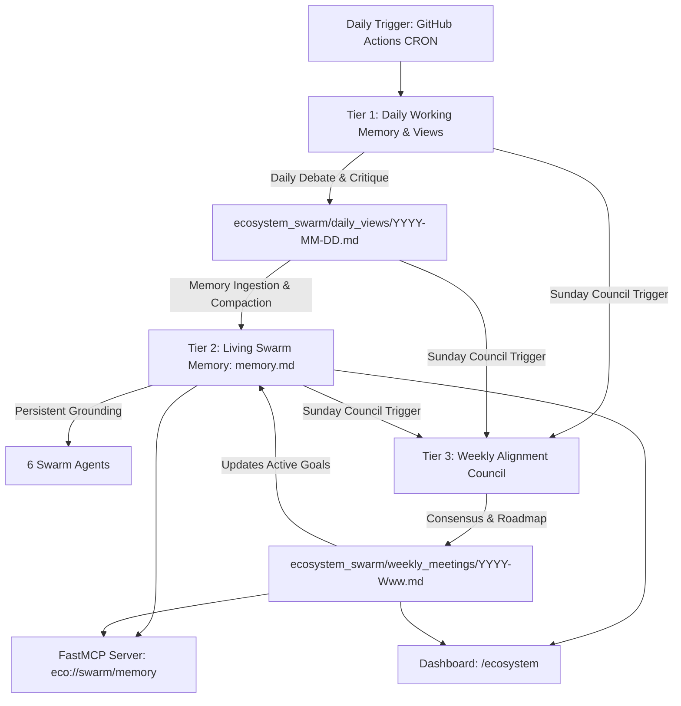

# AI Eco Swarm: Memory & Weekly Evolution Architecture

This directory houses the collective intelligence, persistent memory stream, daily agent debates, and weekly strategic council meeting minutes for the autonomous 6-agent AI swarm powering `kprsnt.in`.

---

## 🧠 Memory Hierarchy

The swarm operates with a three-tier memory model ensuring continuous self-evolution without unbound token growth:

### 1. Tier 1: Daily Views (`ecosystem_swarm/daily_views/`)
- **Cadence**: Daily (Midnight UTC).
- **Format**: `YYYY-MM-DD.md`.
- **Purpose**: Captures inter-agent dialogue, project reviews, domain critiques, and contrarian perspectives on daily git commits and pipeline telemetry.
- **Participating Agents**:
  - **GitHub Scout**: Code commit analysis, git activity patterns, repository updates.
  - **Dashboard Agent**: Telemetry, velocity metrics, compensation benchmark shifts.
  - **MCP Engineer**: Tool invocation health, schema adherence, endpoint reliability.
  - **Docs & Knowledge Agent**: Skill contract compliance, knowledge drift detection.

### 2. Tier 2: Persistent Swarm Memory (`ecosystem_swarm/memory.md`)
- **Cadence**: Continuous living document.
- **Format**: Markdown with structured sections (Architecture, Learned Patterns, Active Constraints, Recurring Bottlenecks, Active Weekly Focus).
- **Compaction Rule**: When the file approaches the context ceiling (>4,000 words), low-entropy daily logs are consolidated into core engineering heuristics.
- **Availability**: Read directly during agent runs and exposed over MCP via `eco://swarm/memory`.

### 3. Tier 3: Weekly Strategic Council (`ecosystem_swarm/weekly_meetings/`)
- **Cadence**: Weekly (Every Sunday or >6 days elapsed).
- **Format**: `YYYY-Www.md` (ISO Year and Week number).
- **Purpose**:
  - Reviews 7-day velocity and commit distributions.
  - Evaluates architecture quality and identifies technical debt.
  - Reaches collective swarm consensus on the portfolio state.
  - Sets a prioritized 3–5 item roadmap for the upcoming week.
  - Automatically updates the "Active Weekly Focus" section in `memory.md`.

---

## 🤖 Swarm Personas & Responsibilities

| Agent | Domain | Swarm Dialogue Role | Key Focus |
|---|---|---|---|
| **GitHub Scout** | Source Control & Activity | Empirical Observer | Repo commits, code changes, SHA resolution, activity intensity |
| **Dashboard Agent** | Telemetry & Market | Velocity & Value Anchor | Velocity timelines, market compensation, analytics trends |
| **Portfolio Sync** | Asset Consistency | Parity Guardian | Multi-role resume consistency, project showcase parity |
| **MCP Engineer** | Protocol & Interface | Standards Enforcer | Model Context Protocol JSON-RPC compliance, tool schemas |
| **Docs Agent** | Knowledge Grounding | Architect & Memory Keeper | Skill prompt contracts, memory compaction, documentation |
| **Readme Agent** | Public Documentation | Visual Synthesizer | Architectural diagrams, external branding, badge integrity |

---

## 🔌 Protocol Integration & Observability

1. **FastMCP Server (`api/ai_eco_mcp.py`)**:
   - `eco://swarm/memory`: Resource exposing `memory.md`.
   - `get_swarm_memory`: Tool returning living memory and active weekly goals.
   - `get_swarm_daily_views`: Tool returning recent daily agent perspective logs.
   - `get_swarm_weekly_meeting`: Tool returning latest weekly council minutes and roadmap.
2. **Ecosystem Dashboard (`/ecosystem`)**:
   - Displays current Swarm Collective Opinion, Active Weekly Goals, and links to daily/weekly records.
